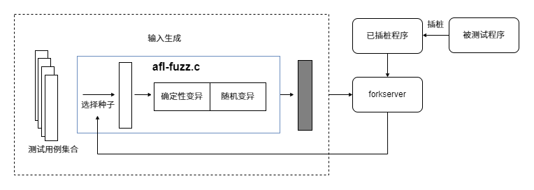
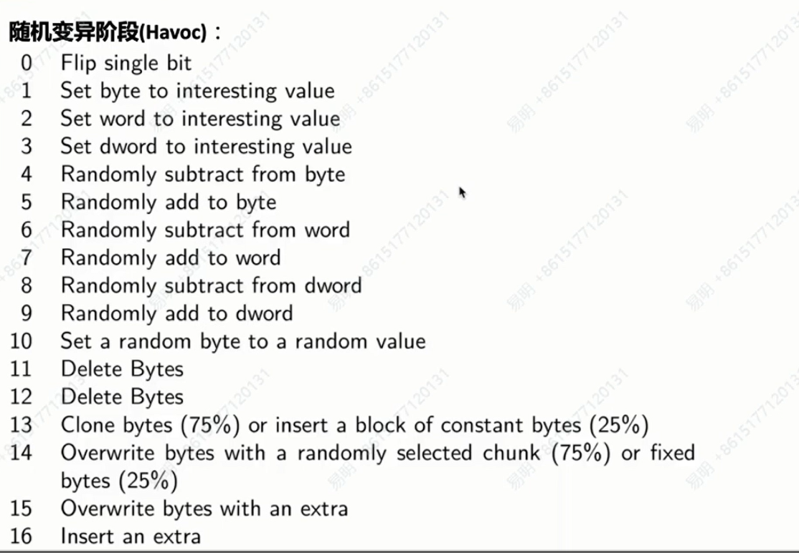

## 前言

熟悉了 AFL 的使用之后，接下来应该分析一下 AFL 的源代码来理解 AFL 的 Fuzz 原理。关于 AFL 的源码分析已经有很多前辈珠玉在前了，所以也想过到底要不要写这篇文章。想了想还是打算动笔，也算是对自己学到的东西做总结。


## AFL源码架构

AFL 源码架构大体可以分为三个模块：

```
AFL 源码架构
├── 核心模块 (afl-fuzz.c)
├── 插桩模块
│   ├── 汇编 (afl-gcc.c, afl-as.c)
|	├── llvm  (llvm_mode)
│   └── qemu  (qemu-mode)
└── 辅助模块
     ├── 输入优化 (afl-tmin, afl-cmin)
     ├── 状态分析 (afl-showmap.c, afl-analyze.c)
	 ├── 内存检测 (libdislocator)
 	 ├── 捕获输入 (libtokencap)
 	 └── 资源管理 (afl-whatsup.sh, afl-gotcpu.c)
```

下面主要对核心模块和插桩模块进行分析来了解 AFL 的工作原理。

## 插桩模块分析

插桩 (instrumentation) 的核心概念是：在保证原程序逻辑完整性的情况下，在程序中插入一些代码来收集运行时的执行状态。

在 AFL 中一共有三种插桩模块，分别是通过`afl-gcc.c`和`afl-as.c`的汇编插桩，以及通过 LLVM Pass 的 LLVM 模式插桩，最后是通过 QEMU 对二进制文件的插桩。

插入的代码从用途上主要分为两类：

1. 记录目标程序执行过程中的路径覆盖信息，需保证在每个基本块上都有插入；
2. 初始化共享内存以及 forkserver。

插桩的代码通常只需要几行汇编代码，并不会做太复杂的操作，否则会对性能产生影响。在 AFL 中插桩被用来搜集代码覆盖率，也就是目标程序执行了哪些路径。

### 汇编插桩

首先通过对`afl-gcc.c`对 gcc 做一层简单的封装，然后交给封装后的 as 汇编器来处理。这里将会查找汇编文件中的`.text`节区，并在各控制流指令或基本块入口等位置插入跳板代码，以实现插桩操作。

`afl-gcc.c`是对 gcc 编译器的封装，其作用是修改用户的编译命令，使其自动包含 AFL 所需的插桩逻辑，进而支持模糊测试。它的目标是修改传递给编译器的参数，确保编译器能够正确地为 AFL 插桩编译代码，从而使 AFL 能够进行有效的模糊测试。

其主要工程流程如下：

- 通过`find_as`函数查找到`as`汇编器的位置
- 然后调用`edit_params`函数解析用户传入的数组，并生成新的参数数组。
- 根据参数数组调用真正的编译器（如gcc、clang），让其生成汇编文件。
- 最终由`afl-as`替代原始`as`汇编器，对汇编文件进行插桩。

由于插桩在汇编阶段完成，因此`afl-gcc`不直接插桩，而是通过参数重写将插桩交给`afl-as`汇编器。

`afl-as`工作流程如下：

- 调用`edit_params()`函数调整传入的参数。
- 执行`add_instrumentation()`函数对`.text`节中的代码进行插桩。
- 使用`fork`函数创建子进程。
- 子进程调用真实的`as`对插桩后的汇编代码进行编译。

插桩仅针对`.text`节，跳过`.data`、`.bss`等非代码段。插桩点主要包括函数标签、控制流跳转（如`jmp`、`call`等汇编指令）和编译器生成的中间标签（如`LBB`）。

同时该封装器还支持设置`AFL_HARDEN`环境变量启用堆栈保护、设置`AFL_USE_ASAN`来启用 ASAN，以发现内存错误。

在 AFL 汇编插桩模式中，核心逻辑主要在`afl-gs.c`文件的`add_instrumentation()`函数中。它负责对编译器生成的汇编文件进行处理，在合适的位置插入 AFL 所需的汇编代码，核心逻辑就是识别哪些位置是合适的插桩点并插桩。

```c
static void add_instrumentation(void) {

  ......
  
  while (fgets(line, MAX_LINE, inf)) {

	//判断算法符合插桩条件
    if (!pass_thru && !skip_intel && !skip_app && !skip_csect && instr_ok &&
        instrument_next && line[0] == '\t' && isalpha(line[1])) {

	  //插入跳板汇编代码
      fprintf(outf, use_64bit ? trampoline_fmt_64 : trampoline_fmt_32,
              R(MAP_SIZE));

      instrument_next = 0;
      ins_lines++;

    }
    
  ......
```

只有满足以下条件的语句才会被插桩：

- 不处于 pass-throug 模式（无需插桩）；
- 当前语法不是 Intel 风格；
- 不在 inline assembly（#APP）块中；
- 当前节区是`.text`；
- 已经识别到是 label 或跳转指令后的 basic block；
- 是以`\t`开头且第二个字符是字母的合法汇编指令。

插桩的内容包含变量`main_payload_64`和`trampoline_fmt_64`，这两个变量定义在`afl-as.h`中。不过，`main_payload_64`主要是定义与 AFL 相关的函数，因此我们先来看`trampoline_fmt_64` 的代码：

```c
static const u8* trampoline_fmt_64 =
    "leaq -(128+24)(%%rsp), %%rsp\n"         // (1) 创建栈帧
    "movq %%rdx,  0(%%rsp)\n"                // (2) 保存寄存器
    "movq %%rcx,  8(%%rsp)\n"
    "movq %%rax, 16(%%rsp)\n"
    "movq $0x%08x, %%rcx\n"                  // (3) 加载随机 BB ID
    "call __afl_maybe_log\n"                 // (4) 调用日志记录函数
    "movq 16(%%rsp), %%rax\n"                // (5) 恢复寄存器
    "movq  8(%%rsp), %%rcx\n"
    "movq  0(%%rsp), %%rdx\n"
    "leaq (128+24)(%%rsp), %%rsp\n";         // (6) 恢复栈指针
```

插桩逻辑的作用：保存当前进程的状态（寄存器等），随机生成一个当前基本块的 ID，通过`RCX`传递它。调用`__afl_maybe_log`收集覆盖信息。

`main_payload_64`变量主要定义了`__afl_maybe_log()`函数，用于初始化模糊测试环境并收集目标代码覆盖率。我们将插桩的汇编代码替换为易理解的 C 代码来分析。

```c
#define READ_PIPE_FD 198
#define WRITE_PIPE_FD 199

char _afl_maybe_log(__int64 r1, __int64 r2, __int64 r3, __int64 bbid)
{
    // 第一次调用：初始化
    if (!_afl_area_ptr) {
        // (1) 通过环境变量获取共享内存
        shmid_str = getenv("__AFL_SHM_ID");
        shmid_int = atoi(shmid_str);
        shm = shmat(shmid_int, NULL, 0);
        _afl_area_ptr = shm;

        // (2) 与 fuzzer 通信建立 fork server
        if (write(WRITE_PIPE_FD, &tmp, 4) == 4) {
            while (1) {
                if (read(READ_PIPE_FD, &tmp, 4) != 4)
                    break;
                pid = fork();
                if (!pid) goto resume;
                write(WRITE_PIPE_FD, &pid, 4);
                waitpid(pid, &tmp, 0);
                write(WRITE_PIPE_FD, &tmp, 4);
            }
            _exit(0);
        }
    }

resume:
    // (3) 记录覆盖路径信息
    edge = _afl_prev_loc ^ bbid;
    _afl_prev_loc = (_afl_prev_loc ^ edge) >> 1;
    _afl_area_ptr[edge]++;
}
```

这段代码主要做了两件事情：初始化共享内存和 forkserver，以及记录路径覆盖信息。

forkserver 是 AFL 性能优化的关键。传统的模糊测试每次测试都调用`execve`启动目标程序，开销巨大。而 AFL 通过引入 forkserver 机制，将这部分开销显著降低。

- 初次执行时，由父进程创建一个 forkserver 循环；
- 每次 AFL 发起测试时，父进程只需`fork()`出一个子进程执行测试代码；
- 测试完成后，父进程回收子进程并将状态返回给 AFL。

这样就避免了频繁加载程序带来的资源消耗，大幅提升执行效率。由于 AFL 需要与 forkserver 传递一些信息（指令和状态码等）所以需要与 forkserver 建立通信，在源码中 AFL 是通过管道机制来与 forkserver通信的

AFL 与 forkserver 通信流程：

- AFL 在启动程序前，会预先创建一对匿名管道，用于与目标程序的 forkserver 通信。
- 目标程序在首次调用`__afl_maybe_log`时触发初始化，通过`__afl_maybe_log`判断是否为首次进入。
- 初始化流程：
  - 通过环境变量`__AFL_SHM_ID`获取共享内存ID，调用`shmat`映射共享内存，用于保存覆盖率信息；
  - 通过管道与 AFL 进行握手，确保通信建立；
  - 启动 forkserver 循环：
    - 父进程阻塞等待 AFL 发出命令；
    - 接收命令后`fork()`一个子进程；
    - 子进程执行测试代码；
    - 父进程等待子进程结束，收集状态并将结果回传给 AFL。

AFL 记录 coverage（覆盖）是以 edge （边）为单位的，edge 是由两个 basic block （基本块）组成。为什么不以基本块来来计算 coverage 呢？以下以一个例子来说明。

例如有 basic block A 和 B，A->B 和 B->A 都会标记 B 被覆盖，但是这样无法记录路径上下文信息，因此 coverage 相同；

但是在 edge 覆盖中，记录从哪个 basic block 跳转到哪个 basic block。这样 A->B 和 B-> 是两个不同的 edge。这样就可以记录控制流的顺序，保留上下文信息，覆盖的粒度更细。

插桩代码会为每个 basic block 生成一个随机 ID（`bbid`）然后通过异或运算来计算 edge：

原始 AFL 通过地址移位和 XOR 生成 block ID，再用 `E = B ^ (B' >> 1)` 生成 edge ID：

```c
edge = prev_loc ^ bbid;            //edge = 上一个块和当前块的ID的异或
_afl_area_ptr[edge]++;             //更新对应的 edge 的执行次数
prev_loc = (prev_loc >> 1) ^ bbid; //更新 prev_loc，为下一次 edge 做准备
```

得到 edge 值后，将其记录到共享内存中。父进程等待子进程执行完毕，然后将子进程的退出状态传递给 AFL。AFL 根据共享内存中的覆盖率信息判断该输入是否具有 “价值”（是否发现了新的路径或崩溃），并决定是否保留该输入。

### llvm_mode

LLVM 模式通过 LLVM Pass 来对目标程序进行编译插桩，它要比通过直接通过汇编进行插桩覆盖粒度更精细。而且性能的开销要低很多，灵活性也更高。

`llvm_mode`目录下分为三个文件：`afl-clang-fast.c`、` afl-llvm-pass.so.c`、`afl-llvm-rt.o.c`。

`afl-clang-fast.c`会编译出 afl-clang-fast 可执行文件，类似于 afl-gcc.c 一样对目标编译器进行一个封装，从而使用 LLVM Pass 来进行插桩。

Pass 插桩代码：

```cpp
//遍历所有函数中的所有基本块，在满足条件的基本块前插入一段记录代码
bool AFLCoverage::runOnModule(Module &M) {

  //获取当前模块的上下文
  LLVMContext &C = M.getContext();

  IntegerType *Int8Ty  = IntegerType::getInt8Ty(C);
  IntegerType *Int32Ty = IntegerType::getInt32Ty(C);
  char be_quiet = 0;

  if (isatty(2) && !getenv("AFL_QUIET")) {
    SAYF(cCYA "afl-llvm-pass " cBRI VERSION cRST " by <lszekeres@google.com>\n");
  } else be_quiet = 1;

  //从环境变量中获取插桩比例，若未设置则默认百分比
  char* inst_ratio_str = getenv("AFL_INST_RATIO"); 
  unsigned int inst_ratio = 100;

  if (inst_ratio_str) {
    if (sscanf(inst_ratio_str, "%u", &inst_ratio) != 1 || !inst_ratio || inst_ratio > 100)
      FATAL("Bad value of AFL_INST_RATIO (must be between 1 and 100)");
  }

  //__afl_area_ptr：指向 AFL 在运行时创建的共享内容区域，用于记录覆盖信息。
  GlobalVariable *AFLMapPtr = new GlobalVariable(M, PointerType::get(Int8Ty, 0), false, GlobalValue::ExternalLinkage, 0, "__afl_area_ptr");

  //__afl_prev_loc：TLS 变量，记录上一个基本块的位置（用于构造边：cur_loc ^ prev_loc)
  GlobalVariable *AFLPrevLoc = new GlobalVariable(
      M, Int32Ty, false, GlobalValue::ExternalLinkage, 0, "__afl_prev_loc",
      0, GlobalVariable::GeneralDynamicTLSModel, 0, false);

  int inst_blocks = 0;

  //遍历模块中的函数和基本块
  for (auto &F : M)
    for (auto &BB : F) {

      //获取当前基本块的第一个可插入位置
      BasicBlock::iterator IP = BB.getFirstInsertionPt();
      IRBuilder<> IRB(&(*IP));

      //如果超出了插桩比例，跳过当前基本块
      if (AFL_R(100) >= inst_ratio) continue;

	  //随机生成一个0~MAP_SIZE范围的数作为当前基本块ID
      unsigned int cur_loc = AFL_R(MAP_SIZE);
      ConstantInt *CurLoc = ConstantInt::get(Int32Ty, cur_loc);

	  //以下部分代码被插入到目标程序

      //读取 __afl_prev_loc
      LoadInst *PrevLoc = IRB.CreateLoad(AFLPrevLoc);
      PrevLoc->setMetadata(M.getMDKindID("nosanitize"), MDNode::get(C, None));
      Value *PrevLocCasted = IRB.CreateZExt(PrevLoc, IRB.getInt32Ty());

	  //计算覆盖索引：index = cur_loc ^ prev_loc（从哪个基本块跳到哪个基本块）
      LoadInst *MapPtr = IRB.CreateLoad(AFLMapPtr);
      MapPtr->setMetadata(M.getMDKindID("nosanitize"), MDNode::get(C, None));
      Value *MapPtrIdx = IRB.CreateGEP(MapPtr, IRB.CreateXor(PrevLocCasted, CurLoc));

	  //对共享内存的当前路径计数器加 1
      LoadInst *Counter = IRB.CreateLoad(MapPtrIdx);
      Counter->setMetadata(M.getMDKindID("nosanitize"), MDNode::get(C, None));
      Value *Incr = IRB.CreateAdd(Counter, ConstantInt::get(Int8Ty, 1));
      IRB.CreateStore(Incr, MapPtrIdx)->setMetadata(M.getMDKindID("nosanitize"), MDNode::get(C, None));

	  //更新 __afl_prev_loc
      StoreInst *Store = IRB.CreateStore(ConstantInt::get(Int32Ty, cur_loc >> 1), AFLPrevLoc);
      Store->setMetadata(M.getMDKindID("nosanitize"), MDNode::get(C, None));
      inst_blocks++;
}
```

`afl-llvm-rt.o.c`实现了插桩时插入到目标程序的代码。

```c
//共享内存映射
static void __afl_map_shm(void) {
  u8 *id_str = getenv(SHM_ENV_VAR);
  if (id_str) {
    u32 shm_id = atoi(id_str);
    __afl_area_ptr = shmat(shm_id, NULL, 0);
    if (__afl_area_ptr == (void *)-1) _exit(1);
    __afl_area_ptr[0] = 1;
  }
}

//forkserver 启动
static void __afl_start_forkserver(void) {

  static u8 tmp[4];
  s32 child_pid;
  u8  child_stopped = 0;
  if (write(FORKSRV_FD + 1, tmp, 4) != 4) return;

  while (1) {
    u32 was_killed;
    int status;
    if (read(FORKSRV_FD, &was_killed, 4) != 4) _exit(1);
    if (child_stopped && was_killed) {
      child_stopped = 0;
      if (waitpid(child_pid, &status, 0) < 0) _exit(1);
    }

    if (!child_stopped) {
      child_pid = fork();
      if (child_pid < 0) _exit(1);
      if (!child_pid) {
        close(FORKSRV_FD);
        close(FORKSRV_FD + 1);
        return;
      }
    } else {
      kill(child_pid, SIGCONT);
      child_stopped = 0;
    }
    if (write(FORKSRV_FD + 1, &child_pid, 4) != 4) _exit(1);

    if (waitpid(child_pid, &status, is_persistent ? WUNTRACED : 0) < 0)
      _exit(1);

    if (WIFSTOPPED(status)) child_stopped = 1;

    if (write(FORKSRV_FD + 1, &status, 4) != 4) _exit(1);
  }
}

//持久化循环
int __afl_persistent_loop(unsigned int max_cnt) {

  static u8  first_pass = 1;
  static u32 cycle_cnt;

  if (first_pass) {
    if (is_persistent) {

      memset(__afl_area_ptr, 0, MAP_SIZE);
      __afl_area_ptr[0] = 1;
      __afl_prev_loc = 0;
    }

    cycle_cnt  = max_cnt;
    first_pass = 0;
    return 1;
  }

  if (is_persistent) {
    if (--cycle_cnt) {

      raise(SIGSTOP);

      __afl_area_ptr[0] = 1;
      __afl_prev_loc = 0;

      return 1;
    } else {
      __afl_area_ptr = __afl_area_initial;
    }
  }
  return 0;
}

//初始化流程
void __afl_manual_init(void) {
  static u8 init_done;

  if (!init_done) {
    __afl_map_shm();
    __afl_start_forkserver();
    init_done = 1;
  }
}

__attribute__((constructor(CONST_PRIO))) void __afl_auto_init(void) {
  is_persistent = !!getenv(PERSIST_ENV_VAR);
  if (getenv(DEFER_ENV_VAR)) return;
  __afl_manual_init();
}

void __sanitizer_cov_trace_pc_guard(uint32_t* guard) {
  __afl_area_ptr[*guard]++;
}


void __sanitizer_cov_trace_pc_guard_init(uint32_t* start, uint32_t* stop) {
  u32 inst_ratio = 100;
  u8* x;

  if (start == stop || *start) return;

  x = getenv("AFL_INST_RATIO");
  if (x) inst_ratio = atoi(x);

  if (!inst_ratio || inst_ratio > 100) {
    fprintf(stderr, "[-] ERROR: Invalid AFL_INST_RATIO (must be 1-100).\n");
    abort();
  }
  
  *(start++) = R(MAP_SIZE - 1) + 1;

  while (start < stop) {
    if (R(100) < inst_ratio) *start = R(MAP_SIZE - 1) + 1;
    else *start = 0;
    start++;
  }
}
```

### qemu_mode

AFL 的二进制模式（又称黑盒模式）是通过 QEMU 模拟器实现的。不过，QEMU 默认并不会记录覆盖率，因此 AFL 通过修改 QEMU 的源代码来实现这一功能。相关的 patch 后的 diff 文件可以在`qemu_mode/patches/`中找到，下面简要介绍一下这些修改的内容。

diff 文件描述了对 QEMU 源码修改了哪些内容：

- `syscall.diff`：修改 kill 处理，确保发送`SIGABRT`时 forkserver 线程能够接收到从而不中断 fuzz。
- `configure.diff / memfd.diff`：使用内存映射（memory mapping）而不是内存文件描述符（memory fd）。
- `elfload.diff`：在解析执行文件的元数据时，初始化`afl_start_code`和`afl_end_code`，这两个标记代表需要被收集覆盖率的程序代码地址的起始和结束位置，`afl_entry_point`用来记录程序的入口点。

`cpu-exec.diff`：插入覆盖率记录宏`AFL_QEMU_CPU_SNIPPET2`，插入 TB 翻译宏`AFL_QEMU_CPU_SNIPPET1`。

```diff
--- qemu-2.10.0-rc3-clean/accel/tcg/cpu-exec.c  2017-08-15 11:39:41.000000000 -0700  
+++ qemu-2.10.0-rc3/accel/tcg/cpu-exec.c      2017-08-22 14:34:55.868730680 -0700  
@@ -36,6 +36,8 @@  
 #include "sysemu/cpus.h"  
 #include "sysemu/replay.h"  
   
+#include "../patches/afl-qemu-cpu-inl.h"  
​  
 typedef struct SyncClocks {  
@@ -144,6 +146,8 @@  
     int tb_exit;  
     uint8_t *tb_ptr = itb->tc_ptr;  
   
+    AFL_QEMU_CPU_SNIPPET2;  
+  
     qemu_log_mask_and_addr(CPU_LOG_EXEC, itb->pc,  
                            "Trace %p [%d: " TARGET_FMT_lx "] %s\n",  
                            itb->tc_ptr, cpu->cpu_index, itb->pc,  
@@ -365,6 +369,7 @@  
             if (!tb) {  
                 tb = tb_gen_code(cpu, pc, cs_base, flags, 0);  
+                AFL_QEMU_CPU_SNIPPET1;  
             }
```

`afl-qemu-cpu-inl.h`：定义了与模糊测试相关的处理，下面摘取了其中重要的部分进行说明：

```c
// 通知 tsl（translation handler）对指定基本块进行转换  
#define AFL_QEMU_CPU_SNIPPET1 do { \  
    afl_request_tsl(pc, cs_base, flags); \  
  } while (0)  
​  
// 如果执行到入口点，就启动 forkserver，并且记录覆盖率  
#define AFL_QEMU_CPU_SNIPPET2 do { \  
    if(itb->pc == afl_entry_point) { \  
      afl_setup(); \  
      afl_forkserver(cpu); \  
    } \  
    afl_maybe_log(itb->pc); \  
  } while (0)  
​ 
//路径覆盖率记录
static inline void afl_maybe_log(abi_ulong cur_loc) {  
​  
    static __thread abi_ulong prev_loc;  
    // 避免记录不在 start ~ end 范围的覆盖率  
    if (cur_loc > afl_end_code || cur_loc < afl_start_code || !afl_area_ptr)  
        return;  
​  
    cur_loc  = (cur_loc >> 4) ^ (cur_loc << 8);  
    cur_loc &= MAP_SIZE - 1;  
​  
    // 通过概率插桩进行优化  
    if (cur_loc >= afl_inst_rms) return;  
    afl_area_ptr[cur_loc ^ prev_loc]++;  
    prev_loc = cur_loc >> 1;  
}
```

## 覆盖计算

- AFL++ 的覆盖率是基于 **基本块（basic block）和边（edge）** 来计算的。

- 每个基本块有一个唯一 ID，当程序从一个块跳到另一个块时，形成一条边。

- AFL++ 的覆盖率是基于边 ID，统计边被访问次数。

- 边 ID 有碰撞风险，主要因为 map 大小限制和 block/edge ID 分布不均。

- 原算法快速但存在密集/稀疏分布问题，block ID entropy 不够。
- 改进方案：
  - 使用 hash 生成 block ID。
  - 使用 rotate 生成 edge ID。
  - 并行 fuzz 使用不同 seed 避免 edge 冲突。
- 这些改进在保持性能的同时提高 map 分布均匀性和并行 fuzz 的效率。
- **执行时**：

  - 使用一维字节数组（按边 ID 索引）统计每条边被访问的次数。

  - 还维护一个 **累积覆盖率数组**，将每条边访问次数映射到一个桶（bucket）： `1, 2, 3, 4-7, 8-15, 16-31, 32-127, 128+`

  - 理论上，边被访问次数的小幅变化（比如 23 次 vs 24 次）并不重要，但第一次访问或者进入新的桶是有意义的。

- 每次执行后，如果出现新的路径（覆盖率不同于累积数组），则将该输入保留为新种子，并更新累积数组。

示例：

```
function() {  
  A:  
    some code  
  B:  
    if (x) goto C; else goto D;  
  C:  
    some code  
    goto E  
  D:  
    some code  
    goto B  
  E:  
    return  
}
```

两个跳转位置之间的代码块即为一个基本块。

`Edge` 表示两个直接连接的基本块之间的唯一关系，如上例：

```
      Block A  
        |  
        v  
      Block B  <------+  
    /        \       |  
    v          v      |  
Block C    Block D --+  
    \  
      v  
      Block E
```

每条基本块间的连接线就是一个 edge。一些循环自回环的基本块也算作 edge。

## 核心模块分析

`afl-fuzz.c`文件是 AFL 工具的核心模块，是 AFL Fuzz 逻辑的主要实现。接下来主要对`afl-fuzz`中的路径信息反馈、forkserver、样本变异、crash监控等核心部分进行分析。

照着大佬的图画的：



### 参数处理

在`main()`函数的开始，`afl-fuzz`会处理用户传入的参数：

```c
  while ((opt = getopt(argc, argv, "+i:o:f:m:b:t:T:dnCB:S:M:x:QV")) > 0)
    switch (opt) {
      case 'i': /* input dir */
        if (in_dir) FATAL("Multiple -i options not supported");
        in_dir = optarg;
        if (!strcmp(in_dir, "-")) in_place_resume = 1;
        break;
      case 'o': /* output dir */
        if (out_dir) FATAL("Multiple -o options not supported");
        out_dir = optarg;
        break;
        
	......
```

`getopt`会获取命令行的参数。`"i:o:f:..."`定义了接受的参数项，每个字符表示一个选项。后面跟`:`表示该选项需要参数（如`-i in`），没有`:`的为不带参数的的选项（如`-d`）。

然后对参数的合法性以及环境变量进行检查：

```c
//检查参数完整性
  if (optind == argc || !in_dir || !out_dir) usage(argv[0]);

  //设置信号处理器
  setup_signal_handlers();
  
  //检查是否启用ASan
  check_asan_opts();
  
  if (sync_id) fix_up_sync();   //检查启用了分布式同步，启用则调用fix_up_sync进行设置

  if (!strcmp(in_dir, out_dir)) //检查输入输出目录是否相同
    FATAL("Input and output directories can't be the same");

  if (dumb_mode) {
    if (crash_mode) FATAL("-C and -n are mutually exclusive"); //检查是否同时开启crash_mode和dumb_mode
    if (qemu_mode)  FATAL("-Q and -n are mutually exclusive"); //检查是否同时开启qemu_mode和dumb_mode
  }

  //对指定环境变量是否被设置进行检查，如果设置则启用相关功能
  if (getenv("AFL_NO_FORKSRV"))    no_forkserver    = 1;
  if (getenv("AFL_NO_CPU_RED"))    no_cpu_meter_red = 1;
  if (getenv("AFL_NO_ARITH"))      no_arith         = 1;
  if (getenv("AFL_SHUFFLE_QUEUE")) shuffle_queue    = 1;
  if (getenv("AFL_FAST_CAL"))      fast_cal         = 1;

  //检查AFL_HANG_TMOUT是否设置，如设置则根据其值更新hang超时时间
  if (getenv("AFL_HANG_TMOUT")) {
    hang_tmout = atoi(getenv("AFL_HANG_TMOUT"));
    if (!hang_tmout) FATAL("Invalid value of AFL_HANG_TMOUT");
  }
  
  //检查如果启用了dumo_mode=2，是否同时又禁用了forkserver
  if (dumb_mode == 2 && no_forkserver)
    FATAL("AFL_DUMB_FORKSRV and AFL_NO_FORKSRV are mutually exclusive");

  //检查是否设置了AFL_PRELOAD，如设置则通过LD_PRELOAD使用它
  if (getenv("AFL_PRELOAD")) {
    setenv("LD_PRELOAD", getenv("AFL_PRELOAD"), 1);
    setenv("DYLD_INSERT_LIBRARIES", getenv("AFL_PRELOAD"), 1);
  }

  //检查是否错误地设置了环境变量AFL_LD_PRELOAD
  if (getenv("AFL_LD_PRELOAD"))
    FATAL("Use AFL_PRELOAD instead of AFL_LD_PRELOAD");

  //保存当前命令行参数
  save_cmdline(argc, argv);

  //调整和设置程序的banner
  fix_up_banner(argv[optind]);

  //检查输出是否为 TTY
  check_if_tty();         

  //获取 CPU 核心数量
  get_core_count();       

#ifdef HAVE_AFFINITY
  bind_to_free_cpu(); //如编译时设置了HAVE_AFFINITY，则将当前进程绑定到一个空闲的CPU核心
#endif /* HAVE_AFFINITY */

  check_crash_handling(); // 检查 core dump 是否打开
  check_cpu_governor();   // 检查 CPU 能效模式
```

以上代码会检查是否设置了指定的环境变量，从而判断是否启动指定的功能。

### 初始化

初始化部分会进行共享内存和一些参数的初始化。

`setup_shm`函数会在初始化阶段被调用，用于初始化共享内存。

```c
EXP_ST void setup_shm(void) {
  u8* shm_str;

  // 如果没有输入的bitmap文件，则将 virgin_bits 初始化为 255
  if (!in_bitmap) memset(virgin_bits, 255, MAP_SIZE);

  memset(virgin_tmout, 255, MAP_SIZE);
  memset(virgin_crash, 255, MAP_SIZE);

  //创建共享内存
  shm_id = shmget(IPC_PRIVATE, MAP_SIZE, IPC_CREAT | IPC_EXCL | 0600);

  if (shm_id < 0) PFATAL("shmget() failed");

  // 注册 exit 钩子函数，当程序退出时删除共享内存
  atexit(remove_shm);

  // 将 shm_id 转换为字符串形式
  shm_str = alloc_printf("%d", shm_id);

  //设置环境变量SHM_ENV_VAR为共享内存id的值
  if (!dumb_mode) setenv(SHM_ENV_VAR, shm_str, 1);

  //释放shm_str所占用的内存
  ck_free(shm_str);
  
  // 将共享内存映射到进程地址空间
  trace_bits = shmat(shm_id, NULL, 0);
  
  if (trace_bits == (void *)-1) PFATAL("shmat() failed");
}
```

这个函数会：

- 创建共享内存并将其映射到当前进程地址空间；
- 设置环境变量，让 fork 出来的子进程能够访问同一个共享内存；
- 初始化一组 AFL 的位图变量用于存储覆盖信息。

另外进行其它初始化，如：初始化信号处理器、检测 ASan、状态统计初始化、设置输出目录、加载输入用例和字典等这里就不再过多阐述。


### Dry Run

执行初始输入语料，收集覆盖率：

```c
static void perform_dry_run(char** argv) {
  struct queue_entry* q = queue;
  u32 cal_failures = 0;
  u8* skip_crashes = getenv("AFL_SKIP_CRASHES");

  //循环遍历队列中的每个测试用例
  while (q) {
    u8* use_mem;
    u8  res;
    s32 fd;

    u8* fn = strrchr(q->fname, '/') + 1;
    ACTF("Attempting dry run with '%s'...", fn);
    fd = open(q->fname, O_RDONLY);
    if (fd < 0) PFATAL("Unable to open '%s'", q->fname);
    use_mem = ck_alloc_nozero(q->len);

    if (read(fd, use_mem, q->len) != q->len)
      FATAL("Short read from '%s'", q->fname);
    close(fd);

	//对测试用例进行校准，该函数返回测试用例的执行状态（如正常、超时、崩溃、执行错误等）
    res = calibrate_case(argv, q, use_mem, 0, 1);
    ck_free(use_mem);

	//如果在此过程中发现了某些中止信号，则提前退出函数
    if (stop_soon) return;

	//如果返回结果是崩溃模式或没有新的覆盖率数据，则打印当前测试用例的执行状态信息
    if (res == crash_mode || res == FAULT_NOBITS)
      SAYF(cGRA "    len = %u, map size = %u, exec speed = %llu us\n" cRST, 
           q->len, q->bitmap_size, q->exec_us);

    switch (res) {
      case FAULT_NONE: //执行正常
        if (q == queue) check_map_coverage(); //检查覆盖率
        if (crash_mode) FATAL("Test case '%s' does *NOT* crash", fn);
        break;
      case FAULT_TMOUT: //超时
        if (timeout_given) {
          if (timeout_given > 1) { //如果设置了timeout_given，则根据超时策略决定是否跳过该测试用例
            WARNF("Test case results in a timeout (skipping)");
            q->cal_failed = CAL_CHANCES;
            cal_failures++; //如果超时次数超过阈值，则跳过该测试用例并标记为失败
            break;
          }

		......

        } else {

		......
		
        }
      case FAULT_CRASH:  
        if (crash_mode) break;
        if (skip_crashes) {
          WARNF("Test case results in a crash (skipping)");
          q->cal_failed = CAL_CHANCES;
          cal_failures++;
          break;
        }
        if (mem_limit) {

		......

        FATAL("Test case '%s' results in a crash", fn);
      case FAULT_ERROR:  //报错
        FATAL("Unable to execute target application ('%s')", argv[0]);
      case FAULT_NOINST: //未检测到插桩
        FATAL("No instrumentation detected");
      case FAULT_NOBITS: //没有产生新的覆盖率
        useless_at_start++;
        if (!in_bitmap && !shuffle_queue)
          WARNF("No new instrumentation output, test case may be useless.");
        break;
    }
    if (q->var_behavior) WARNF("Instrumentation output varies across runs.");
    q = q->next;
  }

  //最终结果统计，如果有校准失败的测试用例，会统计并输出警告，若所有测试用例均失败则终止程序
  if (cal_failures) {
    if (cal_failures == queued_paths)
      FATAL("All test cases time out%s, giving up!",skip_crashes ? " or crash" : "");
    WARNF("Skipped %u test cases (%0.02f%%) due to timeouts%s.", cal_failures,
          ((double)cal_failures) * 100 / queued_paths,skip_crashes ? " or crashes" : "");
    if (cal_failures * 5 > queued_paths)
      WARNF(cLRD "High percentage of rejected test cases, check settings!");}
  OKF("All test cases processed.");
}
```

`check_map_coverage`函数主要做两件事：

- 检查覆盖率：首先判断当前的路径覆盖率是否足够高（`count_bytes(trace_bits)`是否大于 100）。如果覆盖率较低，直接跳过后续的检查。
- 检查未覆盖路径：如果覆盖率足够高，检查`trace_bits`数组的后半部分，看是否有新的路径被执行。如果没有，给出警告，提示用户重新编译二进制文件，使用更新版本的 AFL 以提高覆盖率。

```c
static void check_map_coverage(void) {
  u32 i;

  if (count_bytes(trace_bits) < 100) return;

  for (i = (1 << (MAP_SIZE_POW2 - 1)); i < MAP_SIZE; i++)
    if (trace_bits[i]) return;

  WARNF("Recompile binary with newer version of afl to improve coverage!");
}
```

删除冗余样本，优化队列：

```c
static void cull_queue(void) {
  struct queue_entry* q;
  static u8 temp_v[MAP_SIZE >> 3];
  u32 i;

  //如果开启了dumb模式或者队列中的测试用例的得分没有变化则跳过后续操作
  if (dumb_mode || !score_changed) return;

  score_changed = 0;

  //temp_v是一个临时变量，用于跟踪哪些路径是优先的
  memset(temp_v, 255, MAP_SIZE >> 3);

  //queued_favored和pending_favored分别用于计数当前队列中的优先测试用例和待处理的优先测试用例。
  queued_favored  = 0;
  pending_favored = 0;
  q = queue;

  while (q) {  //遍历队列，将所有测试用例的favored标志重置为 0（即所有用例暂时都不是优先用例）
    q->favored = 0;
    q = q->next;
  }

  //选择优先的测试用例
  for (i = 0; i < MAP_SIZE; i++)
    if (top_rated[i] && (temp_v[i >> 3] & (1 << (i & 7)))) {

      u32 j = MAP_SIZE >> 3;

      while (j--) 
        if (top_rated[i]->trace_mini[j])
          temp_v[j] &= ~top_rated[i]->trace_mini[j];

      top_rated[i]->favored = 1;
      queued_favored++;

      if (!top_rated[i]->was_fuzzed) pending_favored++;
    }

  //标记冗余的测试用例
  q = queue;
  while (q) {
    mark_as_redundant(q, !q->favored);
    q = q->next;
  }
}
```

`show_init_stats`函数展示了模糊测试初始化阶段的各种统计信息，并根据这些统计数据来调整模糊测试的参数（如执行超时、执行频率、队列优化等）。它是 AFL 启动过程中的一个重要部分，帮助用户了解当前测试环境的状态，并对性能进行优化。


### Fuzzing 主循环

当环境初始化完成后，就会进入 fuzzing 的无穷循环：

```c
while (1) {
  cull_queue();                // 保持语料库精简
  if (!queue_cur) {           // 一次 queue 遍历结束
    queue_cycle++;
    ...
    show_stats();             // 显示状态
    if (queued_paths == prev_queued) {
      use_splicing = 1;       // 启用 splicing
    }
    prev_queued = queued_paths;
    if (sync_id && queue_cycle == 1 && getenv("AFL_IMPORT_FIRST"))
      sync_fuzzers(use_argv); // 分布式语料同步
  }

  // 执行一次 fuzzing
  skipped_fuzz = fuzz_one(use_argv); // fuzz 一个样本

  if (!stop_soon && sync_id && !skipped_fuzz) {
    if (!(sync_interval_cnt++ % SYNC_INTERVAL))
      sync_fuzzers(use_argv);
  }

  if (!stop_soon && exit_1) stop_soon = 2;
	
  // 如果执行过程中，fuzzer 本身出现问题，或者目标程序出现异常，
  // 会跳出 while 循环停止 fuzzing
  if (stop_soon) break;
  
  // 获取下一个队列 entry 来执行
  queue_cur = queue_cur->next;
  current_entry++;
}
```

到此为止，就是 `afl-fuzz.c` 中 `main()` 所做的行为。接下来我们会关注 `fuzz_one()` 是如何将当前的队列 entry，从获取文件内容传给目标程序，再到对内容进行变异，最后判断执行结果的好坏。

由于所有处理的逻辑都写在函数 `fuzz_one()` 中，导致该函数多达 1600 行，因此会将其拆分成多个部分进行介绍，其中有些处理会包含概率，通常是以 `if-else` 条件如 `UR(100) < 99`（1% 的概率会发生）形式出现。不过有些行为混入了概率仅是为了增加随机性，并不会影响核心概念，因此会酌情删减代码，方便读者理解。

**开文件与校准**

`fuzz_one()` 一开始会对要执行的输入做校准（calibrate），确保输入本身没有问题：

```c
static u8 fuzz_one(char** argv)
{
    // 变量 "pending_favored" 存储了到达新 coverage 的输入个数，
    // 代表还有比较好的种子可以用来执行，因此先略过 "已 fuzz 过" 或
    // "非 favored" 的种子
    if (pending_favored && (queue_cur->was_fuzzed || !queue_cur->favored))
        return 1;

    // 取出 queue entry 对应到的文件内容，并且使用 memory 的方式存取
    fd = open(queue_cur->fname, O_RDONLY);
    len = queue_cur->len;
    orig_in = in_buf = mmap(0, len, PROT_READ | PROT_WRITE, MAP_PRIVATE, fd, 0);
    close(fd);

    // 如果过去有发生校准失败的情况，这里会执行一次
    if (queue_cur->cal_failed) {
        res = calibrate_case(argv, queue_cur, in_buf, queue_cycle - 1, 0);
        // 如果发生错误，代表该种子有问题
        if (res == FAULT_ERROR)
            FATAL("Unable to execute target application");
    }
    ...
}
```

`calibrate_case()` 的功能有两个：1. 执行目标程序建立 fork server；2. 测试新的输入是否有问题。昨天介绍过在 `main()` 时会调用 `perform_dry_run()` 检查程序是否存在明显问题，一执行就出现异常，而背后就是调用 `calibrate_case()` 来检测输入的执行结果，并且同时唤起 fork server。

`calibrate_case()` 的代码如下：

```c
static u8 calibrate_case(char** argv, struct queue_entry* q, u8* use_mem,
                         u32 handicap, u8 from_queue)
{
    // 如果 TUI 显示在 calibration mode，就代表正在执行此函数
    stage_name = "calibration";

    // fork server 还没被唤起，因此先初始化 fork server
    if (!forksrv_pid)
        init_forkserver(argv);

    // 校准次数默认是 8 次
    for (stage_cur = 0; stage_cur < 8; stage_cur++) {
        show_stats();
        // 将数据写到文件 "<output_dir>/.cur_input" 中
        write_to_testcase(use_mem, q->len);
        // 执行目标程序
        fault = run_target(argv, use_tmout);

        // 如果第一次执行 (!stage_cur) 就没有任何 coverage (!count_bytes(trace_bits))，
        // 代表程序本身有问题
        if (!stage_cur && !count_bytes(trace_bits))
            goto abort_calibration;

        // 通过 checksum 可以迅速得知执行结果是否相同
        cksum = hash32(trace_bits, MAP_SIZE, HASH_CONST);

        // 如果同个输入走到的 coverage 与第一次不同
        if (q->exec_cksum != cksum) {
            // 变量 "virgin_bits" 记录执行到现在还没走到的 coverage，
            // has_new_bits() 会返回此次执行是否产生新的结果
            // return value == 1 代表只改变某个 edge 走到的次数
            // return value == 2 代表有走到新的 edge
            hnb = has_new_bits(virgin_bits);
            if (hnb > new_bits) new_bits = hnb; // 只保留最好的结果

            // 如果并非第一次执行，则会检查第一次和这次执行结果是否有差
            // 变量 "var_bytes" 会记录哪些 coverage 可能是包含随机性，
            // 比如根据执行时间不同会有不同的结果，因此如果有差的话，
            // 会将对应的地址设为 1，代表是 variable（多变的）
            if (q->exec_cksum) {
                for (u32 i = 0; i < MAP_SIZE; i++) {
                    if (!var_bytes[i] && first_trace[i] != trace_bits[i])
                        var_bytes[i] = 1;
                }
                var_detected = 1;
            } else {
                // 如果是第一次执行，保存到 queue entry 的结构中，
                // 并且将 bitmap 的结果存到变量 "first_trace"
                q->exec_cksum = cksum;
                memcpy(first_trace, trace_bits, MAP_SIZE);
            }
        }
    }

    // 收集 performance 相关的数据
    q->exec_us     = (stop_us - start_us) / 8; // 平均执行时间
    q->bitmap_size = count_bytes(trace_bits); // 走到的 coverage 大小
    q->cal_failed  = 0; // 标记校准成功

    // 通过统计数据生成分数，代表此输入的价值
    // 如果第 i 个 edge 同时有两个 queue entry 能走到，
    // 则变量 top_rated[i] 会记录 "执行时间*文件大小" 较小的 entry
    update_bitmap_score(q);

abort_calibration:
    // 有走到新的 edge，且过去没有记录有新 coverage，
    // 更新 q->has_new_cov 为 1，代表此 entry 会走到新的 edge
    if (new_bits == 2)
        q->has_new_cov = 1;

    // 标记该 entry 执行的 edge 具有随机性
    if (var_detected)
        mark_as_variable(q);

    return fault;
}
```

虽然目前还不知道函数 `run_target()` 的行为及返回值，不过可以推测函数本身是在执行目标程序，而返回值则是执行结果。

**唤起fork server**

`init_forkserver()` 在 `main()` 初始化时会被间接调用。首先会建立用于与 child 进程通信的 pipe，然后由 child 执行目标程序，再如同 Day6 所介绍，目标程序会先在插桩生成的代码中执行 fork server，并等待 fuzzer 下指令。

`init_forkserver()` 的代码如下：

```c
void init_forkserver(char** argv)
{
    int st_pipe[2]; // 状态管道
    int ctl_pipe[2]; // 控制管道

    // 创建状态管道和控制管道
    pipe(st_pipe);
    pipe(ctl_pipe);
    forksrv_pid = fork();

    if (!forksrv_pid) { // child 进程
        // 将 stdout 和 stderr 重定向到 /dev/null，代表不接收任何输出
        dup2(dev_null_fd, 1);
        dup2(dev_null_fd, 2);
        // 将输入文件重定向到 stdin，代表输入数据来自文件内容
        dup2(out_fd, 0);

        dup2(ctl_pipe[0], 198); // 只保留控制读取
        dup2(st_pipe[1], 199); // 只保留状态写入

        // 执行目标程序
        execv(target_path, argv);
    }

    fsrv_ctl_fd = ctl_pipe[1]; // 只保留控制写入
    fsrv_st_fd  = st_pipe[0]; // 只保留状态读取

    // 等待来自目标程序的握手
    // 如果能成功收到 4 字节的值，代表正常启动
    rlen = read(fsrv_st_fd, &status, 4);
    if (rlen == 4)
        return;

    // 错误处理
    ...
}
```

现在已经知道 fuzzer 是在什么时间点执行目标程序来唤起 fork server，并且也知道了 fuzzer 是如何检测初次执行的输入。接下来会介绍校准输入后的 fuzzer 会做什么行为，并揭开校准时执行的函数 `run_target()` 的神秘面纱。

**执行target**

函数 `run_target()` 在多个文件中都有定义（如 aflfuzz.c、afl-analyze.c 等），但在 afl-fuzz 中使用的是 aflfuzz.c 文件中的 `run_target()`。因此如果读者在自己跟踪代码时，请注意不要看错地方。

`run_target()` 会向 fork server 发送指令执行 target，并等待执行结束，再根据退出状态来判断是否发生异常，最后返回状态结果，代码如下：

```c
static u8 run_target(char** argv, u32 timeout)
{
    // 初始化记录 coverage 的内存
    memset(trace_bits, 0, MAP_SIZE);
    MEM_BARRIER();

    // 发送指令给 fork server，fork server 收到指令后会
    // fork 一个子进程来执行原本的程序逻辑
    write(fsrv_ctl_fd, &prev_timed_out, 4);
    read(fsrv_st_fd, &child_pid, 4);

    // 设置 timer，如果 timeout 就会收到 SIGALRM，
    it.it_value.tv_sec = (timeout / 1000);
    it.it_value.tv_usec = (timeout % 1000) * 1000;
    setitimer(ITIMER_REAL, &it, NULL);
    
    // 等待执行结束
    read(fsrv_st_fd, &status, 4);
    
    // 分类各个 edge 走到的次数，简化运算操作
    // 0 -> class1, ..., 3 -> class4, 4~7 -> class5, ...
    // 同个 class 的 edge 数会被设为相同，
    // 举例来说分类到 class5 的 edge 次数都被设为 8
    classify_counts((u64*)trace_bits);

    // 如果 target 是因为 signal 所终止，
    // 有可能是触发 segfault，或者是 ASAN 发现异常
    if (WIFSIGNALED(status)) {
        kill_signal = WTERMSIG(status);
        // 如果不是因为 timeout 而被 kill，就代表发生 crash
        if (child_timed_out && kill_signal == SIGKILL) return FAULT_TMOUT;
        return FAULT_CRASH;
    }

    // MSAN 发现异常
    if (uses_asan && WEXITSTATUS(status) == MSAN_ERROR) {
        kill_signal = 0;
        return FAULT_CRASH;
    }

    return FAULT_NONE;
}
```

**Trimming**

`fuzz_one()` 在校正完输入后，会准备开始执行 mutation，但在此之前还会先将输入做修剪（trim），删除输入中不必要的部分：

```c
// 如果该输入过去没有做修剪
if (!queue_cur->trim_done) {
    u8 res = trim_case(argv, queue_cur, in_buf);
    queue_cur->trim_done = 1;
}

// 将修剪后的输入复制到 <output_dir>/.cur_input 中
memcpy(out_buf, in_buf, queue_cur->len);
```

Trimming 的目的是在不影响 coverage 的情况下，缩小输入大小，减少开销。举例来说，如果输入 "AAAABBBBCCCC" 和 "AAAACCCC" 所产生的 coverage 相同，则会将 "AAAABBBBCCCC" 修剪成 "AAAACCCC"。

`trim_case()` 负责处理 trimming，代码如下：

```c
static u8 trim_case(char** argv, struct queue_entry* q, u8* in_buf)
{
    // 如果输入本身数据就不多，则不需要削减
    if (q->len < 5) return 0;
    
    // 求得输入长度的最小 2 次幂
    len_p2 = next_p2(q->len);

    // 移除的大小至少要为 4，也就是 trim 的最小单位
    // 然后以输入长度的 2 次幂将输入拆成 16 份，
    // 每份的长度就是 "remove_len"
    remove_len = MAX(len_p2 / 16, 4);
    
    while (remove_len >= MAX(len_p2 / 16, 4)) {
        // 初始的删除位置为 "remove_len"
        u32 remove_pos = remove_len;
        
        while (remove_pos < q->len) {
            // 因为当初长度有做 2 次幂的 ceiling，
            // 因此有可能最后一部分的大小不足 "remove_len"
            u32 trim_avail = MIN(remove_len, q->len - remove_pos);
            u32 cksum;

            // 将输入内容根据要删除的位置与大小，复制到
            // <output_dir>/.cur_input 对应的文件描述符中
            write_with_gap(in_buf, q->len, remove_pos, trim_avail);
            
            // 执行 target 并获取 bitmap 的 checksum
            fault = run_target(argv, exec_tmout);
            cksum = hash32(trace_bits, MAP_SIZE, HASH_CONST);

            // 两次的 coverage 相同，代表输入可以修剪
            if (cksum == q->exec_cksum) {
                // 变量 "move_tail" 计算出后面没有更新的数据的大小
                u32 move_tail = q->len - remove_pos - trim_avail;
                // 更新输入内容与长度
                q->len -= trim_avail;
                // 将没更新到的数据复制到前面，覆盖掉已被修剪的部分
                memmove(in_buf + remove_pos, in_buf + remove_pos + trim_avail, 
                        move_tail);
                // 更新 2 次幂长度
                len_p2 = next_p2(q->len);
                // 需要更新到文件当中
                needs_write = 1;
            } else
                // 不相同的话则尝试删除下一个部分
                remove_pos += remove_len;
        }
        // 降低粒度，做更细致的 trim
        remove_len >>= 1;
    }

    // 如果输入已经被修剪，则同步至文件当中
    if (needs_write) {
        s32 fd;
        unlink(q->fname);
        fd = open(q->fname, O_WRONLY | O_CREAT | O_EXCL, 0600);
        ck_write(fd, in_buf, q->len, q->fname);
        close(fd);
    }
    
    return fault;
}
```

`trim_case()` 的代码相对复杂，但核心概念就是尝试将输入每隔固定长度删除，如果 coverage 相同就可以移除，从而减少输入大小。

在每次 `queue` 循环时：

- 会调用 `fuzz_one()` 对当前输入用例进行一系列变异、执行
- 若没有新路径发现，则尝试 `use_splicing` 开启组合输入测试
- 若设置了 `-M`/`-S`，定时调用 `sync_fuzzers()` 从其他 AFL 实例同步输入

最好进行清理和退出。

### forkserver

为了提高性能，AFL-fuzz 使用了一个 forkserver，该服务器使得模糊的进程仅经历一次`execve()`、链接和l ibc 初始化，然后通过利用写时复制（copy-on-write）机制从停止的进程镜像中克隆。

forkserver 是注入仪器的一个重要组成部分，它在第一个被仪器化的函数处停止，等待来自AFL-fuzz的命令。

对于快速目标，forkserver 可以提供显著的性能提升，通常介于1.5倍到2倍之间。它还可以：

- 在手动（“延迟”）模式下使用，跳过较大的用户选定初始化代码块。它只需要对目标程序进行非常小的代码修改，对于某些目标，能产生10倍以上的性能提升。

- 启用“持久化”模式，在这种模式下，单个进程被用于尝试多个输入，大大减少了重复的`fork()`调用开销。虽然通常需要对目标程序进行一些代码修改，但对于快速目标，它可以将性能提高5倍以上，接近于内嵌模糊测试作业的性能，同时仍保持强大的隔离性。

`init_forkserver`

```

```

`run_target`

```

```


afl-fuzz运行目标程序。如果每次输入一个样本就需要创建一个子进程这样的效率性能会很低。

所以 AFL 通过 forkserver创建进程，forkserver和 afl-fuzz 会有两个通信管道。一个向forkserver传递命令信息，另一个是反馈管道。forkserver会将子进程的状态信息反馈给 afl-fuzz。比如进程crash后，forkserver会将进程的crash信息传递给afl-fuzz。

forkserver本质上还是一个目标进程，forkserver本质上就是目标进程的一个镜像。


### 样本变异

#### 确定性变异

**字节翻转**：

当 trimming 确保输入只留下重要部分后，程序会进入到 mutation 阶段，即反复执行 "更新输入、执行 target、评估结果" 的循环。AFL 的 mutation 策略会先让新的输入执行固定的变异，然后才会做真正随机化的更新，因此又被称为 **deterministic** 步骤。

步骤：

- bitflip1/1：一次翻转 1 bit
- bitflip2/1：一次翻转 2 bits
- bitflip4/1：一次翻转 4 bits
- bitflip8/8：一次翻转 1 byte
- bitflip16/8：一次翻转 2 bytes
- bitflip32/8：一次翻转 4 bytes
- Arith8/8：对每 byte 做 ±1, ±2, ±3, ..., ±35
- Arith16/8：对每 2 bytes 做 ±1, ±2, ±3, ..., ±35
- Arith32/8：对每 4 bytes 做 ±1, ±2, ±3, ..., ±35
- interest8/8：将某 byte 替换成 interest value 的值，而 interest value 是 edge case 的值，如 MAX_INT、0
- interest16/8：将某 2 bytes 替换成 interest value 的值
- interest32/8：将某 4 bytes 替换成 interest value 的值

最后一组变异是将随机执行上述介绍的方法，因此很有可能产生差异很大的输入：

比如初始样本输入为8字节，8字节就是64bit。先对输入样本进行64次变异。每次变异翻转一个bit。之后再两个bit进行翻转。4bit、8bit、16bit、32bit等。

- 发现token 固定组合
- 无影响 无价值字段

翻转1bit之后执行流程发生了变化，之后会跳转到else流程进行退出。

```c
if(data[0:3]=='meta')
{
}
else{
	exit();
}
```

这种情况下，afl会认为自己发现一个固定组合。

如果一段值，如果进行bit翻转的时候对某一段值无影响的话，代表这个值应该是无价值字段。

**字节加减：**

arith 会把样本分割成不同长度的组合然后给这些组合加减一些固定的值，看看是否会触发新的逻辑。

步骤：

- arith 8/8，针对8个比特，加/减一个数，步长为8bit。
- arith 16/8，针对16个比特，加/减一个数，步长为8bit。
- arith 32/8，针对16个比特，加/减一个数，步长为8bit。
- 从1开始加减。加减数的绝对值上限为`ARITH_MAX`。`ARITH_MAX`为35，定义在config.h中。

**字节替换：**

步骤：

- interest 8/8，针对8个比特，替换成一个固定数，步长为8bit。
- interest 16/8，针对16个比特，替换成一个固定数，步长为8bit。
- interest 32/8，针对32个比特，替换成一个固定数，步长为8bit。


**token替换：**

- 针对 bitflip 1/1 中检测出的 token，替换为用户提供的token。
- 针对 bitflip 1/1 中检测出的 token，添加用户提供的token。
- 针对 bitflip 1/1 中检测出的 token，替换为自动检测出的token。


#### 随机变异

生成随机数，在前面四种变异方法里面随机的选一种变异方法。



- splice，文件拼接

如果当前我们正在变异的是样本a，如果进行文件拼接变异，就会从以前的变异中拿出一个文件，然后对比这两个文件是否有差异，如果是相似的就不做操作。如果文件差异较大，则进行合并。再继续投喂进程。如果得到优良反馈则判断这是一个正确的样本，否则是无效的。

-   havoc：会对输入做多次随机 mutation

由于变异种类很多，因此 `fuzz_one()` 的代码大部分都在处理 mutation，不过基本上概念大同小异，只要知道其中一种变异怎么做就行，以下是执行操作 "bitflip2/1" 的代码片段：

```c
// queued_path 为所有 queued testcases 的数量  
// unique_crashes 为独立的 crash 数量  
new_hit_cnt = queued_paths + unique_crashes;  
// 阶段名称  
stage_name = "bitflip 2/1";  
// 每 2 bits 为一组，一共有几组  
stage_max = (len << 3) - 1;  
// 记录原先的 fuzzing 状态 (testcases 数量 + crash 数量)  
orig_hit_cnt = new_hit_cnt;  
​  
for (stage_cur = 0; stage_cur < stage_max; stage_cur++) {  
    // 翻转  
    FLIP_BIT(out_buf, stage_cur);  
    FLIP_BIT(out_buf, stage_cur + 1);  
​  
    //

执行 target common_fuzz_stuff(argv, out_buf, len);

// 翻回  
FLIP_BIT(out_buf, stage_cur);  
FLIP_BIT(out_buf, stage_cur + 1);

}

// 更新在 bitflip 2/1 的过程中是否有新的 crash， // 或是新增了新的 testcases new_hit_cnt = queued_paths + unique_crashes;

// 更新此阶段的成效 (new - old) stage_finds[STAGE_FLIP2] += new_hit_cnt - orig_hit_cnt;
```

每次进行 mutation 后，都会执行 `common_fuzz_stuff()`，而这个函数会调用 `run_target()` 和 `save_if_interesting()` 来执行 target 并进行分析，代码如下：

```c
EXP_ST u8 common_fuzz_stuff(char** argv, u8* out_buf, u32 len)  
{  
    u8 fault;  
    // 将 mutated 的 input data 写入 <output_dir>/.cur_input  
    // 对应的文件描述符  
    write_to_testcase(out_buf, len);  
    // 执行 target  
    fault = run_target(argv, exec_tmout);  
    // 执行 save_if_interesting() 分析此次 input data  
    save_if_interesting(argv, out_buf, len, fault);  
    return 0;  
}

### Interesting Input

之前已经介绍过 `run_target()`，在这里我们关注的是 `save_if_interesting()`，它的功能是用来保存有趣的输入（interesting input），并进行更深入的分析，代码如下：

static u8 save_if_interesting(char** argv, void* mem, u32 len, u8 fault)  
{  
    // 如果此 input 有走到新的 coverage，或是走到  
    // 更多次的 edge，就表示为 interesting，否则直接  
    // return  
    if (!(hnb = has_new_bits(virgin_bits)))  
      return 0;  
​  
    // 为其生成文件名并加到 queue 中  
    fn = alloc_printf("%s/queue/id:%06u,%s", out_dir, queued_paths,  
                      describe_op(hnb));  
    add_to_queue(fn, len, 0);  
    // 新进来的 queue entry 会是 queue_top，更新  
    // 其 checksum  
    queue_top->exec_cksum = hash32(trace_bits, MAP_SIZE, HASH_CONST);  
    // 校正此 input，检测是否正常  
    res = calibrate_case(argv, queue_top, mem, queue_cycle - 1, 0);  
    // 保存至文件中  
    fd = open(fn, O_WRONLY | O_CREAT | O_EXCL, 0600);  
    ck_write(fd, mem, len, fn);  
    close(fd);  
    keeping = 1;  
​  
    // 检查是否发生 fault  
    switch (fault) {  
        // 执行期间出现 timeout  
        case FAULT_TMOUT:  
            // timeout 异常发生太多次，直接不理会  
            if (unique_hangs >= 500) return keeping;  
              
            // 简化 coverage  
            // 如果过去有相同 coverage 造成 timeout，  
            //则不额外保存 timeout input  
            simplify_trace((u64*)trace_bits);  
            if (!has_new_bits(virgin_tmout))  
                return keeping;  
              
            // 重新执行一次，确保 timeout 确实会发生  
            write_to_testcase(mem, len);  
            new_fault = run_target(argv, hang_tmout);  
              
            // 重新执行的结果是 crash  
            if (new_fault == FAULT_CRASH) goto keep_as_crash;  
            // 重新执行后什么也不是  
            if (new_fault != FAULT_TMOUT) return keeping;  
            // 生成文件名  
            fn = alloc_printf("%s/hangs/id:%06llu,%s", out_dir,  
                              unique_hangs, describe_op(0));  
            unique_hangs++;  
            break;  
​  
        case FAULT_CRASH:  
        keep_as_crash:  
            total_crashes++;  
            // crash 异常发生太多次，直接不理会  
            if (unique_crashes >= 5000) return keeping;  
            // 简化 coverage  
            simplify_trace((u64*)trace_bits);  
            // 如果过去有相同 coverage 造成 crash，  
            // 则不额外保存 crash input  
            if (!has_new_bits(virgin_crash))  
                return keeping;  
​  
            // 生成文件名  
            fn = alloc_printf("%s/crashes/id:%06llu,sig:%02u,%s", out_dir,  
                              unique_crashes, kill_signal, describe_op(0));  
            unique_crashes++;  
            break;  
​  
        default: return keeping;  
    }  
​  
    // 保存 crash input 到 output directory 中  
    fd = open(fn, O_WRONLY | O_CREAT | O_EXCL, 0600);  
    ck_write(fd, mem, len, fn);  
    close(fd);  
    ck_free(fn);  
​  
    return keeping;  
}
```

### Crash监控

AFL 通过监控被测程序的退出状态码和信号来判断是否发生 crash。

- 收到如 `SIGSEGV`（段错误）、`SIGABRT`（断言失败）、`SIGFPE`（浮点异常）等信号。
- 程序异常退出，非正常退出码。
- 程序崩溃导致核心转储。

普通的解析错误是否算作 crash？如果 PDF 解析器遇到格式错误，通常表现为：

- 返回错误码（比如返回非零值）
- 抛出异常（在命令行程序中可能是捕获并优雅处理，不导致进程崩溃）
- 输出错误日志，但进程正常退出（exit code 为 0 或特定错误码）

这些情况不算 AFL++ 的 crash。


## 参考

>[[原创]漏洞挖掘技术之 AFL 项目分析-二进制漏洞-看雪-安全社区|安全招聘|kanxue.com](https://bbs.kanxue.com/thread-249912.htm#msg_header_h2_4)
>[u1f383/fuzzing-learning-in-30-days](https://github.com/u1f383/fuzzing-learning-in-30-days/tree/main#)
>[A Look at AFL++ Under The Hood | Blog | RITSEC](https://blog.ritsec.club/posts/afl-under-hood/)