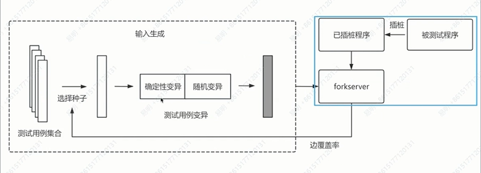
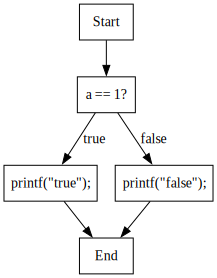
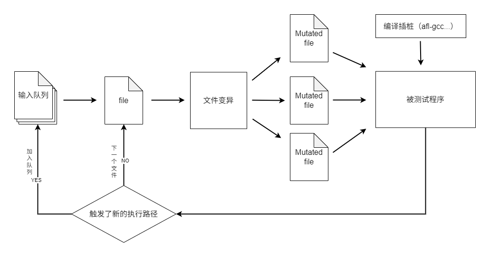
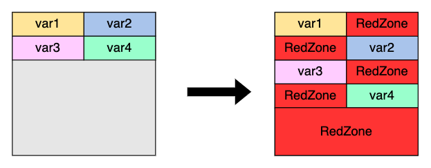
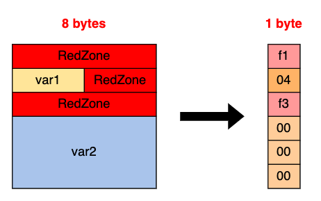
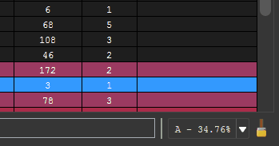

## 前言

玩 Fuzz 也有一段时间了，也是想通过本文对 Fuzz 的原理思想和 AFL 的工具的使用做一个总结。也是对这些内容做一个整理吧。希望可以帮助到后来者。


## 基本概念

### 模糊测试简介

Fuzz Testing（Fuzzing，即模糊测试）是一种自动化的软件测试方法，其核心概念是**自动生成随机输入**到程序中，并监控程序异常（如崩溃、断言失败等），以发现可能的程序错误。


Fuzz testing 在检测安全漏洞中大放异彩，其通过生成大量的测试用例（test cases）并观测执行结果来寻找漏洞，并且已在大量的应用中发现了上千个漏洞。虽然非常高效，fuzz 仍缺乏系统化的对其缺陷的分析。

- fuzz 需要缩小输入空间（input space）与缺陷空间（defect space，触发缺陷的输入）间的差距；在一个应用当中，漏洞（defects）的存在是分散的（spare），这意味着 defects space 要比 input space 小得多。
- fuzzing 生成大量的测试用例进行重复测试——这需要一种自动化的方法；由于查询与漏洞的复杂性，自动化地执行不同的程序会是一个挑战。


整个 Fuzzing 流程大致可以拆分为三个部分，分别是：数据投喂、数据变异、目标监控。

模糊测试一般是一个自动或半自动的过程，这个过程包括反复操纵目标软件并为其提供处理数据。

所有的模糊器都可分为两大类：基于变异的模糊器，这种模糊器对已有数据样本应用变异技术以创建测试用例。

基于生成的模糊器，这种模糊器通过对目标协议或文件格式建模的方法从头开始产生测试用例。

模糊测试（或模糊测试）是一种自动化软件测试技术，它基于向程序提供随机/突变的输入值并监控其异常/崩溃。

覆盖率引导的进化模糊测试：

- **Evolutionary**: 是一种受进化算法启发的元启发式方法，它基本上包括通过使用选择标准（例如覆盖率）来随时间推移初始子集（种子）的进化和突变。

- **Coverage-guided**: 为了增加发现新崩溃的几率，覆盖率引导式模糊测试程序收集并比较不同输入之间的代码覆盖率数据（通常通过插桩），并选择那些导致新执行路径的输入。

核心原理

- **异常输入测试**：向程序提供非预期输入以发现漏洞
- **自动化变异**：对有效输入进行随机修改生成测试用例
- **覆盖率引导**：通过代码覆盖率优化测试效率(灰盒测试)


主要类型

| 类型                                                         | 特点                       | 适用场景             |
| ------------------------------------------------------------ | -------------------------- | -------------------- |
| **白盒测试**                                                 | 需要源码，深度分析内部结构 | 源码可用时的深度测试 |
| **黑盒测试**                                                 | 无需源码，外部输入测试     | 闭源软件测试         |
| **灰盒测试**                                                 | 轻量级插桩，兼顾效率与深度 | 大多数现代Fuzzer采用 |
| 模糊测试（Fuzzing）是一种自动化的、用于发现软件缺陷或漏洞的测试技术，主要通过向程序输入随机或不合法的数据来测试其健壮性。模糊测试的核心目标是通过不合理或意外的输入触发程序中的异常行为、崩溃或安全漏洞。 |                            |                      |

- 种子：初始输入样本
- 变异：通过修改种子生成新输入
- 覆盖率：衡量测试覆盖代码路径的指标
- 崩溃（crash）：程序因异常输入导致的错误

举一个简单的例子来讲解什么是模糊测试。如下我们有一段简单的代码，代码接收一个数字的输入，它有一个 Bug 会在输入数字 100 时触发，但我们并不知道这个程序存在这个 Bug。我们可以从输入数字 1 开始不断的尝试，逐次递增输入数字，最终发现在数字递增到 100 时程序崩溃退出。

以上我们不断输入尝试的行为就是模糊测试。我们输入的第一个数字 1 就是模糊测试的种子，逐次递增数字就是我们模糊测试的变异策略，最后我们发现这个 Bug 后记录下反馈来分析 Bug 产生的原因。

举个简单例子，文件**test.c**是待测试程序的源代码，该程序从stdin读取8字节后输出，但在输出前会比较输入(`input`) (1)的前两个字节是否为`AB`，如果是就会执行有问题的代码(2)，并触发段错误导致程序终止。这里(1)对应真实程序中的某些执行条件，(2)对应存在问题的代码。

```c
#include <stdio.h>
#include <stdlib.h>

int main() {
    int input;
    printf("Enter a number: ");
    scanf("%d", &input);
    if (num == 100) {
        printf("Critical error triggered!\n");
        abort();  // 程序崩溃
    }
    printf("Processing %d: OK\n", num);
    return 0;
}
```

实际生产环境中 fuzz 目标往往有数万行乃至百万行代码，逐行检查效率太低，自动化才是王道。此出现了模糊测试。模糊测试自动完成：1. 执行目标程序、2. 输入测试数据、3. 报告执行结果，执行这些操作的程序称为fuzzer，根据开发和执行效率需求，会选择不同语言实现。


fuzzer.py：

```python
import subprocess  
​  
target = './test'  
inps = ['AA', 'BB', 'BA', 'AB']  
​  
for inp in inps:  
    try:  
        subprocess.run([target], input=inp.encode(), capture_output=True, check=True)  
    except subprocess.CalledProcessError: # (1)  
        print(f"bug found with input: '{inp}'")  
​  
# (输出)  
# bug found with input: 'AB'
```

在模糊测试出现前，为了验证**程序功能**是否正常，会编写测试脚本或**单元测试**，这与模糊测试的方向不同：前者寻找程序异常，后者仅验证程序功能是否按预期执行。

这也解释了为什么模糊测试被归类在安全领域。正常情况下用户会按照**预期方式**使用服务，因此通过单元测试就代表服务能正常运行。但并非所有用户都会规范操作，如果程序未对这些非预期操作进行检查，就可能存在漏洞，轻则导致服务终止，重则让攻击者获得主机控制权。模糊测试的概念恰好符合攻击者视角：执行程序并输入随机生成的数据，通过执行结果检查当前输入是否满足触发漏洞的条件。

简而言之，模糊测试用于发现程序漏洞，帮助开发者及时修复，避免被攻击者利用。

- 基于生成：根据目标格式规范生成输入
- 基于变异：对现有输入样本进行随机修改
- 灰盒/白盒模糊测试：结合代码覆盖率反馈


灰盒模糊测试的工作流程


AFL 工作流程



AFL 的基于一个理论：执行覆盖的代码越多，越有可能触发异常，这里采用边覆盖率代表覆盖代码的多寡

高级主题：

- 覆盖率优化：学习如何利用代码覆盖率反馈提升效率
- 符号执行：结合模糊测试与符号执行
- 语料库管理：优化种子库，提升变异策略
- 漏洞分析：使用调试工具分析崩溃原因

### 模糊测试分类

基于输入的生成方式，fuzzing 可以分为：

- **基于生成的** （generation-based）：基于文法（grammars）或有效语料库（valid corpus）从头开始生成；如 Fig2 所示，其从一组种子中直接获得输入
- **基于变异的**（mutation-based）：对现有的种子进行变异（mutate）以获得新的输入；对给定的一组种子，基于变异的模糊测试通过 seed schedule、byte schedule、mutation schedule 以获得输入

>需要注意的是，fuzzing 并不需要经历 Fig2 中的所有步骤，例如基于生成的模糊测试并不执行 byte schedule 或 mutation schedule，但关注于从初始输入文件中选择最优的种子组

基于执行时观测到的信息量，fuzzing 可以分为：

- **黑盒**（blackbox）：黑盒模糊测试并不知道每次执行的内部状态，通过使用输入格式化或不同的输出状态来进行优化
- **白盒**（whitebox）：白盒模糊测试对每次执行的内部状态是全部得知的，这使其能系统化地探索目标程序的状态空间；其通常使用 concolic execution（例如 _dynamic symbolic execution，即动态符号执行_ ）来分析目标程序
- **灰盒**（greybox）：灰盒模糊测试获得的执行状态信息在黑盒与白盒之间，例如许多 fuzzer 都使用 _边界覆盖率_ （edge coverage）作为内部执行状态

最通用的执行状态便是代码覆盖率（code coverage，例如 CFGs（control flow graphs） 中的基本块（basic block、边（edges）），覆盖率的基本假设用法是：发现更多的执行状态（例如新的覆盖率）能提高发现漏洞的概率。因此 _覆盖率指导_ （coverage-guided）的模糊测试的目标便是覆盖更多的代码。

Fuzzer 通常使用崩溃（crashes）作为安全漏洞的指示器，因为 crashes 提供了直接的自动记录（OS 会自动发出信号告知程序崩溃），然而有的缺陷并不会显示出 crashes，因此 fuzzer 使用其他的指示器，例如 physical safety violation

但 indicators 仅显示了可能的安全问题，还需要安全工具或人工确认这是一个漏洞（vulnerability）

### 基本块

基本块（basic block），是我们在编程时程序在执行时会因为不同的条件执行不同的代码。基本块的关键特性是：执行时从入口指令开始，且不会中途跳出。在控制流图（CFG，Control Flow Graph）中，每个基本块对应一个节点，节点之间的连线表示程序的控制流。

如下例：

如果`a`的值为 1，即输出`true`，否则输出`false`。这里就构成了一个基本块。

```c
if(a==1){
	printf("true");
}else{
	printf("false");
}
```

我们将上述的代码执行逻辑画成程序执行流程的图（CFG）。



代码从`Start`开始执行，每个方框都代表一个基本块。

- 基于生成输入数据fuzz：1.随机 2. 基于模板生成（如HTTP报文 里面各个字段又可分为 固定不变 任意变动 有限变动）
- 基于变异覆盖制导fuzz：样本变异->触发新路径，感知进程反馈->基于反馈 变异样本再输入

### 覆盖率引导

基于覆盖率的模糊测试（Coverage-guided fuzzing）是一种通过测试程序不同代码路径来发现潜在漏洞的自动化技术。这种方法依赖于覆盖率信息，旨在通过不断地生成新的输入数据，覆盖更多的代码路径，从而触发程序中的潜在漏洞。

工作原理：

1. **初始化**：模糊测试器会生成一些初始输入数据，通常这些输入是随机的或者基于已有的测试样本。然后将这些输入数据提供给目标程序进行测试。

2. **执行程序**：每次执行程序时，模糊测试器会监视程序的执行路径。程序执行过程中，会追踪每个基本块（basic block）的覆盖情况。这意味着它会记录哪些代码行被执行过，哪些没有被执行过。

3. **收集覆盖率信息**：模糊测试器通过插桩或其他手段，收集程序执行的覆盖率信息，通常包括以下几种形式：
   - **基本块覆盖（Basic Block Coverage）**：追踪程序执行时每个基本块是否被触发。
   - **路径覆盖（Path Coverage）**：追踪程序执行的不同路径，帮助了解程序是否遍历了所有可能的路径。
   - **分支覆盖（Branch Coverage）**：追踪程序中每个条件分支的执行情况，确保所有的分支条件都得到测试。
4. **生成新输入**：基于覆盖率信息，模糊测试器会生成新的输入数据，试图覆盖尚未测试的代码路径。通常，模糊测试器会根据当前覆盖的路径选择性地生成新输入，优先尝试覆盖那些尚未触发的代码路径。

5. **迭代**：通过不断生成新的输入数据并执行程序，模糊测试器会尽可能多地覆盖程序的代码路径。如果某个输入数据触发了程序中的崩溃或异常行为，模糊测试器将其记录下来，供后续分析。

通常所说的反馈驱动模糊测试（feedback-driven fuzzer）是指模糊测试器（fuzzer）并非随意生成随机输入和变异，而是通过执行结果的好坏来引导下一次生成或选择的输出。根据反馈的来源，可以大致分为两类：

- **Coverage-guided**（覆盖率引导） - 通过代码覆盖率来引导，执行到的代码越多越好。
- **Data-driven**（数据驱动） - 让特定数据或变量的状态变化越多越好。

大多数模糊测试器都是 **coverage-guided** 类型，其目的是在一定时间内尽可能执行更多的代码。当前较有代表性的覆盖率引导模糊测试器有：

### 代码覆盖率

代码覆盖率的计量单位，通常有 3 种：

- 函数：代码执行时调用到哪些函数；
- 基本块：以指令跳转为作划分边界的；
- 边界：edge相比于基本块多记录了一些执行边界的信息。

代码覆盖率是模糊测试中一个极其重要的概念，使用代码覆盖率可以评估和改进测试过程，执行到的代码越多，找到 bug 的可能性就越大，毕竟，在覆盖的代码中并不能 100% 发现 bug，在未覆盖的代码中却是 100% 找不到任何 bug 的。

代码覆盖率是一种度量代码的覆盖程度的方式，也就是指源代码中的某行代码是否已执行；对二进制程序，还可将此概念理解为汇编代码中的某条指令是否已执行。其计量方式很多，但无论是 GCC 的 GCOV 还是 LLVM 的 SanitizerCoverage，都提供函数（function）、基本块（basic-block）、边界（edge）三种级别的覆盖率检测。

- 基本块

缩写为BB，指一组顺序执行的指令，BB中第一条指令被执行后，后续的指令也会被全部执行，每个BB中所有指令的执行次数是相同的，也就是说一个BB必须满足以下特征：

- 只有一个入口点，BB中的指令不是任何**跳转指令**的目标。
- 只有一个退出点，只有最后一条指令使执行流程转移到另一个BB

例如下图中的代码就可以被切割为4个基本块，平时我们在IDA图形模式中看到的就是一个一个的基本块

- 边（edge）

AFL 通过插桩代码捕获边（edge）覆盖率。那么什么是edge呢？我们可以将程序看成一个控制流图（CFG），图的每个节点表示一个基本块，而edge就被用来表示在基本块之间的转跳。知道了每个基本块和跳转的执行次数，就可以知道程序中的每个语句和分支的执行次数，从而获得比记录BB更细粒度的覆盖率信息。

- 元组

具体到AFL的实现中，使用二元组(branch_src, branch_dst)来记录**当前基本块** + **前一基本块** 的信息，从而获取目标的执行流程和代码覆盖情况，伪代码如下：

```c
cur_location = <COMPILE_TIME_RANDOM>;            //用一个随机数标记当前基本块
shared_mem[cur_location ^ prev_location]++;        //将当前块和前一块异或保存到shared_mem[]
prev_location = cur_location >> 1;                //cur_location右移1位区分从当前块到当前块的转跳
```

实际插入的汇编代码，如下图所示，首先保存各种寄存器的值并设置`ecx/rcx`，然后调用`__afl_maybe_log`，这个方法的内容相当复杂，这里就不展开讲了，但其主要功能就和上面的伪代码相似，用于记录覆盖率，放入一块共享内存中。

### AFL Fuzz流程



覆盖测试->感知进程->路径反馈->基于反馈变异数据

AFL 是一种流行的开源模糊测试工具，专门用于发现程序中的漏洞。它主要通过自动化地生成输入数据并将其提供给程序，观察程序的崩溃或异常行为，从而发现潜在的安全漏洞。

AFL++ 是 AFL 的加强版，旨在解决 AFL 中的一些局限性并增强其功能。AFL++ 保持了 AFL 的大部分功能，但增加了更多的特性和性能优化，使其成为现代模糊测试的更强大工具。所以这里我们直接学习 AFL++。


## 环境搭建

安装 AFL++：

- docker

```shell
# 拉取AFL++镜像
docker pull aflplusplus/aflplusplus
# 运行容器
docker run --name afl -it -d aflplusplus/aflplusplus /bin/bash
# 连接容器
docker exec -it afl /bin/bash
```

- 编译安装

```shell
git clone https://github.com/AFLplusplus/AFLplusplus.git
cd AFLplusplus
make
make install
```

- 预编译包安装

Ubuntu 下可以通过 apt 包管理安装。

```shell
apt install afl++
```


## 基本用法

通过 Fuzzing101 的第一个练习来学习如何使用 AFL++ 进行 fuzz，以及如何通过 gdb 来分析崩溃。

我们 AFL 项目中的例子`test-instr.c`来学习 AFL++ 的基础使用。

```c
#include <stdio.h>
#include <stdlib.h>
#include <unistd.h>

int main(int argc, char** argv) {

  char buf[8];

  if (read(0, buf, 8) < 1) {
    printf("Hum?\n");
    exit(1);
  }

  if (buf[0] == '0')
    printf("Looks like a zero to me!\n");
  else
    printf("A non-zero value? How quaint!\n");

  exit(0);

}
```

首先通过

```
afl-gcc test.c -o test
```

通过`afl-gcc`编译后的文件会在`test`程序中进行插桩。

之后我们需要创建`in`目录和`out`目录作为输入输出目录。

并且我们需要在`in`目录中创建文件作为基础语料样本，afl会自动根据样本变异。

如：

```
aaaaaaaaaaaaaaaaaa
```

之后我们便可以执行以下命令开始 fuzz。

```
afl-fuzz -i in -o out -- ./test   
```

### AFL状态窗口

状态屏幕显示 fuzzing 的实时信息，包括性能、覆盖率和异常情况。


为了帮助您决定何时按Ctrl-C停止，循环计数器会进行颜色编码。在第一次循环时，计数器显示为品红色，如果后续循环仍然有新发现，它会变为黄色，然后变成蓝色，最终当模糊器一段时间没有看到新发现时，会变成绿色。

AFL 的终端 UI 使用不同颜色来快速提示运行状态：

| 颜色            | 含义说明                                         |
| --------------- | ------------------------------------------------ |
| 🟢 **绿色**      | 状态正常，如稳定、正在处理、fuzzing 正常进行     |
| 🔴 **红色**      | **严重问题**，可能阻碍模糊测试效果               |
| 🟣 **紫色**      | **警告状态**，可能代表性能低下、覆盖率差或待调优 |
| 🟡 **黄色**      | 次要警告，例如语料库待优化、初始阶段慢等         |
| ⚪ **白色/灰色** | 静态信息或普通文本                               |

- run time：fuzzer 运行总时长；
- last new find：上次发现新路径所经过的时间；
- last uniq crash：最近唯一crash；
- last uniq hang：最近唯一hang；
- Process timing: Fuzzer运行时长、以及距离最近发现的路径、崩溃和挂起经过了多长时间。
- Overall results：Fuzzer当前状态的概述。
- Cycle progress：我们输入队列的距离。
- Map coverage：目标二进制文件中的插桩代码所观察到覆盖范围的细节。
- Stage progress：Fuzzer现在正在执行的文件变异策略、执行次数和执行速度。
- Findings in depth：有关我们找到的执行路径，异常和挂起数量的信息。
- Fuzzing strategy yields：关于突变策略产生的最新行为和结果的详细信息。
- Path geometry：有关Fuzzer找到的执行路径的信息。
- CPU 000：CPU利用率，绿色为可以利用的更多核心，红色为CPU可能过载。

- cycles done：已完成的队列循环次数；循环计数颜色会随着进度变化，第一轮品红，- 后续仍有新路径黄色，新路径停止蓝色，- 长时间无新发现绿色。
- corpus count：生成的corpus
- saved crashes：保存的crash
- saved hangs：保存的hang

覆盖率信息：

- 做：当前输入触发的分支元组数量；
- 右：整个 corpus 的覆盖率；
- - 高覆盖率（>70%）可能会影响 fuzzer 判别新状态，可通过设置 `AFL_INST_RATIO=10` 重编译降低密度。

阶段进度：

- `calibration`：校准阶段，建立基准执行路径
- `trim L/S`：缩减测试用例长度
- `bitflip L/S`：确定性位翻转
- `arith L/8`：确定性算术变异
- `interest L/8`：覆盖已知特殊整数
- `extras`：字典注入
- `havoc`：随机堆叠变异
- `splice`：跨测试用例拼接
- `sync`：多实例同步（不真正 fuzz）

发现结果：

- `favored paths`：被优先处理的路径
- `new edges on`：覆盖到新分支的测试用例
- `total crashes` / `total tmouts`：总 crash / timeout 数量

路径结构：

- `levels`：队列层级深度
- `pending`：未处理的测试用例
- `pend fav`：优先处理的测试用例
- `own finds`：本实例发现的新路径
- `imported`：从其他实例导入的测试用例
- `stability`：执行路径一致性，100% 表示完全一致

输出：

输出目录包含三个主要子目录。

- `queue`：每个不同执行路径的测试用例；
- `crashes`：导致程序崩溃的唯一测试用例；
- `hangs`：导致超时的唯一测试用例。

语料库：

AFL 需要一些初始输入数据（也叫种子文件）作为 Fuzzing 的起点，这些输入甚至可以是毫无意义的数据，AFL可以通过启发式算法自动确定文件格式结构。

种子的选择：

- 有效的输入
  - 目标可以解析的种子，有效输入可以更快的找到更多执行路径。
- 尽量小的体积
  - 较小的文件会不仅可以减少测试和处理的时间，也能节约更多的内存，AFL给出的建议是最好小于1 KB，但其实可以根据自己测试的程序权衡，这在AFL文档的`perf_tips.txt`中有具体说明。

寻找：

1. 使用项目自身提供的测试用例
2. 目标程序 bug 提交页面
3. 使用格式转换器，用从现有的文件格式生成一些不容易找到的文件格式：
4. AFL 源码的 testcases 目录下提供了一些测试用例
5. 其他大型的语料库

### 结束Fuzz

状态窗口中”cycles done”字段颜色变为绿色该字段的颜色可以作为何时停止测试的参考，随着周期数不断增大，其颜色也会由洋红色，逐步变为黄色、蓝色、绿色。当其变为绿色时，继续Fuzzing下去也很难有新的发现了，这时便可以通过Ctrl-C停止afl-fuzz。

 距上一次发现新路径（或者崩溃）已经过去很长时间了，至于具体多少时间还是需要自己把握，比如长达一个星期或者更久估计大家也都没啥耐心了吧。

目标程序的代码几乎被测试用例完全覆盖，这种情况好像很少见，但是对于某些小型程序应该还是可能的，至于如何计算覆盖率将在下面介绍。

上面提到的pythia提供的各种数据中，一旦**path covera**达到99％（通常来说不太可能），如果不期望再跑出更多crash的话就可以中止fuzz了，因为很多crash可能是因为相同的原因导致的；还有一点就是**correctness**的值达到**1e-08**，根据pythia开发者的说法，这时从上次发现path/uniq crash到下一次发现之间大约需要1亿次执行，这一点也可以作为衡量依据。

### 输出结果

- queue：输入队列，在获取到覆盖率信息后，afl 会将触发了新的状态的输入放到 queue 中，在下次执行时从 queue 中取出新的测试用例并进行变异。
- crashes：导致目标接收致命signal而崩溃的独特测试用例。  
- crashes/README.txt：保存了目标执行这些 crash 文件的命令行参数。  
- hangs：导致目标超时的独特测试用例。  
- fuzzer_stats：afl-fuzz的运行状态。  
- plot_data：用于afl-plot绘图。

### 处理测试结果

- crash exploration mode

这是afl-fuzz的一种运行模式，也称为**peruvian rabbit mode**，用于确定bug的可利用性

```
afl-fuzz -m none -C -i poc -o peruvian-were-rabbit_out -- ~/src/LuPng/a.out @@ out.png
```

- triage_crashes

AFL源码的`experimental`目录中有一个名为_triage_crashes.sh_的脚本，可以帮助我们触发收集到的crashes。例如下面的例子中，11代表了 SIGSEGV 信号，有可能是因为缓冲区溢出导致进程引用了无效的内存；06代表了SIGABRT信号，可能是执行了abort\assert函数或double free导致，这些结果可以作为简单的参考。

```shell
triage_crashes.sh fuzz_out ~/src/LuPng/a.out
```

- crashwalk

当然上面的两种方式都过于鸡肋了，如果你想得到更细致的 crashes 分类结果，以及导致 crashes 的具体原因，那么[crashwalk](https://github.com/bnagy/crashwalk)就是不错的选择之一。这个工具基于gdb的exploitable插件，安装也相对简单，在ubuntu上，只需要如下几步即可：

```shell
$ apt-get install gdb golang
$ mkdir tools
$ cd tools
$ git clone https://github.com/jfoote/exploitable.git
$ mkdir go
$ export GOPATH=~/tools/go
$ export CW_EXPLOITABLE=~/tools/exploitable/exploitable/exploitable.py
$ go get -u github.com/bnagy/crashwalk/cmd/...
```

crashwalk支持AFL/Manual两种模式。前者通过读取**crashes/README.txt**文件获得目标的执行命令（前面第三节中提到的），后者则可以手动指定一些参数。两种使用方式如下：

```shell
#Manual Mode
$ ~/tools/go/bin/cwtriage -root syncdir/fuzzer1/crashes/ -match id -- ~/parse @@
#AFL Mode
$ ~/tools/go/bin/cwtriage -root syncdir -afl
```

- afl-collect

最后重磅推荐的工具便是`_afl-collect_`，它也是`_afl-utils_`套件中的一个工具，同样也是基于 exploitable 来检查 crashes 的可利用性。它可以自动删除无效的crash样本、删除重复样本以及自动化样本分类。使用起来命令稍微长一点，如下所示：

```shell
$ afl-collect -j 8 -d crashes.db -e gdb_script ./afl_sync_dir ./collection_dir --  /path/to/target --target-opts
```


## 源码测试

模糊测试流程：

- 编写目标

**LAF-Intel/COMPCOV**：分解整数、字符串、浮点和 switch 比较，用于提升 fuzz 效率。

```shell
export AFL_LLVM_LAF_ALL=1
```

**CMPLOG/Redqueen**：记录比较值，自动注入输入。

```shell
export AFL_LLVM_CMPLOG=1
export AFL_LLVM_ONLY_FSRV=1
```

开启 Sanitizer：

ASAN / MSAN / UBSAN / CFISAN / TASN / LSAN

```shell
export AFL_USE_ASAN=1
```

去掉 checksum、HMAC 等阻碍 fuzz 的逻辑：

```c
#ifdef FUZZING_BUILD_MODE_UNSAFE_FOR_PRODUCTION
    return 0;
#endif
```

构建目标：

   * configure 系统：

```bash
CC=afl-clang-fast CXX=afl-clang-fast++ ./configure --disable-shared
```

   * CMake：

```bash
mkdir build; cd build
cmake -DCMAKE_C_COMPILER=afl-cc -DCMAKE_CXX_COMPILER=afl-c++ ..
```

   * Meson：

```bash
CC=afl-cc CXX=afl-c++ meson
```

高级加速：

   * **Persistent Mode** → 快速 fuzz，需编写专门调用目标函数的 harness。
   * **LibFuzzer harness** → 支持 AFL++ fuzz：

```bash
afl-clang-fast++ -fsanitize=fuzzer -o harness harness.cpp targetlib.a
```


收集种子，然后对种子进行去重。

```bash
afl-cmin -i INPUTS -o INPUTS_UNIQUE -- bin/target -someopt @@
```

最小化输入（可选）：

   ```bash
mkdir input
cd INPUTS_UNIQUE
for i in *; do
    afl-tmin -i "$i" -o "../input/$i" -- bin/target -someopt @@
done
   ```

开始 fuzzing：

   ```bash
afl-fuzz -i input -o output -- bin/target -someopt @@
   ```

性能优化：

   * 内存限制：

```bash
afl-fuzz -m 256
```

   * 超时限制：

     ```bash
     afl-fuzz -t 5000
     ```

   * 多核多实例：

     ```bash
     afl-fuzz -M main -i input -o out -- ./target
     afl-fuzz -S secondary1 -i - -o out -- ./target
     ```

分布式：

   * 主实例 `-M main-$HOSTNAME`，次实例 `-S xxx`
   * 定时 rsync `out` 目录同步队列。

监控 fuzz 状态：

```bash
afl-whatsup -s out/
afl-plot out/ /srv/www/htdocs/plot
```

暂停与恢复：

   * 停止：Ctrl+C
   * 恢复：

```bash
afl-fuzz -i - -o output -- ./target
AFL_AUTORESUME=1
```

添加新种子：

```bash
AFL_BENCH_JUST_ONE=1 AFL_FAST_CAL=1 afl-fuzz -i newseeds -o out -S newseeds -- ./target
```


## 基础实例

### 环境配置


- 编译

```shell
#进入项目目录
cd /root/Fuzzing101/Exercise1

#安装编译工具
sudo apt install build-essential

#下载xpdf源码
wget https://dl.xpdfreader.com/old/xpdf-3.02.tar.gz
tar -xvzf xpdf-3.02.tar.gz

#编译
cd xpdf-3.02
./configure --prefix="/root/Fuzzing101/Exercise1/xpdf-3.02/install/"
make
make install
```

- 测试

```shell
cd 
mkdir pdf_examples && cd pdf_examples
wget https://github.com/mozilla/pdf.js-sample-files/raw/master/helloworld.pdf
wget http://www.africau.edu/images/default/sample.pdf
wget https://www.melbpc.org.au/wp-content/uploads/2017/10/small-example-pdf-file.pdf
```

### 编译插桩

- afl-gcc
- afl-clang-fast
- afl-clang-lto

afl-clang-lto是当前最佳选择，其优势包括：

- 无冲突插桩
- 比afl-clang-fast更快
- 提供更好的测试结果

```shell
#使用afl-clang-fast编译
cd xpdf-3.02
export LLVM_CONFIG="llvm-config-11"
CC="/AFLplusplus/afl-clang-fast" CXX="/AFLplusplus/afl-clang-fast++" \
./configure --prefix="/root/Fuzzing101/Exercise1/xpdf-3.02/install"
make
make install
```

### Fuzzing

开始 Fuzzing：

```shell
afl-fuzz -i in -o out -s 123 -- xpdf-3.02/install/bin/pdftotext   -- xpdf-3.02/install/bin/pdftotext @@ xpdf-3.02/install output
```

- `-i`：输入种子目录
- `-o`：输出目录
- `-s`：随机种子
- `--`：设置测试目标
- `@@`：占位符，表示AFL会将变异后的文件作为参数传递给目标程序。

若出现核心转储提示，执行：


### crash分析

gdb调试

首先定义到发生崩溃的点，动静结合。

通过ida静态分析结合动态分析进行定位。

```shell
gdb --args $HOME/Desktop/Fuzz/training/fuzzing_xpdf/install/bin/pdftotext $HOME/Desktop/Fuzz/training/fuzzing_xpdf/out/default/crashes/id:000000,sig:11,src:000182,time:11158,execs:4841,op:havoc,rep:2 $HOME/Desktop/Fuzz/training/fuzzing_xpdf/output
```

### vscode+gdb分析

通过 vscode+gdb 进行动态调试。

在 vscode 要调试的文件目录下创建一个`.vscode`目录，并在目录下编写一个`launch.json`文件。

```json
{
    "version": "0.2.0",
    "configurations": [
        {
            "name": "Debug",
            "type": "gdb",
            "request": "launch",
            "target": "./uaf",
            "cwd": "${workspaceFolder}",
            "valuesFormatting": "parseText",
        }
    ]
}
```

### afl-analyze

```shell
afl-analyze -i 输入文件 目标文件
```

可以得到造成该 crash 的原始输入，以及其中真正造成 crash 的部分；


## 高级功能

优化 Fuzzing 的方法：

- 缩小种子体积：使用 afl-cmin
- 减少程序启动时间：如何程序开销较大，则可用`-Q`关闭 AFL 的 forkserver 模式，或者尝试使用持久模式
- 开启并发：`-M`，设置主进程，`-S`，设置从进程
- 设置超时：`-t`设置超时时间，`1000`毫秒，`1`秒
- 字典优化：选择精炼的字典
- afl-cov：分析测试覆盖率，指导种子补充

### ASan

AddressSanitizer (ASan) 是 Google 开发的 C/C++ 内存错误检测工具，包含一个编译器插桩模块和一个运行时库，用于在编译时对目标进行插桩从而检测诸如以下安全问题：

- 堆/栈/全局变量的越界访问
- 释放后使用（use-after-free）
- 重复释放
- 内存泄漏

原理说明：

每个变量都会有自己的内存空间来存储值，也就是下方图示中的`var{1,2,3,4}`各自的方格，而这些内存都是连续分配的。对于 pwn 手来说会很熟悉，如果写入目标变量超出容量大小的数据就会导致越界。比如写入超出`var1`大小的数据就可能越界到`var2`，乃至是`var3`和`var4`。

然而 ASAN 会在原本的连续内存中间插入 red zone，代表这些是不应被访问的内存区域。如果`var1`数据越界影响到`var{2,3,4}`，这样就会修改中间的 red zone，ASAN 会通过检查 red zone 是否被覆盖从而判断是否存在漏洞。



因此在每次进行内存访问前，会检查访问地址是否位于 red zone，如果是就会触发 asan 报告，将错误原因输出。

实际使用 **shadow memory** 技术来优化访问速度。假设访问的内存地址为 0x87870000，首先会将该地址右移三个 3 位 (1)，再加上一个固定的偏移量 (2)，得到的内存地址就是 shadow memory。

shadow memory 中存放的值表示要访问的内存类型，如果值为 00，表示正常范围，01~07 表示内存本来就不对齐，因此还需要考虑内存访问时的偏移量 (4)。而小于 0 的值表示漏洞发生 (3)，并且不同的值代表不同的意义。举例来说，当发生 **Freed heap region** (UAF) 漏洞时，值就会是 `fd`。

```c
void *a;  
char magic;  
long unsigned shadow_mem_addr;  
​  
a = (void *)0x87870000;  
shadow_mem_addr = (long unsigned)a >> 3; // (1)  
shadow_mem_addr += 0x7fff8000; // (2)  
magic = *(char *)shadow_mem_addr;  
​  
if (magic < 0) // (3)  
    dump_and_abort();  
​  
if ( ((long unsigned)a & 7) > magic) // (4)  
    dump_and_abort();
```

一开始用 `var{1,2,3,4}` 做介绍，这里用 `var{1,2}` 示范 shadow memory 的应用：



而 **leak checker** (LSAN) 会在程序结束执行前执行另一个进程，并通过 ptrace 来 attach 当前的进程。接着会分析：1. 全局变量、2. 正在执行线程的栈、3. 正在执行线程的寄存器、4. TLS 中存放的数据。这些内存地址中的值会形成 root set。之后，LSAN 会检查 root set 的值是否指向 heap block 的指针，并且该块内存仍是活跃的，表示仍在被使用。

要启用ASAN，请在执行`make clean all`之前设置`AFL_USE_ASAN=1`。`afl-gcc` / `afl-clang`包装器会自动添加适当的标志。请注意，ASAN与`-static`不兼容，因此需要特别注意。

- 编译插桩

```shell
cd $HOME/fuzzing_tcpdump/libpcap-1.8.0/
export LLVM_CONFIG="llvm-config-11"
CC=afl-clang-lto ./configure --enable-shared=no --prefix="$HOME/fuzzing_tcpdump/install/"
AFL_USE_ASAN=1 make

cd $HOME/fuzzing_tcpdump/tcpdump-tcpdump-4.9.2/

#通过设置环境变量启动ASan
AFL_USE_ASAN=1 CC=afl-clang-lto ./configure --prefix="$HOME/fuzzing_tcpdump/install/"
AFL_USE_ASAN=1 make
AFL_USE_ASAN=1 make install
```

### 字典

当我们想要对复杂的基于文本的格式文件（如 XML）进行模糊测试时，通常会使用一个包含基本语法标记的字典。在 AFL 中，字典是一组预定义的、具有特殊格式含义的字段（如 XML 标签等）。

AFL 利用这些字段对测试输入进行变异操作，主要包括：

- 覆盖：使用字典中的某个字段替换输入文件中指定位置的字节，替换长度与字段长度一致。
- 插入：将字典字段插入到文件当前位置，原有内容向后移动，导致文件大小增加。

字典使用：

字典通过`-x`参数指定，一般字典为`dict`后缀的文件。

```
afl-fuzz -i in -o out -x xml.dict -- demo @@
```

字典可以帮助 AFL 在变异过程中生成更符合目标格式规范的测试用例，从而提高模糊测试的效率和有效性。在 AFL 项目的`dictionaries`目录下就存放着很多格式的字典文件。


### 最小化测试用例

文件大小对模糊测试性能有显著影响，主要因为大文件会使目标二进制程序运行变慢，同时也减少了变异操作触及重要格式控制结构的可能性，而这些结构可能会被冗余数据块覆盖。

除了用户可能提供低质量的初始测试用例外，有些类型的突变可能会导致生成的文件逐渐变大，因此必须采取措施来抵消这种趋势。

幸运的是，仪器反馈提供了一种简单的方法来自动修剪输入文件，同时确保文件所做的修改不会影响执行路径。

内置的 AFL 修剪工具（trimmer）尝试顺序删除具有可变长度和步幅的数据块；任何不会影响执行路径的删除都会被保存到磁盘。这个修剪器并不是特别彻底；相反，它力求在精确度和执行过程中的`execve()`调用次数之间找到平衡，选择合适的块大小和步幅。每个文件的平均修剪增益大约为5-20%。

独立的`afl-tmin`工具使用更为详尽的迭代算法，并尝试对修剪后的文件进行字母表标准化。`afl-tmin`的工作流程如下：

首先，工具会自动选择操作模式。如果初始输入导致目标二进制程序崩溃，`afl-tmin`将在未加仪器的模式下运行，仅保留那些能够简化文件但仍导致崩溃的修改。如果目标程序没有崩溃，则使用加仪器的模式，只保留那些能够产生完全相同执行路径的修改。

实际的最小化算法为：

1. 尝试将大数据块置零并使用大步幅。通过经验，这能够通过预先处理较大的修改，避免后续细粒度操作中频繁的`exec`调用。
2. 通过逐步减少块大小和步幅（类似二分查找）进行块删除操作。
3. 通过计算唯一字符并尝试将每个字符替换为零值，执行字母表标准化。
4. 最后，针对非零字节执行逐字节标准化。

`afl-tmin`使用ASCII数字`0`而不是`0x00`来置零。这是因为这种修改更不容易干扰文本解析，因此更有可能成功简化文本文件。

该算法没有一些学术研究提出的复杂测试用例最小化方法，但需要的执行次数远少，且在大多数实际应用中产生的结果可比。

对用例进行裁剪，afl-tmin 用于对单个样本的裁剪，afl-cmin用于对样本集合的裁剪，将路径相同的样本删除只保留一个

```shell
# 指令格式： afl-cmin -i 样本目录 -o 输出目录 [-Q] -- 要fuzz的可执行程序 [程序参数]
# 指令格式： afl-tmin -i 样本文件 -o 输出文件 [-Q] -- 要fuzz的可执行程序 [程序参数]
# 其中 '要fuzz的可执行程序' 必须是带有路径的，不能直接使用，比如 'djpeg 1.jpeg' 可以执行成功，但是fuzz时必须将 'djpeg' 的路径一并带上才可以，即 '/usr/bin/djpeg'
# 默认情况下afl-cmin和afl-tmin会把样本以标准输出的方式喂给要fuzz的程序，如果fuzz程序是从参数指定的文件中读取数据进行处理的，则需要使用 '@@' 来代替输入的文件路径，比如原本执行的指令为 'djpeg in_afl_min/1.jpeg' ，fuzz时指令应为 '/usr/bin/djpeg @@'
# 在安装了qemu-mode时，可以支持 '-Q' 选项，如果目标可执行程序
# 当然这两个指令还有一些其它参数，这里就不介绍使用了，以上为常见用法

afl-cmin -i in_afl -o in_afl_min -Q -- /usr/bin/djpeg @@
afl-tmin -i in_afl_min/1.jpeg -o in_afl_min/1_new.jpeg -Q -- /usr/bin/djpeg @@
```


AFL 自带一个工具 `afl-cmin`，它可以从一批种子文件里自动筛选最小集合，保证覆盖率最大化，同时删除冗余文件。

```shell
afl-cmin -i input_dir -o output_dir -- ./timg -p k --title --center -W --upscale=i --clear=every --threads=4 --auto-crop=3 @@
```

- `input_dir` 是原始种子目录，`output_dir` 是精简后的种子目录。
- 这样生成的种子集体积更小、覆盖更广，提升模糊效率。


### 持久模式

AFL 的默认行为是每次测试一个新的输入样本时就`fork()`一个新的进程。这对启动速度较慢的程序（比如大型程序）效率较低。

持久化模式（Persistent Mode） 是 AFL 提供的一种可以加快 Fuzz 执行速度的功能。持久化模式基于进程内模糊测试技术，通过以下方式提升效率：

- 在单个进程中多次执行测试（而非每次 fork 新进程）
- 只`fork()`一次，循环执行目标代码，每次处理一个输入。
- 大幅减少进程创建与销毁的开销。
- 速度可提升高达 20 倍

可以简单理解为无需每次都进行`fork()`操作，而只是在程序的某一特定位置进行循环 fuzz。

配置持久模式的两种方式：

- 使用`__AFL_LOOP()`宏

这种方式需要我们修改项目源代码，在合适的位置插入。

```c
// 程序初始化  
while (__AFL_LOOP(10000)) {  
  /* 读取输入数据 */  
  /* 调用待测试库代码 */   
  /* 重置状态 */  
}  
// 测试结束
```

- 使用编译器选项

通过`AFL_LLVM_PERSISTENT_ADDR=main`环境变量指定持久化模式的函数入口点，比如让 AFL 从`main`函数开始进行持久化模式插桩。

```shell
AFL_USE_ASAN=1 AFL_LLVM_PERSISTENT_ADDR=main afl-clang-fast -o demo demo.c
```

我们测试哪些项目哪些地方适合启动持久化模式呢？

- 启动开销大：程序启动耗时 > 10ms（如 GUI、解释器、复杂初始化）
- 测试逻辑可重复：主题逻辑可以多次执行且状态可复位（如解析器、函数调用）
- 嵌入库：Fuzz 的目标是函数 / 库（如 libxml，libjpeg）
- 输入/输出开销大：频繁从磁盘加载 / 写入数据的操作可内存重用。

适合插入持久化模式代码的项目地方：

主函数中包裹测试逻辑。

```c
int main(int argc, char** argv) {
  // 初始化
  setup();

  // 使用 AFL 持久模式宏
  while (__AFL_LOOP(10000)) {
    read_input();
    process_input();
    reset_state();  // 清理状态
  }

  return 0;
}
```

测试库函数：

```c
int main(int argc, char** argv) {

  while (__AFL_LOOP(10000)) {
    int len = read(0, buf, MAX_LEN);
    parse_json(buf, len);  // 要测试的函数
  }

  return 0;
}
```

注意：使用 AFL 不要同时启用多线程和持久模式，这样会导致崩溃或覆盖率误报。

```diff
--- ../xcf.c	2014-08-20 08:27:58.000000000 -0700
+++ ./app/xcf/xcf.c	2021-10-11 13:02:42.800831192 -0700
@@ -277,6 +277,10 @@
 
   filename = g_value_get_string (&args->values[1]);
 
+#ifdef __AFL_COMPILER
+  while(__AFL_LOOP(10000)){
+#endif
+
   info.fp = g_fopen (filename, "rb");
 
   if (info.fp)
@@ -366,6 +370,12 @@
   if (success)
     gimp_value_set_image (&return_vals->values[1], image);
 
+#ifdef __AFL_COMPILER
+  }
+#endif
+
+  exit(0);
+
   gimp_unset_busy (gimp);
 
   return return_vals;
```


### 延迟插桩

```c
#include <stdio.h>
#include <stdlib.h>
#include <unistd.h>
#include <signal.h>
#include <string.h>


/* Main entry point. */

int main(int argc, char** argv) {

  char buf[100]; /* Example-only buffer, you'd replace it with other global or
                    local variables appropriate for your use case. */

  /* The number passed to __AFL_LOOP() controls the maximum number of
     iterations before the loop exits and the program is allowed to
     terminate normally. This limits the impact of accidental memory leaks
     and similar hiccups. */

  while (__AFL_LOOP(1000)) {

    /*** PLACEHOLDER CODE ***/

    /* STEP 1: Fully re-initialize all critical variables. In our example, this
               involves zeroing buf[], our input buffer. */

    memset(buf, 0, 100);

    /* STEP 2: Read input data. When reading from stdin, no special preparation
               is required. When reading from a named file, you need to close
               the old descriptor and reopen the file first!

               Beware of reading from buffered FILE* objects such as stdin. Use
               raw file descriptors or call fopen() / fdopen() in every pass. */

    read(0, buf, 100);

    /* STEP 3: This is where we'd call the tested library on the read data.
               We just have some trivial inline code that faults on 'foo!'. */

    if (buf[0] == 'f') {
      printf("one\n");
      if (buf[1] == 'o') {
        printf("two\n");
        if (buf[2] == 'o') {
          printf("three\n");
          if (buf[3] == '!') {
            printf("four\n");
            abort();
          }
        }
      }
    }

    /*** END PLACEHOLDER CODE ***/

  }

  /* Once the loop is exited, terminate normally - AFL will restart the process
     when this happens, with a clean slate when it comes to allocated memory,
     leftover file descriptors, etc. */

  return 0;

}
```

```c
#include <stdio.h>

int main(){

	ssize_t len;
	char buf[100];

	__AFL_INIT();
	while(__AFL_LOOP(UINT_MAX)){
		memset(buf,0,100);

		len=read(0,buf,100);
		if(len < 8) continue;

		if(buf[0]=='f'){

			printf("one\n");
			if(buf[1]=='o'){

				printf("two\n");
				if(buf[2]=='o'){
			
					printf("three\n");
					if(buf[3]=='!'){
			
						printf("four\n");
						if(buf[4]=='!'){
					
							printf("five\n");
							if(buf[5]=='!'){

								printf("six\n");
								abort();
		}
}
```

延迟插桩，在程序运行的起点直接启动 forkserver，当 afl 需要创建子进程时就从这里 fork 一个子进程。

将`__AFL_INIT()`放在哪里，相当于指定forkserver在哪里生成。比如将其放在无意义源码的下方，这样afl会直接略过无意义的代码。

```c
__AFL_INIT();
while(__AFL_LOOP(UNIT_MAX))
```

在一次子进程接收多次样本的投喂。

将它抱起来，在外面加一个while循环。让其运行多次，这样就可以接收多次样本投喂。路径覆盖制导，投喂一百次样本如何让程序将覆盖制导信息返回给afl。如何让后面的投喂不受前面的影响。

`__AFL_LOOP`的使用场景，对网络程序进行fuzz。在fuzz网络程序中我们并不关注socket创建初始化的过程，我们可以通过`AFL_INIT`略过这部分代码，然后对`recv`进行fuzz。

仅插桩你需要的部分

仅对你现在要压力测试的库进行插桩，一次一个。让程序在任何不需要模糊测试的功能上使用系统范围的、未插桩的库。例如，在大多数情况下，不必因为你正在测试一个依赖于libgmp的大数数学的加密应用程序而对libgmp进行插桩。

当程序包含一些奇怪的第三方库时（例如，Spidermonkey），请检查`./configure`选项，使用系统范围的非插桩版本。

### 部分插桩

覆盖率引导模糊测试工具的一个优势是它能够自动发现新的执行路径，但这同时也会产生一些问题。对于具有高度模块化架构的软件（如 VLC），每个模块复杂特定任务，导致如下问题：假设我们向模糊测试工具提供一个有效的 MKV 文件，经过多次变异后，文件的“魔数”发生变化，程序将其视为 AVI 文件，由 AVI 解复用器处理。随后文件再次变异被识别为 MPEG 文件。在这两种情况下，变异文件缺乏有效的语法结构，增加代码覆盖率的潜力较低。

简言之，如果不对代码覆盖率施加限制，模糊测试工具可能选择错误的路径，降低模糊测试效率。

为解决该问题，AFL++ 提供了**部分插桩功能**，允许指定哪些函数或文件需要插桩，哪些不需要。这样模糊测试工具能专注于程序重要部分，避免无关代码路径带来的噪音和干扰。

使用时，在编译阶段设置环境变量 `AFL_LLVM_ALLOWLIST`，该变量指向一个文本文件，文件中列出所有应插桩的函数名或文件路径，每行一个。这样只有白名单中的代码会被插桩，提高测试效率和准确性。

部分插桩就是只对部分代码路径插入代码，忽略一些无关紧要或低价值的路径。

修改插桩比例：

```shell
AFL_INST_RATIO=10 afl-clang-fast -o target target.c
```

表示只有 10% 的分支会被插桩。

黑名单/白名单：

只允许对白名单中的函数进行插桩，其它函数不插桩。同样，仅不对黑名单中的函数进行插桩，其他函数都会被插桩。

```shell
AFL_LLVM_ALLOWLIST=allow.txt #指定白名单
AFL_LLVM_DENYLIST=deny.txt   #指定黑名单
```

- `allow.txt` 中列出希望插桩的函数名、源文件路径。
- `deny.txt` 中列出不希望插桩的目标。

示例白名单 / 黑名单文件：

```c
#include <stdio.h>

void process_data() {
    printf("Processing data...\n");
}

void handle_error() {
    printf("Handling error...\n");
}

void main() {
    process_data();
    handle_error();
}
```

- 白名单

仅对`process_data`函数插桩。

在文件中列出不希望插桩的函数。

```
demo.c

fun:process_data
```


配合持久化模式手动控制插桩区域：

```c
#ifdef __AFL_COMPILER
  while(__AFL_LOOP(10000)) {
    // 只有这里被插桩
  }
#endif
```


### 并行

在 AFL 中如果我们对路径指向有特定要求的程序进行 Fuzz，比如以下这种情况：

```c
if(strcmp(buf,"abc"))
{...}
else{
	...
}
```

输入内容必须为`abc`才能进入`if`路径，这种情况下我们 AFL 直接进行 Fuzz 只能通过不断对输入样本进行变异来让输入达到这种要求。但是这样 Fuzz 的效率极低，我们例子中的要求很少，如果要求很大比如几十个字符，那样的话就更难达到变异要求了。

这时候我们就可以通过字典来加大 Fuzz 效率，如果的字典中有`abc`，则`abc`会被插入到样本中。这样就直接满足了要求。AFL++ 项目中就内置了很多字典

如果我们不指定字典，同样可以通过库函数插桩来进入路径中

```c
if(buf[0]=='a')
	if(buf[1]=='b')
		if(buf[2]=='c')
```

如果想要更高的效率，可以去逆向研究一下要 Fuzz 的程序，将一些可能的固定搭配收集成字典。

#### 并行化

现在我们的计算机一般都是多核的 CPU，所以我们可以通过并行化模糊测试充分利用 CPU 的资源。

- 独立实例

这是最简单的并行化策略。在这种模式下，我们运行多个完全独立的 AFL 实例。

需要记住的是，AFL 使用非确定性的测试算法。因此，如果我们运行多个 AFL 实例，将增加成功的机会。

你只需要在多个终端窗口中运行多个 "afl-fuzz" 实例，并为每个实例设置不同的 "输出文件夹"。一种简单的方法是根据你系统的核心数运行多个模糊测试任务。

注意：如果你使用了 `-s` 参数，需要为每个实例使用不同的种子。

- 共享实例

使用共享实例是更好的并行化模糊测试方法。在这种模式下，每个模糊测试实例会收集其他模糊测试实例发现的测试用例。

通常情况下，你只有一个主实例：

```shell
./afl-fuzz -i afl_in -o afl_out -M Master -- ./program @@
```

和 N-1 个从实例：

```shell
./afl-fuzz -i afl_in -o afl_out -S slave1 -- ./program @@
./afl-fuzz -i afl_in -o afl_out -S slave2 -- ./program @@
...
./afl-fuzz -i afl_in -o afl_out -S slaveN -- ./program @@
```

#### 单系统并行化

如果您希望在本地系统的多个核心上并行化单个作业，只需创建一个新的空输出目录（“同步目录”），并让所有 afl-fuzz 实例共享该目录；然后为每个实例命名，例如“fuzzer01”、“fuzzer02”等。

启动第一个（“主”实例，-M）如下：

```bash
$ ./afl-fuzz -i testcase_dir -o sync_dir -M fuzzer01 [...其他参数...]
```

然后，启动其他（-S）实例如下：

```bash
$ ./afl-fuzz -i testcase_dir -o sync_dir -S fuzzer02 [...其他参数...]
$ ./afl-fuzz -i testcase_dir -o sync_dir -S fuzzer03 [...其他参数...]
```

每个 fuzzer 会将自己的状态保存在不同的子目录中，例如：

```
/path/to/sync_dir/fuzzer01/
```

每个实例也会定期重新扫描顶层同步目录，查看其他模糊测试器是否发现了有趣的测试用例，如果有，它们会将这些用例纳入自己的模糊测试过程中。

-M 和 -S 模式的区别在于，主实例仍然会执行确定性检查；而其他实例会直接进行随机调整。如果您不希望进行确定性模糊测试，完全可以让所有实例都使用 -S 模式。对于非常慢或复杂的目标，或者在高度并行化的作业中，这通常是个不错的选择。

注意：运行多个 -M 实例是浪费资源的，虽然目前有实验性支持来并行化确定性检查。若要利用此功能，您需要按如下方式创建 -M 实例：

```bash
$ ./afl-fuzz -i testcase_dir -o sync_dir -M masterA:1/3 [...其他参数...]
$ ./afl-fuzz -i testcase_dir -o sync_dir -M masterB:2/3 [...其他参数...]
$ ./afl-fuzz -i testcase_dir -o sync_dir -M masterC:3/3 [...其他参数...]
```

其中，冒号后的第一个值是特定主实例的顺序 ID（从 1 开始），第二个值是总共要分配确定性模糊测试的 fuzzers 数量。请注意，如果您启动的 fuzzers 少于第二个数字指定的数量，可能会导致覆盖不足。

您还可以使用 afl-whatsup 工具从命令行监控作业进度。当实例不再发现新的路径时，可能是停止的时候了。

警告：在显式指定 -f 选项时要小心。每个 fuzzer 必须使用单独的临时文件；否则可能会发生冲突。一个安全的例子是：

```bash
$ ./afl-fuzz [...] -S fuzzer10 -f file10.txt ./fuzzed/binary @@
$ ./afl-fuzz [...] -S fuzzer11 -f file11.txt ./fuzzed/binary @@
$ ./afl-fuzz [...] -S fuzzer12 -f file12.txt ./fuzzed/binary @@
```

如果不使用 -f 选项并且让 afl-fuzz 自动生成文件名，通常不会有问题。


#### 多系统并行化

多系统并行化的基本操作原理与第 2 节中解释的机制相似。关键区别在于，您需要编写一个简单的脚本，执行以下两个操作：

- 使用 SSH 和 authorized_keys 连接到每台机器，并获取每个 <fuzzer_id> 本地机器上的 /path/to/sync_dir/<fuzzer_id>/queue/ 目录的 tar 归档。最好为每个 fuzzer ID 使用一个包含主机名的命名方案，例如：

  ```bash
  for s in {1..10}; do
    ssh user@host${s} "tar -czf - sync/host${s}_fuzzid*/[qf]*" >host${s}.tgz
  done
  ```

- 在所有剩余机器上分发并解压这些文件，例如：

  ```bash
  for s in {1..10}; do
    for d in {1..10}; do
      test "$s" = "$d" && continue
      ssh user@host${d} 'tar -kxzf -' <host${s}.tgz
    done
  done
  ```

在 experimental/distributed_fuzzing/ 中有一个这样的脚本示例；您还可以找到 Martijn Bogaard 开发的一个更完整的实验工具：[https://github.com/MartijnB/disfuzz-afl](https://github.com/MartijnB/disfuzz-afl)

Richo Healey 提供的另一个客户端-服务器实现是：[https://github.com/richo/roving](https://github.com/richo/roving)

请注意，这些第三方工具不适宜在暴露于互联网或不受信任的用户的系统上运行。

在开发自定义的测试用例同步代码时，有几个优化点需要注意：

- 同步不必太频繁；每 30 分钟同步一次通常就可以了。
- 不需要同步 crashes/ 或 hangs/ 目录；只需要复制`queue/*`（最好还包括 fuzzer_stats）。
- 不需要（而且不建议）覆盖现有的文件；tar 中的 -k 选项是避免这一点的好方法。
- 不需要获取那些在某台机器上没有运行的模糊测试器的目录，它们可能只是之前复制到该系统上的。
- 对于大规模的系统群，您将希望合并每台主机的 tar 包，这样就可以通过 n 个 SSH 连接来同步，而不是 n*(n-1)。
- 您还可以实现分阶段同步。例如，可以将系统分为 10 组，第 1 组只向第 2 组推送测试用例，第 2 组只向第 3 组推送，以此类推，最终第 10 组会将测试用例回传给第 1 组。

这种安排将使得有趣的测试用例能够在系统群之间传播，而无需将每个 fuzzer 的队列复制到每一台主机上。

- 不要在每台机器上运行一个 “主” 实例；您应当让它们都使用 -S，并仅在某个地方指定一个实例运行 -M。

不建议跳过同步脚本直接在网络文件系统上运行模糊测试器，因为意外的延迟和无法终止的进程可能会导致 I/O 等待状态，进而影响结果。

#### 远程监控和数据收集

您可以使用 screen、nohup、tmux 或类似工具来运行远程的 afl-fuzz 实例。如果您将程序的输出重定向到文件，它将自动从复杂的 UI 切换为更简单的状态报告。每个实例的输出目录都会有一个机器可读的基本信息，可以通过 afl-whatsup 工具查看。

原则上，您可以通过监控主实例（-M）的状态屏幕来查看整体的模糊测试进度，决定何时停止。在这种模式下，最重要的信号就是当长时间没有发现新路径时。如果您没有主实例，只需选择任意一个次要实例进行监控。

您也可以依赖该实例的输出目录来收集覆盖了整个系统群中所有有意义路径的合成语料库。次要实例（-S）不需要任何特殊监控，只要确保它们处于运行状态即可。

请注意，崩溃的输入不会自动传播到主实例，因此您可能仍然需要通过同步或健康检查脚本来监控整个系统群的崩溃情况（参见 afl-whatsup）。

### 输入优化

`afl-tmin`：对测试用例进行裁剪

给定一个输入测试样本（能触发某些行为，如crash或独特路径），尽可能缩小它的大小，同时保持它能复现该行为。

```
afl-tmin -i <原始输入文件> -o <精简后输出文件> -- <被测程序> [程序参数，可能含@@]
```

实现流程：

1. 首先解析命令行参数
2. 建立共享内存`setup_shm`（供目标程序记录覆盖）
3. 加入输入
4. 执行一次目标程序，获取 baseline 行为 `run_target(..., first_run=1)`
5. 根据是 crash 还是 coverage 模式决定精简方式
6. 执行 `minimize()`，进行多阶段最小化。将数据按照块替换为`0`，如果行为不变则保留替换。


`afl-cmin`：用于从一个 fuzzing 初始语料库筛选出能够覆盖最多边的最小文件集合，从而提高 fuzz 效率，减少冗余输入。

用法：

```shell
afl-cmin -i in -o out -- demo @@
```

最小化崩溃样本：

```shell
afl-cmin -C -i crashes/ -o crashes_min/ -- ./target @@
```

原理：afl-cmin 调用 afl-showmap 对每个输入样本执行一次，收集每个样本触发的覆盖信息，并通过贪心策略选择最小数量的样本，覆盖最多路径。

实现流程：

1. 检查环境与参数：确保输入目录、输入目录、目标程序合法。如果目标未插桩，则只允许使用 -Q 模式。检查师傅能从样本中成功运行出覆盖。
2. 收集样本覆盖信息：对于每个样本用`afl-showmap`执行，每个样本一个 trace 文件，记录该样本的触发边列表。
3. 通过`sort | uniq`操作对所有边信息进行统计，输出`.all_uniq`文件。记录每个边被多少样本命中，从少到多排序。
4. 建立边与最小样本的映射：对于每个样本，将其触发的边添加到`.candidate_list`中，所有样本按文件大小升序处理（较小样本优先）。
5. 贪心选择样本写入输出目录：遇到一个还未覆盖的边，就保留它的最小触发样本。然后把该样本所触发的所有边都加入已覆盖列表，避免重复。

### 状态分析

状态分析 (afl-showmap.c, afl-analyze.c)

`afl-showmap`：单独调用可以查看 AFL 插桩后的程序对于某输入所触发的路径。也会被 afl-cmin、afl-tmin调用。

用法：

```
afl-showmap -o map.txt -- test @@
```

实现流程：

1. 先初始化一块共享内存用于存储目标程序覆盖率信息。
2. 创建子进程执行目标程序，通过共享内存读取目标程序执行后留下的覆盖率 bitmap。
3. 将 bitmap 中每个字节的命中计数转换为更具可读性的数值。
4. 将处理后的 bitmap 写入指定输出文件，支持多种格式。

`afl-analyze`：用于对用例进行分析，发现其中有意义的字段。

用法：

```shell
afl-analyze -i <input_file> -- <target_program> [target_args ...]
```

实现流程：

1. 初始化共享内存，准备执行环境。
2. 将输入文件的每个字节执行4种变异操作，然后将变异后的输入写入临时文件，并执行程序获取覆盖。
3. 通过比较变异后的覆盖率和原始覆盖率的关系，将该字节分为无影响、轻微影响、固定影响、多变影响等类。
4. 按字节输出分类结果，可选颜色高亮。


`afl-plot`：为 AFL 生成 gnuplot 图表的工具，它根据 AFL 的状态数据生成三种不同类型的图像，并将它们嵌入到一个 HTML 文件中供用户查看。

用法：

```
afl-plot <input_dir> <output_dir>
```


### 资源管理

资源管理 (afl-whatsup, afl-gotcpu.c)

`afl-whatsup`：AFL 自带的一个状态检测脚本，用来快速汇总和查看本地同步模式下多个 AFL 实例的运行状态。

用法：

```shell
./afl-whatsup afl_sync_dir
#只输入汇总结果
afl-whatsup.sh -s AFL多实例同步目录
```

实现流程：

1. 处理参数，并做目录检查（如果目录中有`queue`）则说明是单个实例输出目录，脚本拒绝运行。
2. 生成一个临时文件，用于后续把 fuzzer_stats 格式转换为 shell 变量再 source。
3. 变量所示实例。

`afl-gotcpu`：检查当前系统中是否有空闲的 CPU core 可以运行更多afl-fuzz实例。

用法：直接执行`afl-gotcpu`文件。


### 输入捕获

`libtokencap.so.c`：它重新定义了标准库中常见的字符串和内存比较函数。当这些函数被调用时，会检测其指针参数是否指向只读内存区域（比如程序代码段、常量字符串段），这部分内存很可能包含 “interesting tokens”（有用的常量字符串、关键字、魔数等）。如果参数位于只读段，则将该字符串或内存块经过转义后写入一个指定文件，用于后续测试使用。

简单来说就是用来制作针对于目标程序的字典文件。

例：

如果目标程序含有如下内容。

```c
if (!strcmp(buf, "username=admin")) { ... }
```

libtokencap 将提取 "username=admin" 并存入 token 文件。

用法：

指定文件输出路径。

```shell
export AFL_TOKEN_FILE=/tokens.txt
```

运行目标程序时注入该库：

```shell
LD_PRELOAD=./libtokencap.so ./target_binary
```


### 内存检测

`libdislocator.so.c`：实现了一个自定义的内存分配器，用于执行内存检测。可以检测如内存泄露、重复释放、使用后释放等。

用法：

```shell
LD_PRELOAD=./libdislocator/libdislocator.so ./target_binary @@
```


## 代码覆盖率测量

代码覆盖率是一种软件指标，表达了每行代码被触发的次数。在进行模糊测试的过程中，我们需要知道我们的 fuzzer 执行的效果怎么样，这个时候就可以使用上代码覆盖率。通过使用代码覆盖率，我们可以了解 fuzzer 已经到达了代码的哪些部分，并可视化 fuzzing 过程。

IDA 的 Lighouse 插件可以通过读取 Pin 产生的覆盖率日志文件，在 IDA 中以图形化形式展现代码的详细执行路径。

在 lighthouse 项目的 coverage目录下提供了 Pin 测量代码覆盖率的 Pintool。

Pin等插桩工具默认使用的日志文件格式为`drcov`格式，这是一种二进制格式，每个基本块的信息的都是以十六进制数据进行记录。虽然二进制形式的记录方式有利于提高性能，但是人工阅读困难。

### Pin

环境配置：

直接进行编译时发生了报错，这里对`Code`文件做了一些修改：

**`std::tr1`命名空间错误**：- 错误表明代码尝试使用`std::tr1::unordered_map`和`std::tr1::unordered_set`，但这些在较新的C++标准中已不再需要

```cpp
//using unordered_set = std::tr1::unordered_set<V>;
using unordered_set = std::unordered_set<V>;

template <typename K, typename V>
//using unordered_map = std::tr1::unordered_map<K, V>;
using unordered_map = std::unordered_map<K, V>;
}
```

获取代码覆盖率日志：

通过 pintool 插桩获取覆盖率。

```shell
pin -t ./obj-intel64/CodeCoverage.so -- /bin/true
```

模块白名单：

通过`-w`参数只采集目标模块。

```shell
pin -t obj-intel64/CodeCoverage.so -w test -- ./test
```


### Frida

通过 frida 动态注入并记录基本块执行信息。覆盖率文件格式与 drcov 兼容，可直接导入 Lighthouse。

环境配置：

```
pip3 install frida
```

收集目标进程覆盖率

```shell
python3 frida-drcov.py <进程名 | PID>

#指定输出路径
python frida-drcov.py -o out.log <进程名 | PID>
```

模块白名单过滤：

```shell
python frida-drcov.py -w libfoo -w libbaz foo
```

多线程目标过滤：

```shell
python frida-drcov.py -t 543 -t 678 foo
```


导出 HTML 覆盖率报告（这里直接偷官方的图了）。



### lcov

接下来我们使用 lcov 来展示代码覆盖率工具的使用。

lcov 是 gcc 测试覆盖率的前段图形展示工具。它通过收集多个源文件的行、函数和分支的代码覆盖信息（程序执行之后生成gcda、gcno文件）并且将收集后的信息生成 HTML 页面。生成 HTML 需要使用 genhtml 命令。

- 使用LCOV测量代码覆盖率
- 利用覆盖率数据提升模糊测试效率

代码覆盖率是衡量代码执行情况的指标，能可视化模糊测试过程。

安装 lcov：

```shell
apt install lcov
```

通过添加代码覆盖率参数构建项目。

```shell
CFLAGS="--coverage" LDFLAGS="--coverage"
make
```

收集覆盖率数据：

```shell
lcov --zerocounters --directory ./
lcov --capture --initial --directory ./ --output-file app.info
$HOME/fuzzing_tiff/install/bin/tiffinfo -D -j -c -r -s -w $HOME/fuzzing_tiff/tiff-4.0.4/test/images/palette-1c-1b.tiff
lcov --no-checksum --directory ./ --capture --output-file app2.info
```

命令说明：

- `lcov --zerocounters`：重置计数器
- `lcov --capture --initial`：生成基线覆盖率文件
- 运行目标程序（可多次执行不同输入）
- 保存当前覆盖率状态

生成 HTML 报告：

```shell
genhtml --highlight --legend -output-directory ./html-coverage/ ./app2.info
```

打开`./html-coverage/index.html`即可查看交互式报告

覆盖率统计 fuzz

```shell
CC=afl-gcc CFLAGS="--coverage" LDFLAGS="--coverage" ./configure --prefix="$HOME/Desktop/Fuzz/training/fuzzing_tiff/install/" --disable-shared

AFL_USE_ASAN=1 make -j$(nproc)
AFL_USE_ASAN=1 make install

lcov --zerocounters --directory ./   # 重置计数器
lcov --capture --initial --directory ./ --output-file app.info

afl-fuzz -m none -i $HOME/Desktop/Fuzz/training/fuzzing_libtiff/tiff-4.0.4/test/images/ -o $HOME/Desktop/Fuzz/training/fuzzing_libtiff/out/ -s 123 -- $HOME/Desktop/Fuzz/training/fuzzing_libtiff/install/bin/tiffinfo -D -j -c -r -s -w @@

lcov --no-checksum --directory ./ --capture --output-file app2.info
```

这里面的一个需要注意的点是，lcov是利用的 GCC 的一些功能，所以我们在指定 CC 的时候，需要使用 afl-gcc，而基于 llvm 的 afl-clang-fast/afl-clang-lto 都无法成功进行 lcov 的初始化，这也是 lcov 不方便的地方。

fuzz 的速度会变慢，所以这里可以使用 Master-Slave 模式来加快 fuzz 速度。

代码覆盖率对于 AFL 这种基于覆盖引导的 fuzzer 来说，意义重大，判定 fuzzer 效果好坏的关键因素之一就是看其代码覆盖率的高低。在对 fuzzer 进行优化和改进时，往往也是朝着可以提升代码覆盖率的方向去更改，毕竟执行越多的代码，越有可能发现更多的问题。

## Harness

在测试一些库的时候我们需要编写一个包装脚本来进行对目标库的封装。

在针对有些目标的时候我们通常需要修改目标的源代码使其支持被测试。

### 基本示例

```c
#include <stdio.h>
#include <stdint.h>
#include <stdlib.h>

extern int readconf(FILE *fp);  // 被 fuzz 的目标函数

int main(int argc, char **argv) {
    FILE *fp = fopen(argv[1], "r");
    if (!fp) return 0;
    readconf(fp);
    fclose(fp);
    return 0;
}
```

### 持久化模式

```c
#include <stdio.h>
#include <stdint.h>
#include <stdlib.h>

extern int readconf(FILE *fp);

#ifdef __AFL_HAVE_MANUAL_CONTROL
#  define AFL_INIT() __AFL_INIT()
#else
#  define AFL_INIT()
#endif

int main(int argc, char **argv) {
    __AFL_FUZZ_INIT();  // 初始化持久模式
    AFL_INIT();
    unsigned char *buf = __AFL_FUZZ_TESTCASE_BUF;
    size_t len;

    while (__AFL_LOOP(10000)) {
        len = __AFL_FUZZ_TESTCASE_LEN;
        FILE *fp = fmemopen(buf, len, "r");
        if (!fp) continue;
        readconf(fp);
        fclose(fp);
    }
    return 0;
}
```

### libFuzzer兼容

```c
#include <archive.h>
#include <archive_entry.h>
#include <stdlib.h>
#include <string.h>

int LLVMFuzzerTestOneInput(const uint8_t *data, size_t size) {
  struct archive *a;
  struct archive_entry *entry;
  int r;

  if (size < 128) return 0; // 跳过太小输入

  a = archive_read_new();

  // 启用常见格式支持（tar/zip/cpio）
  archive_read_support_format_all(a);
  archive_read_support_filter_all(a);

  if ((r = archive_read_open_memory(a, data, size)) != ARCHIVE_OK) {
    archive_read_free(a);
    return 0;
  }

  while (archive_read_next_header(a, &entry) == ARCHIVE_OK) {
    const void *buff;
    size_t size;
    int64_t offset;

    while (archive_read_data_block(a, &buff, &size, &offset) == ARCHIVE_OK) {
      // 消耗数据避免优化器忽略逻辑
      (void)buff;
    }
  }

  archive_read_free(a);
  return 0;
}
```

AFL ++ 在编译和运行时提供了一种 libFuzzer 模式，实现方式如下：

编译时兼容，当 AFL++ 检测到目标代码定义了：

```c
int LLVMFuzzerTestOneInput(const uint8_t *Data, size_t Size);
```

它就会自动使用提供的适配器（入口点）：

内部自动插入如下主函数。

```c
int main(int argc, char **argv) {
  u8 *buf = load_file(argv[1], &len);  // 加载 @@ 指定的输入文件
  LLVMFuzzerTestOneInput(buf, len);   // 调用 fuzzing 主函数
}
```

编译方式：

```shell
afl-clang-fast -o fuzz_target fuzz_target.c
```

```cpp
#include <stddef.h>
#include <stdint.h>
#include <algorithm>
#include <string>
#include <vector>

#include "libxml/parser.h"
#include "libxml/tree.h"
#include "libxml/xmlversion.h"

void ignore (void * ctx, const char * msg, ...) {
  // Error handler to avoid spam of error messages from libxml parser.
}

// Entry point for LibFuzzer.
extern "C" int LLVMFuzzerTestOneInput(const uint8_t *data, size_t size) {
  xmlSetGenericErrorFunc(NULL, &ignore);

  std::vector<uint8_t> buffer(size + 1, 0);
  std::copy(data, data + size, buffer.data());

  xmlRegexpPtr x = xmlRegexpCompile(buffer.data());
  if (x)
    xmlRegFreeRegexp(x);

  return 0;
}
```

```cpp
#include <stddef.h>
#include <stdint.h>

#include "./libxml2/include/libxml/parser.h"

void ignore (void* ctx, const char* msg, ...) {
  // Error handler to avoid spam of error messages from libxml parser.
}

extern "C" int LLVMFuzzerTestOneInput(const uint8_t* data, size_t size) {
  xmlSetGenericErrorFunc(NULL, &ignore);

  if (auto doc = xmlReadMemory(reinterpret_cast<const char*>(data),
                               static_cast<int>(size), "noname.xml", NULL, 0)) {
    xmlFreeDoc(doc);
  }

  return 0;
}
```

### 修改源代码

```diff
--- vlc-demux-run_backup.c	2017-11-24 07:29:18.000000000 -0800
+++ vlc-demux-run.c	2021-11-04 19:03:32.966251147 -0700
@@ -31,7 +31,7 @@
 #include <stdio.h>
 #include "src/input/demux-run.h"
 
-int main(int argc, char *argv[])
+int main2(int argc, char *argv[])
 {
     const char *filename;
     struct vlc_run_args args;
@@ -49,3 +49,66 @@
 
     return -vlc_demux_process_path(&args, filename);
 }
+
+//#include <fstream>
+#include <errno.h>
+#include <stdlib.h>
+#include <fcntl.h>
+
+#include <sys/types.h>
+#include <sys/stat.h>
+#include <unistd.h>
+
+#include <inttypes.h>
+
+int main(int argc, char **argv){
+
+	if (argc != 2) {
+		fprintf(stderr, "Usage %s <input file> \n", argv[0]);
+		return -1;
+	}
+	
+	struct vlc_run_args args;
+	libvlc_instance_t *vlc;
+
+	vlc_run_args_init(&args);
+	vlc = libvlc_create(&args);
+
+	int len;
+	unsigned char *buf;
+
+	//string filename(argv[1]);
+
+#ifdef __AFL_COMPILER
+
+	while (__AFL_LOOP(1000)) {
+
+#endif
+
+		int fd = open(argv[1], O_RDONLY);
+
+		if(fd < 0){
+			printf("Error opening file \n");
+			printf("Errno: %i\n", errno);
+			return -1;
+		}
+
+		struct stat st;
+		stat(argv[1], &st);
+		len = st.st_size;
+
+		buf = (unsigned char *)malloc(len);
+
+		read(fd, buf, len);
+
+//		libvlc_demux_process_memory(vlc, &args, buf, len);
+
+		vlc_demux_process_memory(&args, buf, len);
+
+#ifdef __AFL_COMPILER
+
+	}
+
+#endif
+
+}
```


### libxml2编译Fuzz

构建并安装 libxml2：

```shell
sudo apt-get install python-dev  
CC=afl-clang-lto CXX=afl-clang-lto++ CFLAGS="-fsanitize=address" CXXFLAGS="-fsanitize=address" LDFLAGS="-fsanitize=address" ./configure --prefix="$HOME/Fuzzing_libxml2/libxml2-2.9.4/install" --disable-shared --without-debug --without-ftp --without-http --without-legacy --without-python LIBS='-ldl'  
make -j$(nproc)  
make install
```

现在，我们可以测试是否安装成功：

```shell
./xmllint --memory ./test/wml.xml
```

### 种子语料库创建

首先，我们需要一些 XML 示例文件。我们将使用提供的 **SampleInput.xml** 文件：

```shell
mkdir afl_in && cd afl_in  
wget https://raw.githubusercontent.com/antonio-morales/Fuzzing101/main/Exercise%205/SampleInput.xml  
cd ..
```

### 自定义字典

接下来，创建一个 XML 字典。你也可以使用 AFL++ 提供的 XML 字典：

```shell
mkdir dictionaries && cd dictionaries  
wget https://raw.githubusercontent.com/AFLplusplus/AFLplusplus/stable/dictionaries/xml.dict  
cd ..
```

### Fuzzing

为了捕获漏洞，必须启用 `--valid` 参数。我还通过 **-x 参数** 设置了字典路径，并通过 **-D 参数** 启用了确定性变异（仅对于主模糊测试器）：

例如，我使用以下命令运行了模糊测试：

```shell
afl-fuzz -m none -i ./afl_in -o afl_out -s 123 -x ./dictionaries/xml.dict -D -M master -- ./xmllint --memory --noenc --nocdata --dtdattr --loaddtd --valid --xinclude @@
```

你可以使用以下命令运行另一个从实例：

```shell
afl-fuzz -m none -i ./afl_in -o afl_out -s 234 -S slave1 -- ./xmllint --memory --noenc --nocdata --dtdattr --loaddtd --valid --xinclude @@
```

### Crash分类

要调试一个使用 ASan 构建的程序非常简单，你只需要将崩溃文件输入程序：

```shell
./xmllint --memory --noenc --nocdata --dtdattr --loaddtd --valid --xinclude './afl_out/default/crashes/id:000000,sig:06,src:003963,time:12456489,op:havoc,rep:4'
```

### 案例

简化概括，整体算法流程如下：

1. 将用户提供的初始测试用例加载到队列中。
2. 从队列中取出下一个输入文件。
3. 尝试将测试用例缩减到不会改变程序行为的最小尺寸。
4. 使用各种平衡且经过验证的传统模糊策略反复变异文件。
5. 如果生成的变异导致新的状态转移（由插桩记录），将其加入队列作为新条目。
6. 返回步骤 2。

同时，AFL++ 会定期清理已过时的测试用例，并执行其他基于插桩的优化步骤。

通过模糊测试，还会生成一个**小而自包含的有趣测试用例集合**（corpus），可用于进一步测试，比如浏览器、办公应用、图形工具或闭源软件的压力测试。

```shell
# LLVM 插桩模式
export AFL_LLVM_INSTRUMENT=CLASSIC,CTX #传统覆盖率插桩，CTX上下文敏感插桩，记录调用上下文
export AFL_LLVM_CMPLOG=1 #开启比较日志，记录程序中的比较操作，并尝试生成输入来“满足”这些比较，从而探索更多代码路径

# 运行
export AFL_AUTORESUME=1 #自动从上一次的测试状态继续，而不是从头开始
```

对动态库进行模糊测试有两种方法，都需要编写小型 harness 调用库，然后使用 FRIDA 或 QEMU 模式进行模糊，并使用 `AFL_INST_LIBS=1` 或 `AFL_QEMU/FRIDA_INST_RANGES`。

另一种更慢且不精确的方法是使用 `utils/afl_untracer/`，模板为 `afl-untracer.c`。

`afl-untracer` 是一个示例骨架文件，可以方便地用于 fuzz 封闭源代码的库。

相比 QEMU 模式，它 **占用更少内存**，并且速度 **快 3~5 倍**，但粒度更粗，且不提供诸如 `compcov` 或 `cmplog` 这样的高级功能。

目前支持 **Intel（i386/x86_64）** 和 **AARCH64** 平台。

该思路基于 [UnTracer](https://github.com/FoRTE-Research/UnTracer-AFL)，并由 [Trapfuzz](https://github.com/googleprojectzero/p0tools/tree/master/TrapFuzz) 进行修改。

当前实现速度较慢，因为陷阱（traps）不会在每次运行时被移除，但相对而言能提供更 **准确的覆盖信息**。

使用方法：

#### 修改 afl-untracer.c

1. 打开并修改 `afl-untracer.c`，然后执行 `make` 编译。
2. 要定制 `afl-untracer.c`，请先阅读文件头部说明，然后查找并编辑 `STEP 1`、`STEP 2` 和 `STEP 3` 的位置。

---

#### 生成 patches.txt 文件

1. 使用 `ida_get_patchpoints.py`（IDA Pro）或 `ghidra_get_patchpoints.java`（Ghidra）生成目标库的 `patches.txt` 文件。
2. `patches.txt` 文件需要通过环境变量 `AFL_UNTRACER_FILE` 指定。

> 如果不想打开 Ghidra GUI，可以使用 headless 模式：

```bash
/opt/ghidra/support/analyzeHeadless /tmp/ tmp$$ -import libtestinstr.so -postscript ./ghidra_get_patchpoints.java
rm -rf /tmp/tmp$$
```

生成的文件默认位于 `~/Desktop/patches.txt`。

#### Fuzzing

示例（在修改好 `afl-untracer.c`、编译完成并生成 `patches.txt` 后）：

```bash
LD_LIBRARY_PATH=/path/to/target/library AFL_UNTRACER_FILE=./patches.txt afl-fuzz -i in -o out -- ./afl-untracer
```

> 也可以通过 `afl-network-proxy` 进行远程 fuzz。

#### 测试与调试

可以使用以下命令进行调试：

```bash
make DEBUG=1
AFL_UNTRACER_FILE=./patches.txt AFL_DEBUG=1 gdb ./afl-untracer
```

然后可以方便地在 `"breakpoint"` 和 `"fuzz"` 位置设置断点。

## 二进制程序

Black Box（黑盒 fuzz）就是在没有源代码的情况下对已经被编译好的二进制程序进行 fuzz。这样我们就无法编译插桩了，这样我们该怎么 fuzz 这个程序呢？

- 静态二进制重写
  -  Trampoline（跳转） - 将基本块的开头指令改成 `{call, jmp} XXXX`，跳到指定地址 `XXXX`，该地址中放置用于收集覆盖度的指令，同时还会执行/修复原本的程序片段，最后再跳回原始代码。

- 重新组装（Reassemble） - 尝试将新增的指令嵌入原本的基本块中，挑战在于如何重新组织原指令，使其仍能维持原程序逻辑，并且新增的指令不会影响程序执行。
- 动态二进制插桩
  - 通过模拟器模拟程序执行，特别是在将基本块转成IR之前，先插入一段收集覆盖度的IR，在动态模拟执行时就能知道执行了哪些基本块。

动态和静态各自的优点：

- 动态：可以获得数据的状态，比如结构或类型，结果较为准确。
- 静态：只做一次分析和修正，就能节省后续执行带来的开销。

在实际应用中我们应用最多的就是动态二进制插桩。

QEMU 是一个用于模拟程序执行的工具，主要应用于测试程序的执行，或者执行不同指令集的程序。QEMU 实际上分为两种模式：全系统仿真和用户模式仿真，前者是包含操作系统执行的模拟，后者仅模拟程序的执行。QEMU 的代码库非常庞大，由多个组件组成，因此无法做非常详细的介绍，但大致的流程如下：

1. **初始化** - 一些初始化服务，比如内存管理等，必须在执行程序之前完成。
2. **处理执行文件** - 读取用户指定的执行文件并解析其元数据。
3. **模拟执行** - QEMU 提供了多种模拟方式，但基本上都很复杂。最直观的方式是：逐行读取指令，查看指令的助记符（如 `add`、`sub` 等），执行相应的处理器，记录执行结果，然后执行下一条指令。

AFL 的二进制模式是通过 QEMU 模拟器实现的。不过，QEMU 默认并不会记录覆盖率，因此需要修改 QEMU 的源代码来实现这一功能。相关的 patch 文件可以在 [AFL repo qemu_mode/patches](https://github.com/google/AFL/tree/master/qemu_mode/patches) 中找到，下面简要介绍一下这些修改的内容。

有一些 diff 文件仅做了一些初始化和配置，以下是简要的文字说明：

- `syscall.diff` - 更新 kill 处理，确保发送 `SIGABRT` 时 forkserver 线程能够接收到。
- `configure.diff / memfd.diff` - 使用内存映射（memory mapping）而不是内存文件描述符（memory fd）。
- `elfload.diff` - 在解析执行文件的元数据时，初始化 `afl_start_code` 和 `afl_end_code`，这两个标记代表需要被收集覆盖率的程序代码地址的起始和结束位置，`afl_entry_point`用来记录程序的入口点。

- `AFL_QEMU_CPU_SNIPPET2` 宏会在执行到程序代码地址等同于 `afl_entry_point` 时唤醒 fork server，并记录新的覆盖率。
- `AFL_QEMU_CPU_SNIPPET1` 宏则会提前通知 QEMU 进行转换，避免在 fork 后还要重新进行转换，从而减少额外的开销。
  - QEMU 转换会将原本程序的汇编代码转换为 QEMU 能够理解的形式（IR），然后模拟执行时会更快。


针对二进制程序进行 fuzzing，有两种方法：一种是动态二进制插桩，另一种是静态二进制重写。

根据官方文档描述，QEMU 模式和 Frida 模式是最快的，当然是可以使用持久模式且程序足够稳定。否则可以尝试 Zafl、RetroWrite、Dyninst；如果这些都失败，再尝试标准的 FRIDA/QEMU 模式，并使用 `AFL_ENTRYPOINT` + `AFL_EXITPOINT`。unicorn_mode 多用于非 Linux 系统及异架构程序。

**静态二进制重写**：

二进制重写器是 AFL++ 的替代方案，速度快但不总是可用。

- ZAFL：[开源软件 / zafl ·GitLab 的](https://git.zephyr-software.com/opensrc/zafl)
- [HexHive/retrowrite：RetroWrite -- 改造编译器通过二进制重写](https://github.com/HexHive/retrowrite)
- [开源软件 / zafl ·GitLab 的](https://git.zephyr-software.com/opensrc/zafl)
- [HexHive/retrowrite：RetroWrite -- 改造编译器通过二进制重写](https://github.com/HexHive/retrowrite)

**动态二进制插桩**：

| 模式           | 依赖               | 源码 | 二进制 | 特点                       | 场景                    |
| -------------- | ------------------ | ---- | ------ | -------------------------- | ----------------------- |
| coresight_mode | ARM CoreSight 硬件 | 否   | 可     | 硬件跟踪，低开销           | ARM/IoT 设备            |
| frida_mode     | Frida              | 否   | 可     | 动态 hook                  | Android/iOS，API hook   |
| nyx_mode       | KVM + QEMU         | 可   | 可     | 全系统仿真，快照，加分布式 | 复杂 Linux 用户态程序   |
| qemu_mode      | QEMU               | 否   | 可     | 二进制插桩                 | 二进制-only，交叉平台   |
| unicorn_mode   | Unicorn            | 否   | 可     | CPU 仿真，灵活、快速       | 单函数/固件/IoT fuzzing |

### 环境配置

使用`-Q`参数开启 qemu mode。

```shell
ACRO_INSTALL_DIR=/opt/Adobe/Reader9/Reader ACRO_CONFIG=intellinux LD_LIBRARY_PATH=$LD_LIBRARY_PATH:'/opt/Adobe/Reader9/Reader/intellinux/lib' afl-fuzz -Q -i ./afl_in/ -o ./afl_out/ -t 2000 -- /opt/Adobe/Reader9/Reader/intellinux/bin/acroread -toPostScript @@

afl-fuzz -Q -i ./in -o ./out -t 2000 -- mb @@
```

但现在模糊测试速度非常慢：在我的机器上大约每秒7次执行。那么，我们如何提高模糊测试速度呢？

我们接下来了解 qemu 的持久模式。

QEMU 模式是 AFL++ 的“原生”解决方案，位于 `./qemu_mode/` 目录中。编译后，可通过 `afl-fuzz -Q` 使用。它是最易用的替代方案，甚至适用于跨平台二进制。

对于 Linux 程序及其库，这是通过 QEMU 的“用户空间仿真模式”（user space emulation）实现的。QEMU 是独立于 AFL++ 的项目，但可以方便地构建该功能：

```shell
cd qemu_mode
./build_qemu_support.sh
```

推荐的 QEMU 模式设置：

* 运行一个 `afl-fuzz -Q` 实例，使用 CMPLOG（`-c 0` + `AFL_COMPCOV_LEVEL=2`）
* 运行一个 `afl-fuzz -Q` 实例，使用 QASAN（`AFL_USE_QASAN=1`）
* 运行一个 `afl-fuzz -Q` 实例，使用 LAF（`AFL_PRELOAD=libcmpcov.so` + `AFL_COMPCOV_LEVEL=2`），或者使用 FRIDA 模式，将 `-Q` 换成 `-O` 并去掉 LAF 实例

然后根据剩余核心数运行尽可能多的实例，可使用 `-Q` 模式或静态二进制重写器（如 Dyninst、RetroWrite、ZAFL 等）。
二进制重写器各有优缺点，但 ZAFL 是不错的选择。

如果二进制重写器可用，则可以正常使用 afl-fuzz，其速度大约是 QEMU 模式的两倍（但比 QEMU 持久模式慢）。

QEMU 模式速度下降约 50%。可以通过以下方式提高速度：

* 使用 AFL\_ENTRYPOINT 将 forkserver 入口移动到更晚的基本块（+5-10%）
* 使用持久模式（可实现 150-300% 的速度提升）
* 使用 AFL\_CODE\_START/AFL\_CODE\_END 仅插桩特定部分

> 持久模式约比编译时插桩慢 2-5 倍，并且不利于并行化，但对于二进制模糊测试可显著提升速度。


### 环境配置

```
CPU_TARGET=i386 ./build_qemu_support.sh
make distrib
sudo make install
```

针对黑盒、仅有二进制目标的仪器化是通过QEMU的“用户仿真”模式实现的。这也允许执行跨架构的代码——例如，在x86上运行ARM二进制程序。

QEMU使用基本块作为翻译单元；仪器化则是在此基础上实现的，模型类似于编译时钩子：

```c
if (block_address > elf_text_start && block_address < elf_text_end) {

    cur_location = (block_address >> 4) ^ (block_address << 8);
    shared_mem[cur_location ^ prev_location]++;
    prev_location = cur_location >> 1;
}
```

QEMU模式的启动相对较慢；为了解决这个问题，AFL fork服务器通过提供仿真器与父进程之间的通信通道来进行优化。该通道用于通知父进程任何新遇到的块的地址，并将其添加到翻译缓存中，以便将来子进程可以复用。

通过这些优化，QEMU模式的开销大约为2-5倍，相比之下，PIN的开销超过100倍。

我们前面所学习的都是通过 AFL 对开源程序进行 Fuzz，下面我们学习如何通过 qemu_mode 对闭源程序进行 Fuzz。

`AFL_USE_QASAN`

使用 qemu fuzz 其它架构的程序，或者将 afl 移植到异架构设备上。

告诉 qemu 从某个地址启动 forkserver，循环起始的地址，循环结束的地址。

通过环境变量进行持续性的 fuzz。


- 编译

```shell
#编译qemu
./build_qemu_support.sh
#fuzz异架构
CPU_TARGET=arm ./build_qemu_support.sh
#移植
STATIC=1 HOST=arm-linux-gnueabi CPU_TARGET=arm ./build_qemu_support.sh
```

- 使用

```shell
afl-fuzz -i in -o out -m none -Q ./test
```

### 延迟初始化

- 设置 `AFL_ENTRYPOINT` 可将 forkserver 移到目标程序特定位置（如文件打开前），提升性能。
- 设置 `AFL_EXITPOINT` 可指定地址终止 forked 实例。

### CMPLOG

- 基于 Redqueen 项目。
- 对 CMP 指令中的即时值建立动态字典，并尝试在输入中解锁匹配。
- 支持 x86、x86_64、arm、aarch64。
- 启用方法：

```bash
afl-fuzz -c /path/to/target
```

### 链接说明

- 仅支持 Linux。
- 插桩仅跟踪第一个 ELF 文件的 `.text`，不追踪共享库。
- 因此：
  1. 想分析的库需静态链接。
  2. C 标准库等可动态链接，以避免无效插桩。
- 设置 `AFL_INST_LIBS=1` 可插桩所有基本块。


### 性能对比

- 为与 `afl-clang-fast` 结果对比，需：
  - 非插桩二进制使用相同优化参数。
  - 测试部分需静态链接。


示例：

```bash
CFLAGS="-O3 -funroll-loops" ./configure --disable-shared
make clean all
```

> 否则速度或覆盖对比意义不大。

---

### 覆盖信息

- 可使用 QEMU 插件 `drcov.c` 收集覆盖信息，输出 Drcov 格式。
- 可用工具分析：
  - [lighthouse](https://github.com/gaasedelen/lighthouse)
  - [lightkeeper](https://github.com/WorksButNotTested/lightkeeper)
  - [Cartographer](https://github.com/nccgroup/Cartographer)
- 编译插件：

```bash
make plugins
```

- 加载插件：

```bash
afl-qemu-trace -plugin qemuafl/build/contrib/plugins/libdrcov.so,arg=filename=/tmp/target.drcov.trace <target> <args>
```

- 执行完成后，覆盖信息写入 `/tmp/target.drcov.trace`。

### Persistent模式

默认情况下，AFL++ 每次变异一个输入样本就会重新启动目标程序，这在 Fuzzing 大型程序的时候非常低效。

持久模式通过在一次程序运行中处理多个输入来显著提高性能，避免每次都要重新启动程序。

插入`AFL_LOOP`是我们告诉 AFL++ 要启用持久模式的方式。但在这种情况下，我们无法访问源代码。

使用`AFL_QEMU_PERSISTENT_ADDR`指定一个函数的地址，告诉 AFL++ 在那里插入持久循环钩子，从而避免重复加载程序。

通过 IDA 反编译工具反编译目标程序，然后寻找合适的偏移量：

```shell
sudo apt install valgrind kcachegrind
```

- `valgrind`：内存调试和性能分析
- `kcachegrind`：用于可视化性能分析数据

使用 callgrind 收集运行数据：

```shell
ACRO_INSTALL_DIR=/opt/Adobe/Reader9/Reader \
ACRO_CONFIG=intellinux \
LD_LIBRARY_PATH=$LD_LIBRARY_PATH:'/opt/Adobe/Reader9/Reader/intellinux/lib' \
valgrind --tool=callgrind /opt/Adobe/Reader9/Reader/intellinux/bin/acroread -toPostScript sample.pdf
```

使用 `kcachegrind` 打开生成的 `callgrind.out.*` 文件：

```shell
kcachegrind
```

建议你在 kcachegrind 中查看`count`字段，识别只执行 1 次的函数，并尝试在 afl-fuzz 中达到超过 90% 的稳定性分数。

设置`AFL_QEMU_PERSISTENT_GPR=1`环境变量，它将在每个持久周期中保存和恢复通用寄存器的原始值。

现在，我们可以用以下命令行运行模糊测试器

```shell
AFL_QEMU_PERSISTENT_ADDR=0x085478AC \
AFL_QEMU_PERSISTENT_GPR=1 \
ACRO_INSTALL_DIR=/opt/Adobe/Reader9/Reader \
ACRO_CONFIG=intellinux \
LD_LIBRARY_PATH=$LD_LIBRARY_PATH:'/opt/Adobe/Reader9/Reader/intellinux/lib' \
afl-fuzz -Q -i ./afl_in/ -o ./afl_out/ -t 2000 -- \
/opt/Adobe/Reader9/Reader/intellinux/bin/acroread -toPostScript @@
```

如你所见，执行时间提高了4倍。

Persistent 模式允许你在两个地址之间持续 fuzz 目标程序，而无需每次都 fork 子进程。这能将 fuzzing 速度提高 **2~5 倍**，因此非常有价值。

目前，Persistent 模式仅支持 **x86/x86_64、arm 和 aarch64** 架构。

如何使用 Persistent 模式：

#### START 地址

- 持续循环的起始地址由环境变量 `AFL_QEMU_PERSISTENT_ADDR` 指定。
- 这个地址可以是任意指令的地址。
  - 如果指向函数开头，使用起来最简单。
  - 如果在函数中间，需要设置 **RET、OFFSET 或 EXITS**（见 2.2、2.3、2.6）。
- 地址必须为十六进制（带 `0x` 前缀）或十进制数。
- 如果未设置 RET 和 EXITS，QEMU 会假设 START 是函数入口，并自动将返回地址 patch 回 START（类似 WinAFL）。

**注意 PIE/PIC 二进制：**

- amd64: 需加 `0x4000000000`
- 32-bit: 加 `0x40000000`
- aarch64: 通常为 `0x5500000000`

可以通过：

```bash
AFL_QEMU_DEBUG_MAPS=1 afl-qemu-trace TARGET-BINARY
```

打印进程内存映射来确认基址。

如果 START 地址无效，`afl-fuzz` 启动时会报错，提示找不到 forkserver。

#### RET 地址

- RET 地址是持续循环的结束指令。
- 模拟器在翻译到 RET 指令时会跳回 START。
- 可选，仅在循环结束不是函数末尾时需要设置。
- 设置方法：`AFL_QEMU_PERSISTENT_RET`，PIE/PIC 下同样需加基址。

#### OFFSET

仅 x86/x86_64

- 如果 START 不是函数开头，且未设置 RET，则需要通过 OFFSET 来找到返回地址在栈上的位置。
- 设置变量：`AFL_QEMU_PERSISTENT_RETADDR_OFFSET`。

**获取方法：**

1. 使用 gdb 附加目标。
2. 在 main 设置断点（PIE/PIC 二进制必须）。
3. 运行目标并输入合法命令行。
4. 在包含 START 的函数设置断点。
5. 在 START 地址设置断点。
6. 运行到函数入口断点，打印 ESP：`print $esp`。
7. 继续到 START 断点，再打印 ESP。
8. 两次 ESP 的差值就是 OFFSET。

#### 重置寄存器状态

- 通常需要在每次循环开始时恢复通用寄存器状态。
- 推荐设置：

```bash
AFL_QEMU_PERSISTENT_GPR=1
```

- 例如将 `main()` 用作 START 时，如果不恢复寄存器，`argc` 会在第二次循环丢失。

```c
int main(int argc, char **argv) {
  if (argc < 2) return 1;
  // 执行逻辑
}
```


#### exit() 时重置

- 可以让 QEMU 在遇到 `exit_group` syscall 时回到 START，而不是退出程序。
- 设置环境变量：`AFL_QEMU_PERSISTENT_EXITS`。

### 部分插桩

- 指定仅插桩地址空间的一部分：

```bash
AFL_QEMU_INST_RANGES=A,B,C...
```

- 排除某些区域：

```bash
AFL_QEMU_EXCLUDE_RANGES=A,B,C...
```

> 排除范围优先于包含范围或 `AFL_INST_LIBS`。

### 实例

- Fuzzing

```shell
AFL_USE_QASAN=1 ACRO_INSTALL_DIR=/opt/Adobe/Reader9/Reader ACRO_CONFIG=intellinux LD_LIBRARY_PATH=$LD_LIBRARY_PATH:'/opt/Adobe/Reader9/Reader/intellinux/lib' /usr/local/bin/afl-qemu-trace -- /opt/Adobe/Reader9/Reader/intellinux/bin/acroread -toPostScript [crashFilePath] 
```

- Crash分析

在发生 crash 之后，使用 afl-qemu-trace 来查看最终的crash信息：

```shell
ACRO_INSTALL_DIR=/opt/Adobe/Reader9/Reader ACRO_CONFIG=intellinux LD_LIBRARY_PATH=opt/Adobe/Reader9/Reader/intellinux/lib /usr/local/bin/afl-qemu-trace -- /opt/Adobe/Reader9/Reader/intellinux/bin/acroread -toPostScript [crashFilePath] 
```

直接按照上面的常规的命令来执行 trace，会报页错误。所以我们使用另外一种方法—— [QASAN](https://github.com/andreafioraldi/qasan)

```shell
AFL_USE_QASAN=1 ACRO_INSTALL_DIR=/opt/Adobe/Reader9/Reader ACRO_CONFIG=intellinux LD_LIBRARY_PATH=opt/Adobe/Reader9/Reader/intellinux/lib /usr/local/bin/afl-qemu-trace -- /opt/Adobe/Reader9/Reader/intellinux/bin/acroread -toPostScript [crashFilePath] 
```

## 后言

在 AFL++ 的 utils 目录中提供了各种各样的辅助 Fuzz 的工具。除了 AFL 之外常用的还有 libFuzzer 和 honggfuzz。其中 libFuzzer 是一个和 AFL 完全不同的 Fuzz 工具，它是一种新的思想的实现，可以说后来的 go-fuzz 等工具都是基于它的思想来实现的。


## Reference

>Fuzzing: A Survey for Roadmap
>[u1f383/fuzzing-learning-in-30-days](https://github.com/u1f383/fuzzing-learning-in-30-days/tree/main#)
>[AFL 漏洞挖掘技术漫谈（一）：用 AFL 开始你的第一次 Fuzzing](https://paper.seebug.org/841/)
>[AFL 漏洞挖掘技术漫谈（二）：Fuzz 结果分析和代码覆盖率](https://paper.seebug.org/842/#_4)
>[AFL二三事 -- 1 - V4ler1an](https://www.v4ler1an.com/2020/12/afl%E4%BA%8C%E4%B8%89%E4%BA%8B1/#%E4%B8%80%E7%AE%80%E4%BB%8B)
>[strongcourage/fuzzing-corpus: My fuzzing corpus](https://github.com/strongcourage/fuzzing-corpus/tree/master)