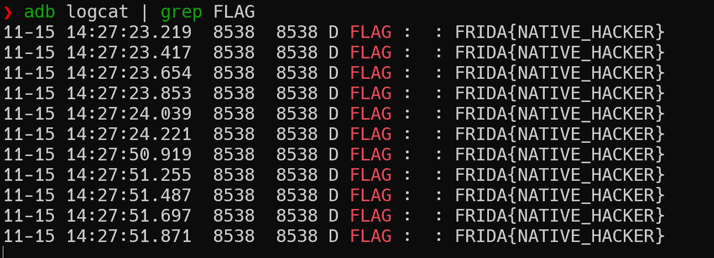

## 简介

Frida 是一款开源的动态插桩工具，可以插入一些代码到原生 App 的内存空间去动态地监视和修改其行为，支持 Windows、Mac、Linux、Android 或者 IOS。从安卓层面来讲，可以实现 Java 层和 Native 层 Hook 操作。

什么是 Hook？Hook 指的是拦截并修改应用程序或 Android 系统本身中函数或方法行为的过程。比如，我们可以 hook 应用里的某个方法，通过插入自己的实现来改变它的功能。

Frida 与 Xposed 的对比：Xposed 配置麻烦，难以 hook 底层代码，Frida 持久化 Hook 相对麻烦。

frida17 相比于 过去的 frida 版本 api 发生了一些变化：

### Legacy-style enumeration API 移除

以前：

```javascript
Process.enumerateModules({
  onMatch(module) { console.log(module.name); },
  onComplete() {}
});
```

现代方式：

```javascript
for (const module of Process.enumerateModules()) {
  console.log(module.name);
}
```

- **原因**：大多数平台的枚举操作本身很快，提供异步接口没必要。
- **TypeScript 用户**：只需要使用现代风格，无需改动旧代码，除非依赖老版本 typings。


### Memory 读写 API 现代化

以前：

```javascript
const playerHealth = Memory.readU32(ptr('0x1234'));
Memory.writeU32(ptr('0x1234'), 100);
```

现代方式：

```javascript
const playerHealthLocation = ptr('0x1234');
const playerHealth = playerHealthLocation.readU32();
playerHealthLocation.writeU32(100);
```

- 支持链式写入：

```javascript
ptr('0x1234')
  .add(4).writeU32(13)
  .add(4).writeU16(37)
  .add(2).writeU16(42);
```

> 旧版 `Memory.readXXX` / `Memory.writeXXX` 已移除。


### 静态 Module API 移除

以下静态方法已经删除：

```text
Module.ensureInitialized()
Module.findBaseAddress()
Module.getBaseAddress()
Module.findExportByName()
Module.getExportByName()
Module.findSymbolByName()
Module.getSymbolByName()
```

迁移方式：

- `Module.getSymbolByName(null, 'open')` → `Module.getGlobalExportByName('open')`
- 其他方法通过先获取模块再操作：

以前：

```javascript
Module.getExportByName('libc.so', 'open');
Module.getBaseAddress('libc.so');
```

现代方式：

```javascript
const libc = Process.getModuleByName('libapp.so'); //获取当前进程中名为 `"libc.so"` 的模块对象。
const openImpl = libc.getExportByName('open');   //获取 `libc.so` 中名为 `"open"` 的导出函数的地址。
const base = libc.base; //获取 libc.so 模块的基址
```


## 环境搭建

安装 python 库：

```shell
pip3 install frida
pip3 install frida-tools
```

下载相应版本的`frida-server`服务端，然后 push 到模拟器。

```shell
adb push .\frida-server-17.0.5-android-x86_64 /data/local/tmp
adb shell
su root
cd /data/local/tmp

#加可执行权限
chmod +x frida-server-17.0.5-android-x86_64

./frida-server-17.0.5-android-x86_64

#也可以自定义端口
./frida-server-17.0.5-android-x86_64 -l 0.0.0.0:6666
```


## 基本使用

### frida-ps

```shell
frida-ps -Uai
```

- `-U`：表示连接 USB 设备
- `-a`：列出所有进程
- `-i`：显示详细信息。

我们可以通过 frida-ps 获取目标 APP 的包名。

获得特定的包名：

```
frida-ps -Uai | grep "应用名称"
```

为了将 frida 附加到一个应用程序，我们需要先获取该应用的包名。一旦获得包名，就可以使用以下命令附加 frida：

```shell
frida -U -f 包名
```

Frida存在两种操作模式：第一，通过命令行直接将JavaScript脚本 注入进程中，对进程进行操作，这种模式称为CLI（命令行）模式；第 二，使用Python脚本间接完成JavaScript脚本的注入工作，这种模式称为 RPC(1) （Remote Procedure Call，远程过程调用）模式，这种模式虽然加 入了Python的包装，但实际对进程进行操作的还是JavaScript脚本。因此 本章将重点以CLI模式讲解Frida的使用。

Frida 具体操作 APP 的方式有两种：

- 一种是spawn（调用）模式，简而言之就是将启动App的权利交由 Frida来控制。当使用spawn模式时，即使目标App已经启动，在使用 Frida对程序进行注入时，还是会由Frida将App重新启动并注入。在命令 行模式中，frida命令加上-f参数就会以spawn模式操作目标App。
- 另一种是attach（附加）模式，这种模式是建立在目标App已经启动的情况下，Frida直接利用ptrace原理注入程序进而完成Hook操作。在 CLI模式中，如果不添加-f参数，则默认通过attach模式注入App。

### 操作模式

- CLI 模式：通过命令行直接将 js 脚本注入进程中；
- RPC 模式：使用 Python 进行 js 脚本的注入工作，实际对进程进行操作的还是 js 脚本，可以通过 RPC 传输给 Python 脚本进行复杂数据的处理。

注入模式和启动命令：

- Spawn 模式：将启动 App 的权利交由 Frida 来控制，即使目标 App 已经启动，在使用 Frida 注入程序是还是会重启 App

```shell
frida -U -f 进程名 -l hook.js
```

- Attach 模式：在目标 App 已经启动的情况下，Frida 通过 ptrace 注入程序从而执行 Hook 操作。
  - s在 CLI 模式中，如果不添加 -f 参数，则默认会通过 attach 模式注入 App
  - 适用于已经运行的App，不会重新启动 App，对用户体验影响较小

```shell
frida -U 进程名 -l hook.js
```

### frida脚本基础


基础语法：

- `Java.use(className)`：获取指定的 Java 类并使其在 JavaScript 代码中可用。
- `Java.perform(callback)`：确保回调函数在 Java 的主线程上执行。
- `Java.choose(className,callbacks)`：枚举指定类的所有实例。
- `Java.cast(obj,cls)`：将一个 Java 对象转换成另一个 Java 类的实例。
- `Java.enumerateLoadedClasses(callbacks)`：枚举进程中已经加载的所有 Java 类。
- `Java.enumerateClassLoaders(callbacks)`：枚举进程中存在的所有 Java 类加载器。
- `Java.enumerateMethods(targetClassMethod)`：枚举指定类的所有方法。

日志输出语法区别：

- `console.log()`：使用 js 直接进行日志打印。
- `send()`：frida 专有方法，用于发送数据或日志到外部 python 脚本
- `hexdump()`：是用来打印内存空间的值，可以说是相当便捷的查看内存的方式了。

```js
const libc = Module.findBaseAddress('libc.so');// 获取 so 的基址
console.log(hexdump(libc, {
  offset: 0,// 相对偏移
  length: 64,//dump 的大小
  header: true,
  ansi: true
}));
```

Hook 框架模板：

```js
function main(){
	Java.perform(function(){
		hookTest();
	});
}
setImmediate(main);
```

通过以下方法获取 Java 类的 JavaScript 包装器：

```js
Java.use("java.lang.String")
```

通过调用`$new`来实例化这些类：

```js
var string_class=Java.use("java.lang.String")
var string_instance=string_class.$new("Testing")
string_instance.charAt(0);
```

我们可以通过在类上覆盖方法来替换方法的实现：

```js
string_class.charAt.implementation = (c) => { 
	console.log("charAt overridden!"); 
	return "X"; 
}
```

我们通过右击某个类将其复制为 frida 片段。

创建一个脚本来跟踪活动：

```js
Java.perform(() => {
	let ActivityClass = Java.use("android.app.Acitivity");
	ActivityClass.onResume.implementation=function(){
		console.log("Activity resumed:", this.getClass().getName());
		this.onResume();
	}
})
```

跟踪活动片段的脚本：

```js
Java.perform(() => {
	let FragmentClass = Java.use("android.fragment.app.Fragment");
	FragmentClass.onResume.implementation=function(){
		console.log("Fragment resumed:", this.getClass().getName());
		this.onResume();
	}
})
```

Frida的脚本模板：

```js
Java.perform(function() {

  var <class_reference> = Java.use("<package_name>.<class>");
  <class_reference>.<method_to_hook>.implementation = function(<args>) {

    /*
      我们对该方法自己的实现
    */

  }

})
```

### Frida Hook

常见数据类型

- Int64
- Uint64
- NativePointer
  - 运算：add、sub、and、or、xor、shr、shi、not
  - 读取内存：readPointer、readByteArray、readCString、read58、readU8、readU16、readS64、readU64、readS32、readU32、readShort、readUshort、readInt、readUint、readFloat、readDouble
  - 写入内存：writePoniter、writeByteArray、writeUtf8String、write58、writeU8、writeS16、writeU16、writeS64、writeU64、writeS32、writeU32、writeShort、writeUShort、writeint、writeUint、writeFloat、writeDouble
- NativeFunction

```js
var friendFunctionNmae = new NativeFunction(friendFunctionPtr,'void',['pointer','pointer']);

var returnvalue = Memory.alloc(sizefLargeObject);

friendlyFunctionName(returnvalue,thisPtr);
```

**常用模块**

process：

- Process.id()：返回附加进程的 pid
- Process.getCurrentThreadid()：获取当前线程id

Hook 模板：

```
function main(){
	Interceptor.attach(addr,{
		onEnter(args){
		
	},
	onLeave(retval)
	
	});
}
setImmediate(main)
```

在Frida脚本中实现native层Hook的API函数 是Interceptor.attach()函数，它的第一个参数是要Hook的函数地 址，第二个参数是一个callbacks回调。

在callbacks回调中存在两个 函数：onEnter()函数是在函数调用前产生的回调，在这个函数中可 以处理函数参数的相关内容，被Hook的函数参数内容以数组的方式 存储在onEnter()函数的参数args中；onLeave()函数则是在被Hook的目标函数执行完成后执行的函数，被Hook的函数返回值用 onLeave()函数中的retval变量来表示。

## Frida-Labs

这个仓库包含一系列专为学习 Android 上 Frida 而设计的挑战。这些挑战并不像硬核的 CTF（Capture The Flag）题目那样困难，而是更适合作为 Frida 入门学习的资源。

### Frida Lab 1

先获取包名`com.ad2001.frida0x1`。


应用界面


应用要求我们输入数字。

jadx 反编译分析，通过`AndroidManifest.xml`定位到`MainAcitivity`


`get_random`函数返回一个`0~100`之间的数字。


`check`函数会i将按此


要使得校验结果正确我们有两种办法：

- hook get_random 方法

既然随机数是在`get_random()`方法中生成的，我们可以 hook 这个方法获取它的返回值，或者直接覆盖返回值，让`get_random()`返回我们想让`check()`方法接收的任意值。

我们已经获取了包名，接下来要确认 hook 的方法所在的类名，`get_random`方法在`MainActivity`之下，所以我们编写如下脚本：

```java
Java.perform(function() {

  var a = Java.use("com.ad2001.frida0x1.MainActivity");

})
```

然后我们修改脚本，添加对`get_random`方法的自定义实现。

`get_random`方法源码如下：

```java
int get_random() {
    return new Random().nextInt(100);
}
```

frida 脚本：

```js
Java.perform(function() {

  var a = Java.use("com.ad2001.frida0x1.MainActivity");
  a.get_random.implementation = function() {

    console.log("This method is hooked");
    var ret_val = this.get_random(); //调用原方法
    console.log("The return value is " + ret_val); //输出原始返回值
    console.log("The value to bypass the check " + (ret_val * 2 + 4)); // 计算绕过输入
    return ret_val; // 返回原始随机数

  }
})
```

这段脚本的作用是：当`get_random()`被调用时，会执行我们自定义的代码（这里是打印一行日志）。因为`get_random()`不带参数，所以`function()`里不写参数。

我们在 hook 里用 `this.get_random()` 调用原方法，把结果存 `ret_val`，打印出来。

但是这样会崩溃，因为没返回值给调用者。

正确做法是返回这个原始返回值，同时打印信息，并算出绕过检查的值：

运行：

```shell
frida -U -f com.ad2001.frida0x1 -l .\lab1.js
```


输入 132 拿到 flag。


- hook check 方法

传递给`check()`方法的参数包含了随机数，因此我们可以尝试 hook 这个方法，获取它的参数，从而发现随机数。

我们尝试之前提到的第二种方法：hook `check()` 方法并捕获它的参数，因为传给 `check()` 的参数中包含了随机数。

```java
void check(int i, int i2) {
    if ((i * 2) + 4 == i2) {

        ...
        ...
        ...

    }
}
```

查看 `check` 函数的参数，第一个参数 `i` 是随机数，第二个参数 `i2` 是用户输入的数字。我们用 Frida 捕获并打印这两个参数。

hook 带参数的方法时，需要用 `overload(arg_type)` 指定参数类型，并且在 hook 函数里写出对应的参数。这里 `check()` 接受两个整型参数，所以写法如下：

```js
a.check.overload(int, int).implementation = function(a, b) {
  ...
}
```

拿到参数后，关键是保证 `check` 函数正常执行，因为它里头有生成 flag 的逻辑。我们只需调用原始的 `check()` 函数，并把参数传回去即可。

```js
Java.perform(function() {
  var a = Java.use("com.ad2001.frida0x1.MainActivity");
  a.check.overload('int', 'int').implementation = function(a, b) {
    // 参数：check(random, input)
    console.log("随机数是 " + a);
    console.log("用户输入是 " + b);
    this.check(a, b); // 继续调用原始的 check 方法
  }
});
```

既然要获得 flag，输入必须满足 `(random * 2 + 4)`，那为什么不直接调用 `check()`，传入满足条件的数字呢？这样我们就不必关心随机数，自己造参数。

试试看。我用 `4` 作为随机数，`(4 * 2 + 4) = 12` 作为用户输入。

```js
Java.perform(function() {
  var a = Java.use("com.ad2001.frida0x1.MainActivity");
  a.check.overload('int', 'int').implementation = function(a, b) {
    this.check(4, 12);
  }
});
```

### Frida Lab 2

- Hook 静态方法

分析 APK 可知应用目前唯一做的事情就是设置 TextView 的内容。显然我们的 flag 存在于`get_flag()`方法中。


但这个方法在任何地方都没有被调用。`get_flag()`方法的作用是解密 flag 并将其设置到 TextView 中。通过初步观察，可以看出它使用了 AES 加密。


另外，该方法内部还有一个`if`判断，检查传入参数`a`是否等于`4919`。因此，我们只需要调用 `get_flag()` 方法并传入正确的参数，即可获得 flag。

获取包名，然后编写 frida 脚本。

```js
Java.perform(function() {

    var a = Java.use("com.ad2001.frida0x2.MainActivity");
    a.get_flag(4919); 
})
```

Hook 成功：


### Frida Lab 3

- 知识点：修改变量的值


onClick 是按钮的点击事件处理函数，其中校验了`Checker.code`变量是否为 512。如果满足，则执行成功逻辑，否则输出`TAR AGAIN`。


`Checkr.code`变量在`Checker`类中声明，并且`Checker`类还定义了一个`increase`方法，每调用一次可以将`code`变量加 2。


我们有两种 hook 方法：

这里同样首先要获取包名，但由于我们需要操作的变量或方法在`Checker`类中，所以我们需要将操作的类修改为`Checker`类。

- 直接更改变量的值

```js
Java.perform(function (){

    var a = Java.use("com.ad2001.frida0x3.Checker");
    a.code.value = 512;  // 修改 code 的值为 512

})
```

- 调用`increase()`方法 256 次

```js
Java.perform(function () {
    var a = Java.use("com.ad2001.frida0x3.Checker");

    for (var i = 1; i <= 256; i++) {
        console.log("第 " + i + " 次调用 increase() 方法");
        a.increase();  // 调用方法
    }
});
```

以上两种方式都可以成功 hook。


### Frida Lab 4

- 创建一个类的实例

`Check`类中的`get_flag`方法很明显是用于获取 flag 的，所以我们可以通过调用这个方法获取 flag。


但是这个方法不是静态方法并且也没有被调用，所以我们要首先创建该类的一个实例，然后才能通过这个实例调用该方法。

frida 脚本：

这里同样要选择`Check`类。

```js
Java.perform(function() {
  var check = Java.use("com.ad2001.frida0x4.Check");
  var check_obj = check.$new(); // 创建类对象
  var res = check_obj.get_flag(1337); // 调用方法
  console.log("FLAG " + res); // 打印结果
})
```

hook 成功：


### Frida Lab 5

- 知识点：调用一个已有实例的方法

在`MainActivity`中，我们发现了一个叫`flag`的方法，这个方法的功能是解密 flag 并将其设置到 TextView 上，但它并没有在程序中被调用。此外，要通过`if`判断，还需要传入一个参数`code`值需为`1337`，这和我们在上一节中遇到的情况非常相似，不过这次这个方法是在`MainActivity`中。


这里我们并不能像上节一样直接创建`MainActivity`的类实例，但是当 Android 应用启动时，系统会自动创建并管理`MainActivity`的实例。所以我们可以通过 Frida 获取这个已经存在的实例，然后调用`flag()`方法。

frida 脚本：

这里使用了一个新的 api：`Java.choose()`，它用于在运行时枚举内存中已存在的某个类的所有实例。

```js
Java.performNow(function() {
  Java.choose('com.ad2001.frida0x5.MainActivity', {
    onMatch: function(instance) {
      console.log("找到 MainActivity 实例");
      instance.flag(1337); // 调用方法
    },
    onComplete: function() {}
  });
});
```

- `onMatch`：当找到类的一个实例时，会执行此函数。参数`instance`就是这个实例。
- `onComplete`：所有匹配完成后的回调，可以不写。

hook 成功：


### Frida Lab 6

- 调用带对象参数的方法

这里同样是通过`get_flag`方法获取 flag，不同的是`get_flag`方法的参数是`Checker`对象参数。


并且要求`Checker`类中的变量`num1`和`num2`的值为`1134`和`4321`。


所以我们需要先创建`Checker`类的实例，然后设置`num1 = 1234`，`num2 = 4321`；然后获取`MainActivity`的实例，之后调用`get_flag`方法并传入`Checker`实例。

frida 脚本：

```js
Java.performNow(function() {
  Java.choose('com.ad2001.frida0x6.MainActivity', {
    onMatch: function(instance) {
      console.log("Instance found");

      var checker = Java.use("com.ad2001.frida0x6.Checker");
      var checker_obj  = checker.$new();  // 创建实例
      checker_obj.num1.value = 1234; // 设置值为 1134
      checker_obj.num2.value = 4321; // 设置值为 4321
      instance.get_flag(checker_obj); // 调用 flag 方法并传参

    },
    onComplete: function() {}
  });
});
```

hook 成功：


### Frida Lab 7

- Hook 构造函数

flag 方法用于获取 flag，传参`Checker`对象参数，要求变量`num1`和`num2`都必须大于 512：


`Checker`类中定义了一个构造函数，它接受两个整数参数。这两个值被赋给类的成员变量`num1`和`num2`。


一种解决方法是获取或创建一个`Checker`类的实例，并修改其中的变量值。然后，我们可以获取`MainActivity`的实例，并将这个 `Checker`实例作为参数传入`flag`函数。

与上节不同的是这次`Checker`类有一个构造函数，使用`$init`操作符表示构造函数。

- 16

```
Java.perform(function() {
  var a = Java.use("com.ad2001.frida0x7.Checker");
  a.$init.implementation = function(param){
    this.$init(600, 600);
  }
});
```

- 17

```js
Java.perform(function() {
  var a = Java.use("com.ad2001.frida0x7.Checker");
  a.$init.implementation = function(param){
    this.$init(600, 600);
  }
});
```

通过这种方式，`MainActivity`中创建的`Checker`实例就会使用我们传入的值，从而满足`flag`方法的判断条件。

hook 成功：


### Frida Lab 8

- native 函数 hook

分析 apk 发现要求`cmpstr`方法校验我们的输入，如果结果为`1`则我们的输入就是 flag。而`cmpstr`方法是一个`native`方法，所以我们需要分析 so 文件来分析这个方法。


以下的`frida0x8`就是我们要分析的 so 文件。

```java
Systen.loadLibrary("frida0x8")
```

用 ida 打开 apk 然后 ctrl+f 搜索 frida0x8 字符串，出现了四个不同架构的 so 文件，我们可以随意选择一个分析。


在函数窗口搜索`cmpstr`，发现只有一个函数，然后点击反编译分析这个函数。


方法原型：

```java
extern "C" JNIEXPORT jint JNICALL  
Java_com_ad2001_frida0x8_MainActivity_cmpstr(JNIEnv *env, jobject thiz, jstring str)
```

- 参数：`env`为 JNI 环境，`thiz`为 Java 对象，`str`为 Java 字符串。

代码中的`JNIEnv::GetStringUTFChars`函数用于在 native 代码中获取 Java `String`对象的 UTF-8 编码表示，即将 Java 的 `jstring`转换成 C 风格的字符串。

然后代码将 GSJEB|OBUJWF\`MBOE~ 字符串每位减去 1，再与输入进行比较是否相等。

- 如果相等返回 1，否则返回 0。


我们可以通过 frida hook `strcmp`函数，来打印它比较时的参数。

`Interceptor` API 用于 hook native 函数，模板如下：

```js
Interceptor.attach(targetAddress, {
    onEnter: function (args) {
        console.log('Entering ' + functionName);
        // 如果需要，可以修改或打印参数
    },
    onLeave: function (retval) {
        console.log('Leaving ' + functionName);
        // 如果需要，可以修改或打印返回值
    }
});
```

- `Interceptor.attach`：绑定回调到指定函数地址，`targetAddress` 是要 hook 的 native 函数地址。
- `onEnter`：函数进入时调用，可访问参数 `args`。
- `onLeave`：函数返回前调用，可访问返回值 `retval`。

这里我们需要获取 native 函数的地址，可以通过以下 frida api 方法获取：

```js
var addr = Module.findGlobalExportByName("strcmp");
console.log(addr);
```

`Module.findGlobalExportByName(exportName)`函数用来查找全局导出符号的地址，不需要指定模块名称，它会在所有已加载模块中搜索。

接下来我们开始编写 hook `strcmp` 的脚本：

直接 hook `strcmp`的话我们会 hook 应用中所有的`strcmp`，但是这样很难观察结果。所以我们可以通过特定字符串过滤，根据反编译我们已知在 app 中的输入是第一个参数，所以我们可以尝试过滤第一个参数。

```js
var strcmp_adr = Module.findGlobalExportByName("strcmp");
Interceptor.attach(strcmp_adr, {
    onEnter: function (args) {
        var arg0 = args[0].readUtf8String();
        if (arg0.includes("hello")) { //如果第一个参数包含 hello，则打印日志
            console.log("正在 hook strcmp 函数");
            console.log("Flag 是 "+ args[1].readUtf8String());
        }
    },
    onLeave: function (retval) {
    }
});
```

在 app 中输入 hello，然后点击按钮就可以成功 hook。


hook 结果：


### Frida Lab 9

- 修改 native 函数的返回值

jadx 分析，要求`check_flag`方法的返回值为`1337`，而`check_flag`方法为 native 方法，在`a0x9`中。


ida 分析`check_flag`函数，发现它直接返回`1`。


接下来我们通过 frida hook 修改`check_flag`函数的返回值：

```js
Java.perform(function () {
    var MainActivity = Java.use("com.ad2001.a0x9.MainActivity");

    MainActivity.check_flag.implementation = function () {
        this.check_flag();
        return 1337;
    };
});
```

点一下按钮即可 hook 成功。


### Frida Lab 10

- 调用一个 native 函数

资源文件中存在 kotlin 目录，可以判断这个 apk 是使用 kotlin 开发的。


代码中声明了一个`native`方法`stringFromJni`，我们使用 ida 分析 so 文件。

在函数表中发现了`get_flag`函数。


跟进分析：


分析发现`get_flag`函数没有在 Java 层和 native 层任何地方被调用。

这个函数接受两个整数，将它们相加，如果结果等于 3，就进入循环，对硬编码字符串`"FPE>9q8A>BK-)20A-#Y"`进行解码，然后打印解密后的 flag。所以要获取 flag，我们只需要调用这个方法。

```js
var adr = Module.findGlobalExportByName("get_flag");
var get_flag_ptr = new NativePointer(adr);
const get_flag = new NativeFunction(get_flag_ptr, 'void', ['int', 'int']);
get_flag(1, 2);  // 调用函数，打印解码后的 flag
```


### Frida Lab 11

- 使用 X86Writer 和 ARM64Writer 进行指令修补

X86Writer 往往用于我们使用的模拟器，而 ARM64Writer 则是用于真机。

按钮会调用`getFlag`，但因为 if 条件永远不成立，flag 永远不会打印。所以我们可以通过 patch 让跳转不发生从而打印 flag。


反编译加载的 so 文件：

分析汇编：

```
00115244  subs w8, w8, #0x539
00115248  b.ne  LAB_0011532c
0011524c  b     LAB_00115250
```

`b.ne` 是“非零跳转”，我们要阻止它跳。

不像 x86 要补齐长度，ARM64 每条指令固定 **4 个字节**，放心覆盖。

我们用 `putBImm()` 指令，将其改为：

```
b <下一条指令地址>
```

即强制不跳。

- 16
- 17

```js
Java.perform(function () {

    var base = Process.getModuleByName("libfrida0xb.so").base;

    var adr = base.add(0x15248);   // b.ne 的位置
    var target = base.add(0x1524c); // 下一条指令的地址（不跳转）

    // ARM64 指令必须 4 字节对齐
    Memory.protect(adr, 4, "rwx");

    // Frida 17 必须指定 pc，否则 writer 会报错
    var writer = new Arm64Writer(adr, { pc: adr });

    try {
        writer.putBImm(target);  // 写入无条件跳转
        writer.flush();
    } finally {
        writer.dispose();
    }
});
```




## objection

objection 是基于 frida 的命令行 hook 集合工具，可以让你不写代码，敲几句命令就可以对 java 函数进行hook，但是局限性在于仅仅适合对 Java 层进行 Hook。

Objection是一个将各种常用功能整合进工具中 供我们直接在命令行中使用的利器，Objection甚至可以不写一行代 码就能进行App的逆向分析。 


### 环境搭建

虚拟环境：

```shell
mkvirtualenv 新建环境
rmvirtualenv 删除环境
```

环境配置：

```shell
pip install objection==1.11.0
pip install frida-tools==9.2.4
```

### 基础使用

注入命令：

```shell
objection -g 包名 explore
```

启动前就 hook：

```shell
objection -g 进程名 explore --startup-command "android hooking watch class 路径.类名"
```


将 frida 注入 apk：

```shell
objection patchapk -s apk_name.apk
```

Objection 将提取、修补、重新打包、对齐和签署应用程序，因此这是让 Frida 运行的一种非常快速和简单的方法。

请注意，应用程序将在启动时等待 Frida 连接到它，因此要启动应用程序，我们必须运行：

### 基本用法

通过 objection 注入目标应用，注入成功后便进入了Objection的REPL界面。

```shell
objection -g com.android.settings explore
```

在学习Objection的REPL界面命令之前，首先要了解空格键的作 用。在 Objection REPL 界面中，当不知道命令时通过按空格键就会提示可用的命令，在出现提示后通过上下选择键及回车键便可以输入命令。

- jobs命令：用于查看和管理当前所执行 Hook 的任务。
- Frida命令：查看 frida 相关信息。
- 内存漫游相关命令：Objection可以快速便捷地打印出内存 中的各种类的相关信息，这对App快速定位有着无可比拟的优势，下 面介绍几个常用命令。
  - android hooking list classes：列出内存中的所有类；
  - android hooking search classes display：搜索包含 display 关键词的类；
  - android hooking search methods <key>：从内存中搜索所有包含关键词key的方法。
  - android hooking list class_methods：使用以下命令查看关心的类的所有方法；
  - android hooking list activities：列出进程所有的activity。
  - android hooking list services：列出进程所有的service
  - android hooking list receivers：列出进程所有的receivers。
  - android hooking list providers：列出进程所有的providers。
- Hook相关命令：
  - android hooking watch class_method <classname>：hook构造函数。
    - `android hooking watch class_method java.io.File.$init --dump-args --dump-backtrace --dump-return`：--dump-args、--dump backtrace、--dump-return三个参数，分别用于打印函数的参数、 调用栈以及返回值。这三个参数对逆向分析的帮助是非常大的：有些 函数的明文和密文非常有可能放在参数和返回值中，而打印调用栈可 以让分析者快速进行调用链的溯源。另外需要注意的是，此时虽然只确定了Hook构造函数，但是默 认会Hook对应方法的所有重载。同时，在输出的最后一行显示 Registering job 7s9a29pxmt4，这表示这个Hook被作为一个“作 业”添加到Objection的作业系统中了，此时运行job list命令可以查 看到这个“作业”的相关信息。
    - 测试结束后，可以根据作业的 id 来删除作业，取消对这些函数的 hook。可以通过`jobs list`查看作业id，然后通过`jobs kill id`删除它。
  - android hooking watch class <classname>：对指定类classname中所有函数 hook。
    - `android hookinig watch class java.io.File`：
  - android heap search instances <classname>：对实例的搜索。
    - `android heap search instances java.io.File`：这里仍以 java.io.File 类为例，搜索到很多 File 的实例，并且打印 出对应的Handle和toString()的结果。
  - 主动调用：
    - android heap execute <Handle> <methodname>：这里的实例方法指的是没有参数的实例方法。不过这里使用 execute 带参数会报错。
    - android heap evaluate <Handle>：在进入一个迷你编辑器环境后，输入想要执行的脚本内容，确认 编辑完成，然后按Esc键退出编辑器，最后按回车键，即会开始执行 这行脚本并输出结果。这里的脚本内容和在编辑器中直接编写的脚本 内容是一样的。heap evaluate既可以执行有参函数，也可以执行无参函数，这 里不再演示，留待读者自行研究。

```
objection -N -h 192.168.31.52 -p 8888 -g com.shimeng.qq2693533893 explore 
```


### 基础API

1. memory list modules 查看内存中加载的库
2. memory list exports so 名词 查看库的导出函数
3. android hooking list activities 查看内存中加载的 activity/android hooking list services 查看内存中加载的services
4. android intent launch_activity 类名-启动 activity 或 service（可以用于一些没有验证的 activity，在一些简单的ctf中有时候可以出奇效）
5. 关闭 ssl 校验 android sslpinning disable
6. 关闭 root 检测：android root disable

### objection内存漫游

1. 内存搜刮类实例

```

```

2. 

### objectionHook

1. hook类的所有方法

2. hook方法的参数、返回值和调用栈

3. hook 类的所有方法


objection 切换 activity：

```
android intent launch_activity com.chanson.business.MainActivit
```


## RPC

```python
import frida
import sys
import time

package_name = "INSERT_PACKAGE_HERE"  # 替换为目标包名，例如 "com.example.app"

js_script = """
function main() {
    return "hello from injected script";
}

rpc.exports = {
    main: main
};
"""

def on_message(message, data):
    print("[frida message] %s -> %s" % (message, data if data else ""))

try:
    print("[ * ] Looking for app: " + package_name)
    device = frida.get_usb_device(timeout=10)
    print("[ * ] Spawning app...")
    pid = device.spawn([package_name])

    # 先 attach（在进程停在 spawn 状态时 attach），然后创建并加载脚本，
    # 确保脚本在进程继续运行前已经注入。这是关键改动点。
    session = device.attach(pid)
    script = session.create_script(js_script)
    script.on('message', on_message)

    print("[ * ] Loading script into spawned process...")
    script.load()

    # 脚本已加载后再 resume，让应用继续执行（脚本能尽早生效）
    device.resume(pid)
    print("[ + ] App launched and script loaded. PID=%d" % pid)

    time.sleep(0.2)
    try:
        result = script.exports.main()
        print("[ + ] rpc result:", result)
    except Exception as e:
        print("[ ! ] rpc call failed:", e)

    print("[ * ] Press Ctrl+C to quit.")
    sys.stdin.read()

except frida.ServerNotRunningError:
    print("[ - ] Frida server is not running! Start frida-server on the device and try again.")
except frida.ProcessNotFoundError:
    print("[ - ] Unable to find process. Make sure the package name is correct and the app is installed.")
except frida.NotSupportedError:
    print("[ - ] Operation not supported on this device.")
except KeyboardInterrupt:
    print("\n[ - ] Interrupted. Exiting...")
except Exception as e:
    print("[ - ] Unexpected error:", e)
finally:
    try:
        if 'session' in locals():
            session.detach()
    except Exception:
        pass
```

frida 提供了一种跨平台的 rpc（远程过程调用）机制，通过 frida rpc 可以在主机和目标设备之间进行通信，并在目标设备上执行代码，简单理解就是可以不需要分析某些复杂加密，通过传入参数获取返回值，进而来实现 python 来调用的一系列操作。

rpc 就是让 Python 端可以调用你注入到目标进程中的 JavaScript 脚本中的函数，就像调用本地函数一样。

```python
import frida,sys

jsCode = """ ...... """ 
script.exports.rpcfunc() 
process = frida.get_usb_device().attach('包名') # 获取USB设备并附加到应用 
script = process.create_script(jsCode) # 创建并加载脚本 
script.load()# 执行脚本 
sys.stdin.read()# 保持脚本运行状态，防止它执行完毕后立即退出

```

spawn 方式启动

```python
import frida, sys
jsCode = """ ...... """
script.exports.rpcfunc()
device = frida.get_usb_device()
pid = device.spawn(["包名"])    #以挂起方式创建进程
process = device.attach(pid)
script = process.create_script(jsCode)
script.load()
device.resume(pid)  #加载完脚本, 恢复进程运行
sys.stdin.read()
```

连接非标准端口

```python
import frida, sys
jsCode = """ ...... """
script.exports.rpcfunc()
process = frida.get_device_manager().add_remote_device('192.168.1.22:6666').attach('包名')
script = process.create_script(jsCode)
script.load()
sys.stdin.read()
```

```shell
frida-tools==9.2.4，uvicorn，fastapi，requests
```

```python
from fastapi import FastAPI
from fastapi.responses import JSONResponse
import frida, sys
import uvicorn

# 创建FastAPI应用实例
app = FastAPI()

# 定义一个GET请求的路由'/download-images/'
@app.get("/download-images/")
def download_images():
    # 定义处理frida消息的回调函数
    def on_message(message, data):
        message_type = message['type']
        if message_type == 'send':
            print('[* message]', message['payload'])
        elif message_type == 'error':
            stack = message['stack']
            print('[* error]', stack)
        else:
            print(message)

    # Frida脚本代码，用于在目标应用内部执行
    jsCode = """
    function getinfo(){
        var result = [];
        Java.perform(function(){
            Java.choose("com.zj.wuaipojie.ui.ChallengeNinth",{
                onMatch:function(instance){
                    instance.setupScrollListener(); // 调用目标方法
                },
                onComplete:function(){}
            });

            Java.choose("com.zj.wuaipojie.entity.ImageEntity",{
                onMatch:function(instance){
                    var name = instance.getName();
                    var cover = instance.getCover();
                    result.push({name: name, cover: cover}); // 收集数据
                },
                onComplete:function(){}
            });
        });
        return result; // 返回收集的结果
    }
    rpc.exports = {
        getinfo: getinfo // 导出函数供外部调用
    };
    """

    # 使用frida连接到设备并附加到指定进程
    process = frida.get_usb_device().attach("com.zj.wuaipojie")
    # 创建并加载Frida脚本
    script = process.create_script(jsCode)
    script.on("message", on_message)  # 设置消息处理回调
    script.load()  # 加载脚本
    getcovers = script.exports.getinfo()  # 调用脚本中的函数获取信息
    print(getcovers)

    # 返回获取的信息作为JSON响应
    return JSONResponse(content=getcovers)

# 主入口，运行FastAPI应用
if __name__ == "__main__":
    uvicorn.run(app, host="127.0.0.1", port=8000)  # 使用uvicorn作为ASGI服务器启动应用
```

Frida 脚本中使用 `rpc.exports` 暴露函数：

```js
rpc.exports = {
    hello: function () {
        return "Hello from target process!";
    },
    add: function (a, b) {
        return a + b;
    }
}
```

Python 端使用 `script.exports.functionName()` 来调用：

```python
import frida

session = frida.get_usb_device().attach("com.example.app")
script = session.create_script(open("agent.js").read())
script.load()

# 调用 JavaScript 中的 rpc.exports.hello
print(script.exports.hello())

# 调用加法
print(script.exports.add(1, 2))
```

## 后言 

> Frida三板斧

### 定位

> objection辅助定位

Objection在逆向过程中最 强大的功能其实是从海量的代码中快速定位关键的程序逻辑。Frida 需要每次手动编写代码去Hook从静态分析到的函数，进而观察其参数和返回值是否与需求相符，Objection将常用的一些功能集成在一起，使得逆向开发和分析人员在分析过程中不需要浪费精力在编写代码上。

### 利用

> Frida脚本修改参数、主动调用

在使用Frida将代码注入App前，我们先取消Objection的 Hook，然后进行Frida脚本的注入。这里取消Objection对目标函数 的Hook是因为不能使用Objection和Frida对同一个函数进行Hook， 否则会报错。

使用Frida对Hook函数进行内部逻辑的修改以 及对函数的主动调用。当然，这只是一种对Hook函数进行利用的方 式，读者还可以在Hook时对函数的返回值进行修改，甚至完整替换 函数的内部逻辑等其他使用方式进行测试

### 规模化利用

>Python规模化利用

在完成关键函数的定位与主动调用后，如果想要大规模地对关键函数进行调用，此时就会用到RPC。

既然是批量数据的调用，就需要修改原有的主动调用脚本call.js 的内容，将原本只调用一次的`sub()`函数修改为可以调用多次的格式， 并且需要将完成主动调用的函数修改为导出的rpc函数。

在修改完毕后还需要重新对这个脚本进行测试，并且在确认脚本没有错误后方能使用Python进行RPC调用。
