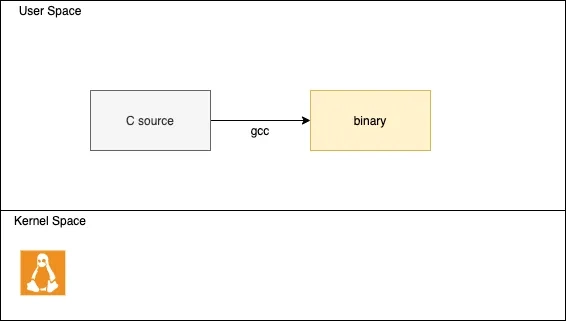
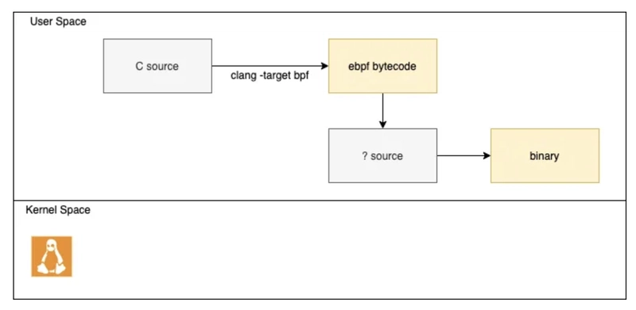
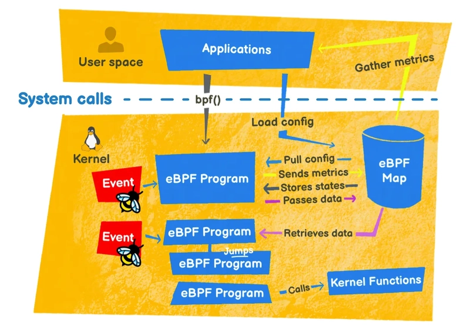
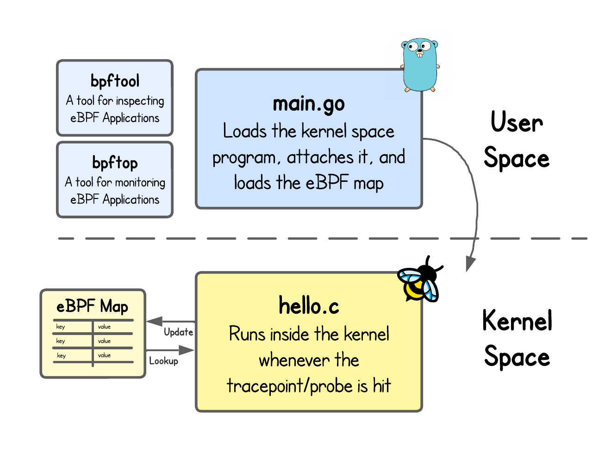

## 简介

eBPF 是 Linux 内核提供的一种动态 Hook 机制，可以将自定义代码逻辑 Hook 到指定内核事件上，当内核触发该事件时就会调用相应的自定义代码逻辑。

为了让您更具体地了解 eBPF 可以做什么，让我们为您提供一个非详尽的列表，列出可以使用 eBPF 完成的小程序：

- `top`或`ps`：允许您查看进程及其在 CPU 和 RAM 方面占用的内容
- `tcpdump`：用于监视服务器上的网络流
- `strace`：它允许您查看进程的系统调用

还有其它使用 eBPF 的程序，例如 systemd（初始化系统）。

## 原理

在传统程序中，我们有一个源代码。从这个源代码中，我们创建程序，如果它是编译语言，则对其进行编译：



在 eBPF 中，不是一个程序，而是两个程序：

- 将在用户空间中编译的 eBPF 代码，但只能在内核空间中运行；
- 一个用户空间代码，主要加载刚刚编译到内核中的 eBPF 二进制文件。




我们稍后会看到，可以在内核空间和用户空间之间进行通信（通过 eBPF 映射），也可以在内核空间 eBPF 程序之间进行通信（通过尾部调用）。



从上面可以看出，一个完整的 eBPF 程序通常分为用户态和内核态两部分：用户态负责 eBPF 程序的加载、事件绑定以及 eBPF 程序运行结果的汇总输出；内核态运行在 eBPF 虚拟机中，负责定制和控制系统的运行状态；内核态的 eBPF 程序通过 BPF 映射（Map）用户态程序交互


**bpf 系统调用：**

```c
#include <linux/bpf.h>  
  
int bpf(int cmd, union bpf_attr *attr, unsigned int size);
```

- `cmd`: 操作命令，比如 `BPF_PROG_LOAD` 就是加载 eBPF 程序。
- `attr`: 操作命令对应的属性。
- `size`: 属性的大小。


## eBPF 程序开发

### 内核态程序

内核态的 eBPF 程序在内核视角就是 eBPF 字节码，可以用 C 或 Rust 编译而来，分以下几种方案：

- • libbpf:
  - • 开发语言：C
  - • 编译依赖：libbpf （用到为编译器提供的宏，如 SEC）。
  - • 运行依赖：无
  - • 内核要求：内核开启 BTF 特性，需要非常较新的发行版才会默认开启（如 RHEL 8.2+ 和 Ubuntu 20.10+ 等）。

- • bcc：
  - • 开发语言：C
  - • 编译/运行依赖：bcc、LLVM、内核头文件（bcc 方案是目标机器上进行编译并运行的）

- • Aya：
  - • 开发语言：Rust
  - • 编译依赖：Rust 环境、Aya
  - • 运行依赖：无

eBPF 框架有两种类型：

- 那些使用两种不同编程语言的语言：一种用于内核空间，另一种用于用户空间；如 ebpf go；
- 那些在内核和用户空间中使用单一语言的语言，如 Aya。

### 用户态程序

用户态程序主要负责将内核态 eBPF 程序加载到内核并运行，然后通过 BPF 映射读取内核态 eBPF 程序输出的数据，最后做相应的业务逻辑处理，它可以用任何语言编写，下面列举了一些常用的方案：

- ebpf-go：
  - 开发语言：go
  - 编译依赖：go、cilium/ebpf
  - 运行依赖：无
- Libbpf：
  - 开发语言：C/C++
  - 编译依赖：需要 clang / LLVM（运行时编译 eBPF 程序）
  - 运行依赖：支持 eBPF 的 Linux 内核 + libbpf（用户态库）+ 内核 BTF（CO-RE 场景下）
- Aya：
  - 开发语言：Rust
  - 编译依赖：Rust 环境、Aya
  - 运行依赖：无


## 开发实例

参考项目：https://github.com/maiyao1988/ebpf-plugin.git

编写一个 hook 全部 syscall 的 程序。



### 环境配置

开发 eBPF 程序需要手机的内核版本高于 5.10。

```
go mod init hello
go get github.com/cilium/ebpf@v0.17.1

sudo apt update
sudo apt install clang llvm libelf-dev gcc make git
```


- hello.c

```c
//go:build ignore
// 告诉 Go 工具链忽略该文件（否则 go build 会尝试编译这个 C 文件）

#include "vmlinux.h"              // 由 BTF 生成的内核类型定义（支持 CO-RE）
#include <bpf/bpf_helpers.h>      // eBPF helper 函数与 SEC() 宏定义

// 声明 eBPF 程序的 License
// 使用 GPL 是为了能够调用 GPL-only 的 helper（如 bpf_printk）
char _license[] SEC("license") = "GPL";

/*
 * Tracepoint eBPF program
 *
 * 挂载点：
 *   syscalls:sys_enter_execve
 *
 * 触发时机：
 *   每次进程调用 execve 系统调用时
 *
 * ctx：
 *   tracepoint 上下文，类型来自 vmlinux.h
 *   可用于读取系统调用参数和寄存器状态
 */
SEC("tracepoint/syscalls/sys_enter_execve")
int handle_execve_tp(struct trace_event_raw_sys_enter *ctx)
{
    /*
     * 将字符串输出到内核 trace buffer
     * 可通过以下命令查看：
     *   sudo cat /sys/kernel/debug/tracing/trace_pipe
     *
     * ⚠️ 仅用于调试，生产环境不推荐使用
     */
    bpf_printk("Hello world");

    /*
     * 对于 tracepoint 类型的 eBPF 程序：
     * - 返回值不会影响系统调用行为
     * - 通常直接返回 0
     */
    return 0;
}
```

- main.go

```go
package main

//go:generate go run github.com/cilium/ebpf/cmd/bpf2go -target bpf hello hello.c

import (
    "context"
    "log"
    "os"
    "os/signal"
    "syscall"

    "github.com/cilium/ebpf/link"
    "github.com/cilium/ebpf/rlimit"
)

func main() {

    // 1️⃣ 移除内存锁限制，允许 eBPF 程序和 map 加载到内核
    if err := rlimit.RemoveMemlock(); err != nil {
        log.Fatal("Removing memlock:", err)
    }

    // 2️⃣ 加载编译好的 eBPF 对象（hello_bpf.o）
    //    loadHelloObjects 来自 hello_bpf.go 自动生成
    var objs helloObjects
    if err := loadHelloObjects(&objs, nil); err != nil {
        log.Fatal("Loading eBPF objects:", err)
    }
    defer objs.Close() // 程序退出时释放资源

    // 3️⃣ 将 eBPF 程序 attach 到 tracepoint: syscalls:sys_enter_execve
    tp, err := link.Tracepoint("syscalls", "sys_enter_execve", objs.HandleExecveTp, nil)
    if err != nil {
        log.Fatalf("Attaching Tracepoint: %s", err)
    }
    defer tp.Close() // 程序退出时 detach

    log.Println("eBPF program attached to tracepoint. Press Ctrl+C to exit.")

    // 4️⃣ 阻塞程序，直到收到 Ctrl+C 或 SIGTERM
    ctx, stop := signal.NotifyContext(context.Background(), os.Interrupt, syscall.SIGTERM)
    defer stop()

    <-ctx.Done()
    log.Println("Received signal, exiting...")
}
```

- 下载 bpf-tools：https://github.com/libbpf/bpftool/releases

```shell
# 推送到设备
adb push bpftool /data/local/tmp/
adb shell chmod +x /data/local/tmp/bpftool
```

- 获取内核符号

```shell
#进入Android设备
adb shell
su
cd /data/local/tmp
./bpftool btf dump file /sys/kernel/btf/vmlinux format c > vmlinux.h
adb pull /data/local/tmp/vmlinux.h ./
```

### 内核态程序

内核态程序只能通过 C 语言编写，只能使用内核导出的函数或内核 bpf 库中的函数。

### 用户态程序

```shell
go generate
go build
```

### 编译

目前 ebpf-go 库并不认 Android 是 Linux，所以需要自行将库中`/internal/platform/platform.go`中的 Linux 这一项改为 

```
runtime.GOOS == "linux" || runtime.GOOS == "android" 
```

构建：

```shell
GOOS=android \
GOARCH=arm64 \
go build
```


## 参考

>[eBPF - 简介、教程和社区资源](https://ebpf.io/labs/)
>[【第拾壹期 REVERSE 分享会】驱动逆向 & Ebpf & 某实战逆向 & Angr & 自定义ROM & Frida](https://www.bilibili.com/video/BV17hBQBqEda/?spm_id_from=333.1387.favlist.content.click&vd_source=edca928f1ab30d19924c36939a858238)
>[[原创\] 60秒学会用eBPF-BCC hook系统调用 ( 2 ) hook安卓所有syscall-Android安全-看雪安全社区｜专业技术交流与安全研究论坛](https://bbs.kanxue.com/thread-275176.htm)