编译器编译源代码后生成的文件叫做**目标文件**，那么目标文件里面到底存放的是什么呢？或者我们的源代码在经过编译以后是怎么存储的？

目标文件从结构上讲，它是已经编译后的可执行文件格式，只是还没有经过链接的过程，其中可能有些符号或有些地址还没有被调整。其实它本身就是按照可执行文件格式存储的，只是跟真正的可执行文件在结构上稍有不同。

可执行文件格式涵盖了程序的编译、链接、装载和执行的各个方面。了解它的结构并深入刨析它对于认识系统、了解背后的机理大有好处。

## 3.1 目标文件的格式

​现在 PC 平台流行的**可执行文件格式（Executable）** 主要是 Windows 下的 PE（Portable Executable）和 Linux 的 ELF（Executable Linkable Format），它们都是 COFF（Common file format）格式的变种。**目标文件就是源代码编译后但未执行链接的那些中间文件（Windows的.obj和Linux下的.o）**，它跟可执行文件的内容与结构很相似，所以一般可执行文件格式一起采用一种格式存储。从广义上看，目标文件与可执行文件的格式其实几乎是一样的，所以我们可以广义地将目标文件与可执行文件看成是一种类型的文件，在 Windows 下，我们可以统称它们为 PE-COFF 文件格式。在 Linux 下，我们可以将它们统称为 ELF 文件。其他不太常见的可执行文件格式还有 Intel/Microsoft 的 OMF（Object Module Format）、Unix a.out 格式和 MS-DOS .COM 格式等。

不光是**可执行文件**（Windows的.exe 和 Linux 下的ELF可执行文件）按照可执行文件格式存储。**动态链接库（DLL，Dynamic Linking Library）**（Windows 的.dll和 Linux的.so）及**静态链接库（Static Linking Library）** （Windows 的.lib 和 Linux 的.a）文件都按照可执行文件格式存储。它们在 Windows 下都按照 PE-COFF 格式存储，Linux 下按照 ELF 格式存储。静态链接库稍有不同，它是把很多目标文件捆绑在一起形成一个文件，再加上一些索引，你可以简单地把它理解为一个包含有很多目标文件的文件包。

ELF 文件标准里面把系统中采用 ELF 格式的文件归为如表所列举的 4 类。

| ELF文件类型                    | 说明                                                                                                                 | 实例                                                     |
| -------------------------- | ------------------------------------------------------------------------------------------------------------------ | ------------------------------------------------------ |
| 可重定位文件（Relocatable File）   | 这类文件包含了代码和数据，可以被用来链接成可执行文件或共享目标文件，静态链接库也可以归为这一类                                                                    | Linux 的.o                          Windows 的.obj       |
| 可执行文件（Executable File）     | 这类文件包含了可以直接执行的程序，它的代表就是ELF可执行文件，它们一般都没有扩展名                                                                         | 比如 /bin/bash 文件            Windows 的 .exe              |
| 共享目标文件（Shared Object File） | 这种文件包含了代码和数据，可以在以下两种情况下使用。一种是链接器可以使用这种文件跟其他的可重定位文件和共享目标文件链接，产生新的目标文件。第二种是动态链接器可以将几个这种共享目标文件与可执行文件结合，作为进程映像的一部分来运行。 | Linux 的 .os，如 /lib/glibc-2.5.so          Windows 的 DLL |
| 核心转储文件（Core Dump File）     | 当进程意外终止时，系统可以将该进程的地址空间的内容及终止时的一下其他信息转储到核心转储文件                                                                      | Linux 下的 core dump                                     |

Linux下可以使用file命令查看相应的文件格式。

## 3.2 目标文件是什么样的

我们大概能猜到，目标文件中的内容至少有编译后的机器指令代码、数据。没错，除了这些内容以外，目标文件中还包括了链接时所须要的一些信息，比如符号表、调试信息、字符串等。一般目标文件将这些信息按不同的属性，以 **“节” （Section）** 的形式存储，有时候也叫 **“段” （Segment）**，在一般情况下，它们都表示一个一定长度的区域，基本上不加以区别，唯一的区别是在 ELF 的链接视图和装载视图的时候，后面会专门提到。在本书中默认情况下统一将它们称为 “段”。

​程序源代码编译后的机器指令经常被放在**代码段（Code Section）** 里，代码段常见的名字有 “.code” 或 “.text”；全局变量和局部静态变量数据经常放在**数据段（Data Section）**，数据段的一般名字都叫 “.data”。

让我们来看一个简单的程序编译成目标文件后的结构，如图所示。
​

假设图中的可执行文件的格式是 ELF，从图中可以看到，ELF 文件的开头是一个 “文件头”，它描述了整个文件的文件属性，包括文件是否可执行、是静态链接还是动态链接及入口地址（如果是可执行文件）、目标硬件、目标操作系统等信息，文件头还包括一个**段表（Section Table）**，段表其实是一个描述文件中各个段的数组。段表描述了文件中各个段在文件中的偏移位置及段的属性等，从段表里面可以得到每个段的所有信息。文件头后面就是各个段的内容，比如代码段保存的就是程序的指令，数据段保存的就是程序的静态变量等。

对照图来看，一般C语言的编译后执行语句都编译成机器代码，保存在 .text 段：已初始化的全局变量和局部静态变量都保存在 。data段；未初始化的全局变量和局部静态变量一般放在一个叫 "bss" 的段里。我们知道未初始化的全局变量和局部静态变量默认值都为 0，本来它们也可以被放在 .data 段的，但是因为它们都是 0，所以它们在 .data 段分配空间并且存放数据 0 是没有必要的。程序运行的时候它们的确是要占内存空间的，并且可执行文件必须记录所有未初始化的全局变量和局部静态变量的大小总和，记为 .bss 段。**所以.bss段只是未初始化的全局变量和局部静态变量预留位置而已**，它并没有内容，所以它在文件中也不占据空间。

​	**总体来说，程序源代码被编译以后主要分成两种段：程序指令和程序数据。代码段属于程序指令，而数据段和 .bss 段属于程序数据。**

​	为什么要将程序的指令和数据的存放分开？数据和指令分段的好处有很多。主要有以下几个方面。

* 一方面是当程序被装载后，数据和指令分别被映射到两个虚存区域。由于数据区域对于进程来说是可读写的，而指令区域对于进程来说是只读的，所以这两个虚存区域的权限可以被分别设置成可读写和只读。这样可以防止程序的指令被有意或无意地改写。

* 另外一方面是对于现代的CPU来说，它们有着极为强大的缓存(Cache)体系。由于缓存在现代的计算机中地位非常重要，所以程序必须尽量提高缓存的命中率。指令区和数据区的分离有利于提高程序的局部性。现代CPU的缓存一般都被设计成数据缓存和指令缓存分离，所以程序的指令和数据被分开存放对CPU的缓存命中率提高有好处。

* 第三个原因，其实也是最重要的原因，就是当系统中运行着多个该程序的副本时，它们的指令都是一样的，所以内存中只须要保存一份改程序的指令部分。对于指令这种只读的区域来说是这样，对于其他的只读数据也一样，比如很多程序里面带有的图标图片、文本等资源也是属于可以共享的。当然每个副本进程的数据区域是不一样的，它们是进程私有的。不要小看这个共享指令的概念，它在现代的操作系统里面占据了极为重要的地位，特别是在有动态链接的系统中，可以节省大量的内存。比如我们常用的 Windows Internet Explorer 7.0 运行起来以后，它的总虚存空间为 112 844 KB，它的私有部分数据为 15944 KB,即有 96900 KB 的空间是共享部分。如果系统中运行了数百个进程，可以想象共享的方法来节省大量空间。关于内存共享的更为深入的内容我们将在装载这一章探讨。

## 3.3 挖掘 SimpleSection.o

objdump -h 查看文件段的基本信息

除了最基本的代码段、数据段和BSS段以外，还有3个段分别是只读数据段（.rodata）、注释信息段（.comment）和堆栈提示段（.note.GNU-stack）。

段的长度（size）和段所在的位置（file offset），每个段的第二行中的“contents”、“alloc”等表示段的各种属性。

contents表示该段在文件中存在。

size 查看ELF文件的代码段、数据段和BSS段的长度

### 3.3.1 代码段

挖掘各个段的内容，还是须要objdump这个利器。objdump的 “-s” 参数可以将所有段的内容以十六进制的方式打印出来，“-d” 参数可以将所有包含指令的段反汇编。

显示结构最左边是偏移量，中间4列是十六进制内容，最有面一列是.text的ASCII码形式。

可以十六进制对照反汇编进行分析。

### 3.3.2 数据段和只读数据段

​.data段保存的是那些已经**初始化了的全局静态变量和局部静态变量**。

​字符串常量属于只读数据，所以它会放到 .rodata。

单独设立“.rodata”段可以使操作系统在加载的时候可以将“.rodata”段的属性映射成只读，这样对于这个段的任何修改操作都会作为非法操作处理。

有时候编译器会把字符串常量放在“.data”段，而不会单独放在“.rodata”段。

**字节序**，数据在内存里以小端序存储。

### 3.3.3 BSS段

.bss段存放的是**未初始化全局变量和局部静态变量**，

有些编译器会将**全局的未初始化变量**存放在目标文件.bss段，有些则不存放，只是预留一个**未定义的全局变量符号**，等到最终链接成可执行文件的时候再在.bss段分配空间。

**编译单元内部可见的静态变量**的确是存放在.bss段的。

**Quiz变量存放位置**

全局变量为0，可以认为是未初始化的，所以被优化掉可以放在.bss。

​	

### 3.3.4 其他段

​除了.text、.data、.bss这3个最常用的段之外，ELF文件也有可能包含其他的段，用来保存与程序相关的其他信息。

| 常用的段名    | 说明                                                         |
| ------------- | ------------------------------------------------------------ |
| .rodata l     | Read only Data，这种段里存放的是只读数据，比如字符串常量、全局const变量。跟 “.rodata” 一样 |
| .comment      | 存放的是编译器版本信息，比如字符串：“GCC:（GNU）4.2.0”       |
| .debug        | 调试信息                                                     |
| .dynamic      | 动态链接信息                                                 |
| .hash         | 符号哈希表                                                   |
| .line         | 调试时的行号表，即源代码行号与编译后指令的对应表             |
| .note         | 额外的编译器信息。比如程序的公司名、发包版本号等             |
| .strtab       | String Table.字符串表，用于存储ELF文件中用到的各种字符串     |
| .symtab       | Symbol Table.符号表                                          |
| .shstrtab     | Section String Table.段名表                                  |
| .plt    .got  | 动态链接的跳转表和全局入口表                                 |
| .init   .fini | 程序初始化与终结代码段                                       |

​这些段的名字都是由 “.” 作为前缀，表示这些表的名字是系统保留的，应用程序也可以使用一些非系统保留的名字作为段名。

一个ELF文件可以拥有几个相同段名的段。

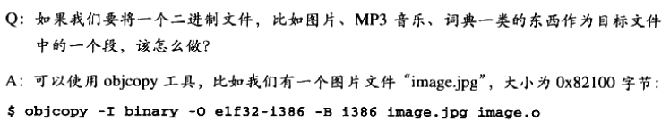

​	**自定义段**

​	正常情况下，GCC编译出来的目标文件中，代码会被放到 “.text” 段，全局变量和静态变量会被放到 “.data” 和 “.bss” 段，正如我们前面所分析的。

​	但是有时候你可能希望变量或某些部分代码能够放到你所指定的段中去，以实现某些特定的功能。比如为了满足某些硬件的内存和 I/O 的地址布局，或者是像 Linux 操作系统内核中用来完成一些初始化和用户空间复制时出现页错误异常等。

​	GCC提供了一个扩展机制，使得程序员可以指定变量所处的段：

​	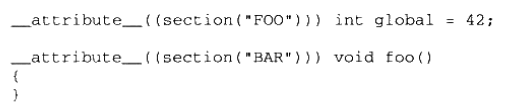

​	我们在全局变量或函数之前加上“ __ attribute__((section("name"))) ”属性就可以把相应的变量或函数放到以“name”作为段名的段中。

## 3.4 ELF 文件结构描述

​	ELF文件基本结构图

​	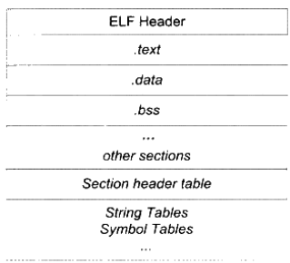

​	ELF目标文件格式的最前部**ELF文件头（ELF Header）**，它包含了描述整个文件的基本属性，比如ELF文件版本、目标机器型号、程序入口地址等。紧接着是ELF文件各个段。其中ELF文件中与段有关的重要结构就是**段表（Section Header Table）**，该表描述了ELF文件包含的所有段的信息，比如各个段的段名、段的长度、在文件中的偏移、读写权限及段的其他属性。

### 3.4.1 文件头

​	readelf命令可以详细查看ELF文件。

​	-h	查看ELF文件头

​	ELF的文件头中定义了**ELF魔术、文件机器字节长度、数据存储方式、版本、运行平台、ABI版本、ELF重定位类型、硬件平台、硬件平台版本、入口地址、程序头入口和长度、段表的位置和长度及段的数量**等。

​	ELF文件结构及相关常数被定义在 “/usr/include/elf.h” 里，因为ELF文件在各种平台下通用，ELF文件有32位版本和64位版本。它的文件头结构也有这两种版本，分别叫做“Elf32_Ehdr” 和 “Elf64_Ehdr”。

​	32位版本与64版本的ELF文件的文件头内容是一样的，只不过有些成员的大小不一样。为了对每个成员的大小做出明确的规定以便于在不同的编译环境下都拥有相同的字段长度，“elf.h”使用typedef定义了一套自己的变量体系，如表所示。

| 自定义类型  | 描述                   | 原始类型 | 长度（字节） |
| ----------- | ---------------------- | -------- | ------------ |
| Elf32_Addr  | 32位版本程序地址       | uint32_t | 4            |
| Elf32_Half  | 32位版本的无符号短整型 | uint16_t | 2            |
| Elf32_Off   | 32位版本的偏移地址     | uint32_t | 4            |
| Elf32_Sword | 32位版本有符号整型     | uint32_t | 4            |
| Elf32_Word  | 32位版本无符号整型     | int32_t  | 4            |
| Elf64_Addr  | 64位版本程序地址       | uint64_t | 8            |
| Elf64_Half  | 64位版本的无符号短整型 | uint16_t | 2            |
| Elf64_Off   | 64位版本的偏移地址     | uint64_t | 8            |
| Elf64_Sword | 64位版本的有符号整型   | uint32_t | 4            |
| Elf64_Work  | 64位版本无符号整型     | int32_t  | 4            |

​	ELF文件头结构成员含义

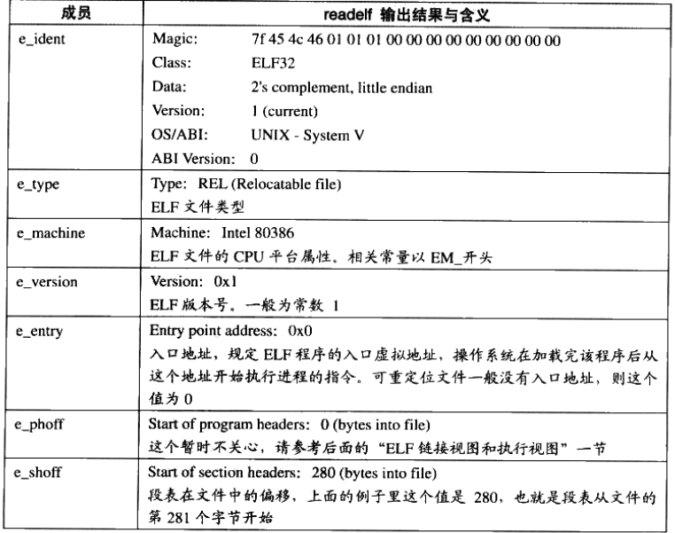

​	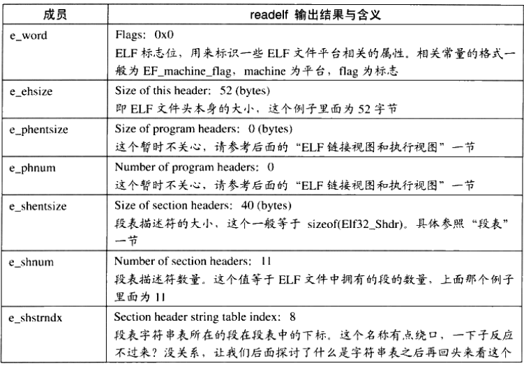

​	这些字段的相关常量都定义在“elf.h”里面。

​	**ELF魔数**	我们可以从前面readelf的输出看到，最前面的 “Magic” 的16个字节刚好对应 “Elf32_Ehdr” 的e_ident这个成员。这16个字节被ELF标准规定用来标识ELF文件的平台属性，比如这个ELF字长（32位/64位）、字节序、ELF文件版本。

​	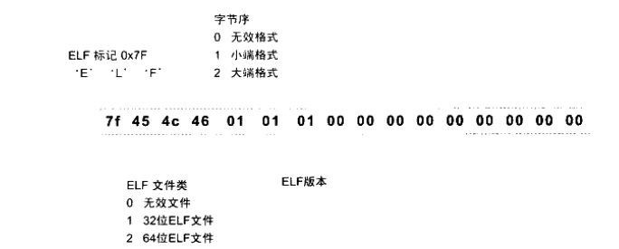

​	最开始的4个字节是所有ELF文件都必须相同的标识码，分别为0x7f、0x45、0x4c、0x46，第一个字节对应ASCII字符里面的DEL控制符，后面3个字节刚好是ELF这3个字母的ASCII码。这4个字节又被称为ELF文件的**魔数**，几乎所有的可执行文件格式的最开始的几个字节都是魔数。

​	这种魔数用来确认文件的类型，操作系统在加载可执行文件的时候会确认魔数是否正确，如果不正确会拒绝加载。

​	接下来的一个字节是用来标识ELF的文件类的，0x01表示32位的，0x02表示是64位：第6个字是字节序，规定该ELF文件是大端的话说小端的。第7个字节规定ELF文件的主版本号，一般是1，因为ELF标准自1.2版一行就再也密钥更新了。后面的9个字节ELF标准密钥定义，一般填0，有些平台会使用这9个字节作为扩展标志。

​	**文件类型**	e_type成员表示ELF文件类型，即前面提到过的3种文件类型，每个文件类型对应一个常量。系统通过这个常量来判断ELF的真正文件类型，而不是通过文件的扩展名。

​	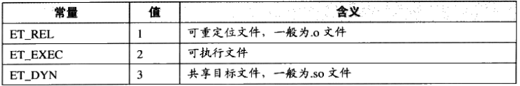

​	**机器类型**	ELF文件格式被设计成可以在多个平台下使用。这并不表示同一个ELF文件可以在不同的平台下使用（就像java的字节码文件那样），而是表示不同平台下的ELF文件都遵循同一套ELF标准。e_machine成员就表示该ELF文件的平台属性，比如3表示该ELF文件只能在 intel x86机器下使用。	

​	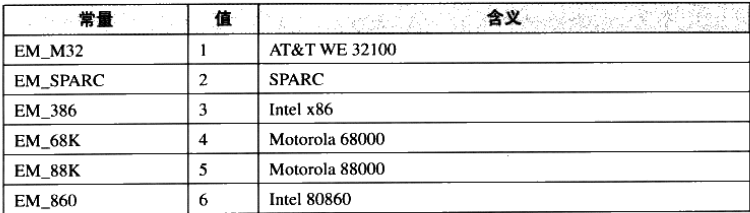

​	

### 3.4.2 段表

​	我们知道ELF文件中有很多各种各样的段，这个**段表（Section Header Table）**就是保存这些段的基本属性的结构。段表是ELF文件中除了文件头以外最重要的结构，它描述了ELF的各个段的信息，比如每个段的段名、段的长度、在文件中的偏移、读写权限及段的其他属性。也就是说，ELF文件的段结构就是由段表决定的，编译器、链接器和装载器都是依靠段表来定位和访问各个段的属性的。段表在ELF文件中的位置由ELF文件头的“e_shoff”成员决定。

​	objdump -h命令只会把ELF文件中关键的段显示出来，而省略了其他的辅助性的段，比如：符号表、字符串表、段名字符串表、重定位表等。可以用readelf -S来查看文件的段，它显示出来的结果才是真正的段表结构。

​	段表是结构是一个以 “Elf32_Shdr” 结构体为元素的数组。数组元素的个数等于段个数，每个 “Elf32_Shdr”结构体对应一个段。“Elf32_Shdr”又被称为**段描述符（Section Descriptor）**。

​	ELF段表的这个数组的第一个元素是无效的段描述符，它的类型为“NULL”，除此之外每个段描述符都对应一个段。

​			**数组的存放方式**

> ELF文件里面很多地方采用了这种与段表类似的数组方式保存。一般定义一个固定长度的结构，然后依次存放。这样我们就可以使用小标来引用某个结构。
>
> Elf32_Shdr被定义在 “/usr/include/elf.h”

​	

[^注1]: 事实上段的名字对于编译器、链接器来说是有意义的，但是对于操作系统来说并没有实质的意义，对于操作系统来说，一个段该如何处理取决于它的属性和权限，即由段的类型和段的标志位这两个成员决定。

​	**段的类型（sh_type）**正如前面所说的，段的名字只是在链接和编译过程中有意义，但它不能真正地表示段的类型。我们也可以将一个数据段命名为“.text”，对于编译器和链接器来说，主要决定段的属性的是段的类型（sh_type）和段的标志位（sh_flags）。段的类型相关常量以SHT_开头。

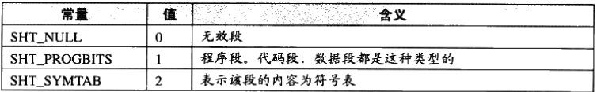

​		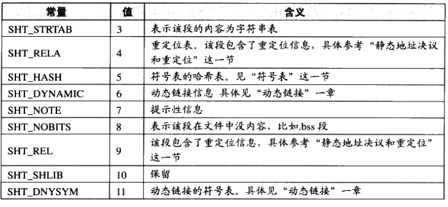

​	**段的标志位（sh_flag）**段的标志位表示该段在进程虚拟地址空间中的属性，比如是否可写，是否可执行等。相关常量以SHF_开头。

​	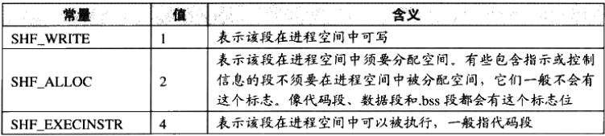

​	系统保留段的属性

​	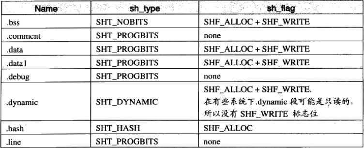

​	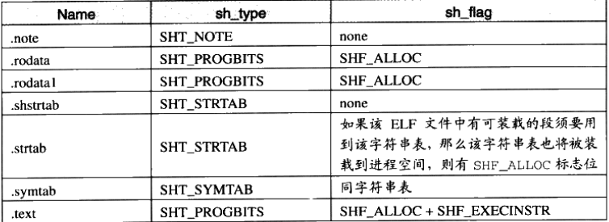

​	**段的链接信息（sh_link、sh_info）**如果段的类型是与链接相关的（不论是动态链接或静态链接），比如重定位表、符号表等，那么sh_link和sh_info这两个成员所包含的意义如表所示。对于其他类型的段，这两个成员没有意义。

​	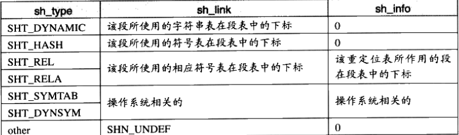

### 3.4.3 重定位表

​	“rel.text” 的段，它的类型（sh_type）为 “SHT_REL”，也就是说它是一个**重定位表（Relocation Table）**。正如我们最开始所说的，链接器在处理目标文件时，须要对目标文件中某些部位进行重定位，即代码段和数据段中那些对绝对地址的引用的位置。这些重定位的信息都记录在ELF文件的重定位表里面，对于每个须要重定位的代码段或数据段，都会有一个相应的重定位表。

​	一个重定位表同时也是ELF的一个段，那么这个段的类型（sh_type）就是“SHT_REL”类型的，它的“sh_link”表示符号表的下标，它的“sh_info”表示它作用于哪个段。比如“.rel.text”作用于“.text”段，而“.text”段的下标为“1”，那么“.rel.text” 的 “sh_info”为“1”。

### 3.4.4 字符串表

​	ELF文件中用到了很多字符串，比如段名、变量名等。因为字符串的长度往往是不定的，所以用固定的结构来表示它比较困难。一种很常见的做法是把字符串集中起来存放到一个表，然后使用字符串在表中的偏移来引用字符串。

​	如下表

​	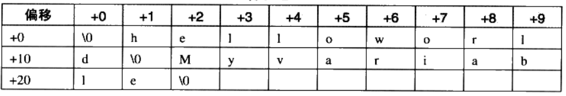

​	偏移与它们对应的字符串如下表所示

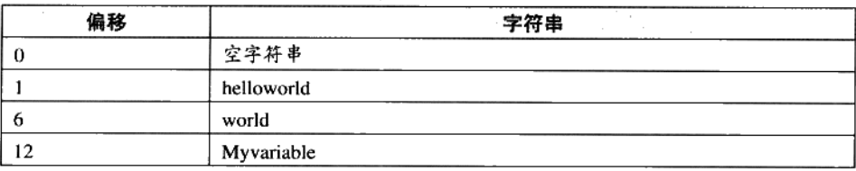

​	通过这种方法，在ELF文件中引用字符串只须给出一个数字下标即可，不用考虑字符串长度的问题。一般字符表在ELF文件中也以段的形式保存，常见的段明为“.strtab”或“.shstrtab”。这两个字符串表分别为**字符串表（String Table）**和**段表字符串表（Section Header String Table）**。顾名思义，** 字符串表**用来保存普通的字符串，比如符号的名字；**段表字符串表**用来保存段表中用到的字符串，最常见的就是段名（sh_name）

​	接着我们再回头看这个ELF文件头中的“e_shstrndx”的含义，我们在前面提到过，“e_shstrndx”是ELF32_Ehdr的最好一个成员，它是“Section header string table index”的缩写。我们知道段表字符串表本身也是ELF文件中的一个普通的段，知道它的名字往往叫做“.shstrtab”。那么这个“e_shstrndx”就表示“.shstrtab”在段表中的下标，即**段字符串表**在段表中的下标。

​	只要分析ELF文件头，就可以得到段表和段表字符串表的位置，从而解析整个ELF文件。

​	

## 3.5 链接的接口——符号

​	在链接中，目标文件之间相互拼合实际上是目标文件之间对地址的引用，即对函数和变量的地址的引用。

​	比如，目标文件B要用到了目标文件A中的函数，那么我们称目标文件A**定义（Define）** 了函数，称目标文件B**引用（Reference）** 了目标文件A中的函数。

​	每个函数和变量都有自己独特的名字，才能避免链接过程中不同变量和函数之间的混淆。

​	在链接中，我们将函数和变量统称为**符号（Symbol）**，函数名或变量名就是**符号名（Symbol Name）**。

​	我们可以将符号看作是链接中的粘合剂，整个链接过程正是基于符号才能够正确完成。链接过程中很关键的一部分就是符号的管理，每一个目标文件都会有一个相应的**符号表（Symbol Table）**，这个表里面记录了目标文件中所用到的所有符号。每一个定语的符号有一个对应的值，叫做**符号值（Symbol Value）**，对于变量和函数来说，符号值就是它们的地址。除了函数和变量之外，还存在其他集中不常用到的符号。我们将符号表中所有的符号进行分类，它们也可能是下面这些类型中的一种：

* 定义在本目标文件的全局符号，可以被其他目标文件引用。
* 在本目标文件中引用的全局符号，却没有定义在本目标文件，这一般叫做**外部符号**（Extermal Symbol），也就是我们前面所讲的符号引用。
* 段名，这种符号往往由编译器产生，它的值就是该段的起始地址。
* 局部符号，这类符号只在编译单元内部可见。
* 行号信息，即目标文件指令与源代码中代码行的对应关系，它也是可选的。

​	链接过程只关心全局符号的相互“粘合”，局部符号、段名、行号等都是次要的，它们对应其他目标文件来说是“不可见”的，在链接过程中也是无关紧要的。

​	

### 3.5.1 ELF符号表结构

​	ELF文件中的符号表往往是文件中的一个段，段名一般叫“.symtab”。符号表的结构很简单，它是一个Elf32_Sym结构（32位ELF文件）的数组，每个Elf32_Sym结构对应一个符号。这个数组的第一个元素，也就是下标0的元素为无效的“未定义符号”。

​	Elf32_Sym的结构定义如下：

​	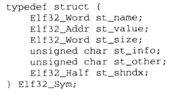

​	这几个成员的定义如表所示：

​	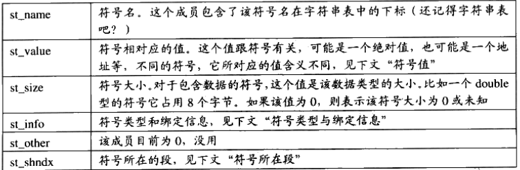

### 3.5.2 特殊符号

### 3.5.3 符号修饰与函数签名

### 3.5.4 extern “C”

### 3.5.5 弱符号与强符号

## 3.6 调试信息

​目标文件里面还有可能保存的是调试信息。几乎所有现代的编译器都支持源代码级别的调试，比如我们可以在函数里面设置断点，可以监视变量变化，可以单步行进等，前提是编译器必须提前讲源代码与目标代码之间的关系等，比如目标代码中的地址对应源代码中的哪一行、函数和变量的类型、结构体的定义、字符串保存到目标文件里面。甚至有些高级的编译器和调试器支持查看STL容器的内容，即程序员在调试过程中可以之间观察STL容器中的成员的值。

如果我们在GCC编译时加上”-g“参数，编译器就会在产生的目标文件里面加上调试信息，我们通过readelf等工具可以看到，目标文件里多了很多”debug“相关的段。

这些段中保存的就是调试信息。现在的ELF文件采用一个叫DWARF（Debug WithArbitrary Record Format）的标准的调试信息格式，现在该标准以及发展到了第三个版本，即DWARF 3，由DWARF标准委员会由2006年年颁布。Microsoft也有自己相应的调试信息格式标准，叫 Code View。

​调试信息在目标文件和可执行文件中占用很大的空间，往往比程序的代码和数据本身大好几倍，所以当我们开发我程序并要将它发布的时候，须要把这些对于用户没有用的调试信息去掉，以节省大量的空间。在Linux下，我们可以使用 ”strip“ 命令来去掉ELF文件中的调试信息。
