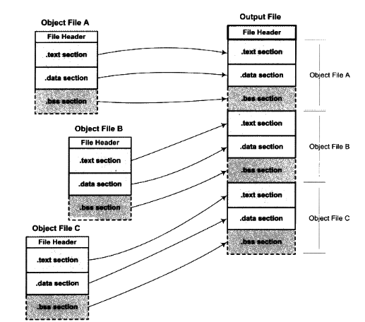

## 4.1 空间与地址分配
​对于链接器来说，整个链接过程中，它就是将几个输入目标文件加工后合并成一个输出文件。

对于多个输入目标文件，链接器如何将他们的各个段合并到输出文件？或者说，输出文件中的空间如何分配给输入文件？
### 4.1.1 按序叠加
一个最简单的方案就是将输入的目标文件按照次序叠加起来。

​	

​但是这样做会造成一个问题，在有很多输入文件的情况下，输出文件将会有很多零散的段。比如一个规模稍大的应用程序可能会有数百个目标文件，如果每个目标文件都分别有.text段、data段和bss段，那最后的输出文件将会有成百上千个零散的段。这种做法非常浪费空间，因为每个段都须要有一定的地址和空间对齐要求，比如对于x86的硬件来说，段的装载地址和空间的对齐单位是页，也就是4096字节。那么就是说如果一个段的长度只有1个字节，它也要在内存中占用4096字节。这样会造成内存空间大量的内部碎片，所以这并不是一个很好的方案。

### 4.1.2 相似段合并

​一个更实际的办法是将相同性质的段合并到一起，比如将所有输入文件的“.text”合并到输出文件的“.text”段，接着是“.data”段、“.bss”段等。

​

正如我们前文所提到的，“.bss”段在目标文件和可执行文件中并不占用文件的空间，但是它在装载时占用地址空间。所以链接器在合并各个段的同时，也将“.bss”合并，并且分配虚拟空间。

“链接器为目标文件分配地址和空间”这句话中的“地址和空间”其实有两个含义：第一个是在输出的可执行文件中的空间；第二个是在装后的虚拟地址中的虚拟地址空间。对于有实际数据的段，
